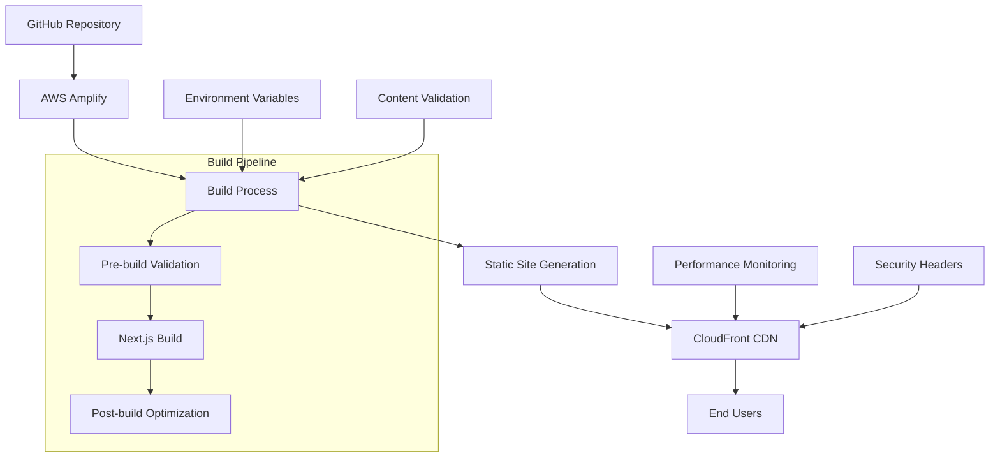
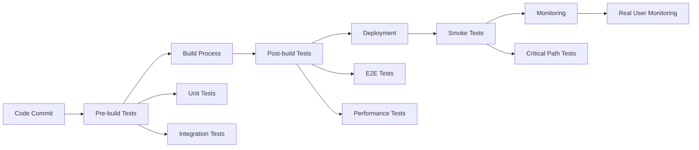

# Design Document

## Overview

The AWS deployment setup leverages AWS Amplify for hosting a mobile-first marketing website built with Next.js. The architecture focuses on static site generation with optimized performance, security, and automated CI/CD deployment. The existing project is already configured with comprehensive build scripts, testing, and optimization tools that integrate seamlessly with Amplify's deployment pipeline.

## Architecture

### High-Level Architecture



### Deployment Flow

1. **Source Control Integration**: GitHub repository connected to AWS Amplify
2. **Automated Triggers**: Deployments triggered on main branch commits
3. **Build Pipeline**: Multi-stage build process with validation, compilation, and optimization
4. **Static Asset Generation**: Next.js static export creates optimized HTML, CSS, and JS files
5. **CDN Distribution**: CloudFront serves content globally with edge caching
6. **Monitoring**: Performance and error tracking through integrated monitoring

## Components and Interfaces

### 1. AWS Amplify Configuration

**Purpose**: Orchestrates the entire deployment pipeline
**Configuration File**: `amplify.yml`

**Key Features**:
- Multi-phase build process (preBuild, build, postBuild)
- Dependency caching for faster builds
- Environment variable management
- Custom headers for security and performance
- Redirect and rewrite rules

**Build Phases**:
```yaml
preBuild:
  - Dependency installation (npm ci)
  - Environment validation
  - Content structure validation
  - Type checking
  
build:
  - Next.js static build
  - Test execution
  
postBuild:
  - Cache optimization
  - CDN invalidation
  - Deployment monitoring
```

### 2. Next.js Application Configuration

**Purpose**: Optimizes the application for static deployment
**Configuration File**: `next.config.js`

**Key Optimizations**:
- Static export mode for Amplify compatibility
- Image optimization with modern formats (WebP, AVIF)
- Bundle analysis capabilities
- Mobile-first responsive image sizes
- Security headers and CSP configuration

### 3. Build Automation Scripts

**Purpose**: Comprehensive build validation and optimization
**Location**: `scripts/` directory

**Script Categories**:
- **Content Management**: Validation, generation, and testing
- **Environment**: Variable validation and configuration
- **Performance**: Monitoring, optimization, and caching
- **Deployment**: Monitoring and cache invalidation

### 4. Security and Performance Headers

**Purpose**: Implement security best practices and optimize performance
**Configuration**: Custom headers in `amplify.yml`

**Security Headers**:
- Strict Transport Security (HSTS)
- Content Security Policy (CSP)
- X-Frame-Options, X-Content-Type-Options
- Referrer Policy and Permissions Policy

**Performance Headers**:
- Long-term caching for static assets (1 year)
- Medium-term caching for HTML (1 hour)
- Compression and encoding optimization

## Data Models

### Environment Variables Schema

```typescript
interface EnvironmentConfig {
  // Site Configuration
  NEXT_PUBLIC_SITE_URL: string;
  NEXT_PUBLIC_SITE_NAME: string;
  NEXT_PUBLIC_SITE_DESCRIPTION: string;
  
  // Analytics
  NEXT_PUBLIC_GA_ID?: string;
  NEXT_PUBLIC_GTM_ID?: string;
  NEXT_PUBLIC_FACEBOOK_PIXEL_ID?: string;
  
  // Contact Configuration
  CONTACT_EMAIL: string;
  SMTP_HOST?: string;
  SMTP_PORT?: number;
  SMTP_USER?: string;
  SMTP_PASS?: string;
  
  // Social Media
  NEXT_PUBLIC_FACEBOOK_URL?: string;
  NEXT_PUBLIC_TWITTER_URL?: string;
  NEXT_PUBLIC_LINKEDIN_URL?: string;
  NEXT_PUBLIC_INSTAGRAM_URL?: string;
  
  // AWS Amplify (Auto-configured)
  AMPLIFY_BRANCH: string;
  AMPLIFY_APP_ID: string;
  AWS_REGION: string;
}
```

### Build Configuration Schema

```typescript
interface BuildConfig {
  nodeVersion: string;
  buildCommand: string;
  outputDirectory: string;
  environmentVariables: EnvironmentConfig;
  cacheSettings: {
    dependencies: string[];
    buildCache: string[];
  };
}
```

## Error Handling

### Build-Time Error Handling

1. **Pre-build Validation**:
   - Environment variable validation with detailed error messages
   - Content structure validation to prevent broken builds
   - TypeScript compilation checks
   - Dependency integrity verification

2. **Build Process Errors**:
   - Graceful handling of build failures with detailed logs
   - Automatic retry mechanisms for transient failures
   - Rollback capabilities to previous successful deployment

3. **Post-build Validation**:
   - Output file verification
   - Performance metric validation
   - Security header verification

### Runtime Error Handling

1. **CDN-Level Errors**:
   - Custom error pages for 404, 500 errors
   - Fallback mechanisms for asset loading failures
   - Graceful degradation for JavaScript failures

2. **Monitoring and Alerting**:
   - Real-time error tracking
   - Performance monitoring with Core Web Vitals
   - Automated alerts for deployment failures

## Testing Strategy

### Pre-deployment Testing

1. **Unit Tests**: Component and utility function testing with Vitest
2. **Integration Tests**: API endpoint and service integration testing
3. **End-to-End Tests**: User journey testing with Playwright
4. **Performance Tests**: Lighthouse CI integration for performance validation

### Build Validation Testing

1. **Content Validation**: Automated content structure and integrity checks
2. **Environment Testing**: Configuration validation across environments
3. **Security Testing**: Header and CSP policy validation
4. **Accessibility Testing**: WCAG compliance validation

### Post-deployment Testing

1. **Smoke Tests**: Critical path functionality verification
2. **Performance Monitoring**: Real-time performance metric tracking
3. **Security Monitoring**: Continuous security header and policy monitoring
4. **User Experience Monitoring**: Real user monitoring (RUM) implementation

### Testing Automation



## Performance Optimization

### Build-Time Optimizations

1. **Dependency Management**: npm ci for faster, reliable installs
2. **Caching Strategy**: Multi-layer caching for dependencies and build artifacts
3. **Bundle Optimization**: Tree shaking, code splitting, and minification
4. **Image Optimization**: Modern format conversion and responsive sizing

### Runtime Optimizations

1. **CDN Configuration**: Global edge caching with CloudFront
2. **Compression**: Gzip/Brotli compression for all text assets
3. **Caching Headers**: Aggressive caching for static assets, smart caching for dynamic content
4. **Resource Hints**: Preload, prefetch, and preconnect optimizations

### Monitoring and Analytics

1. **Core Web Vitals**: LCP, FID, CLS tracking and optimization
2. **Performance Budgets**: Automated performance regression detection
3. **Real User Monitoring**: Actual user experience tracking
4. **Synthetic Monitoring**: Continuous performance testing from multiple locations 