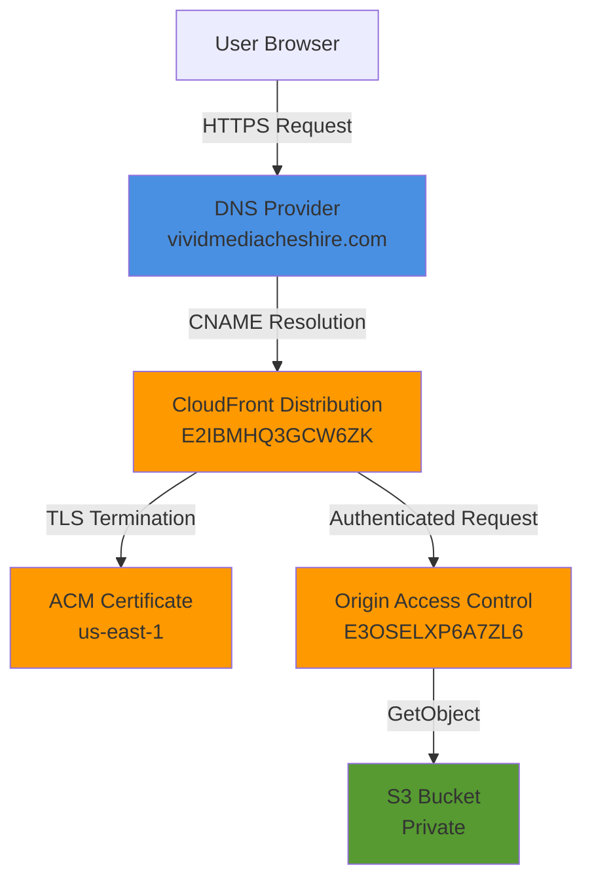
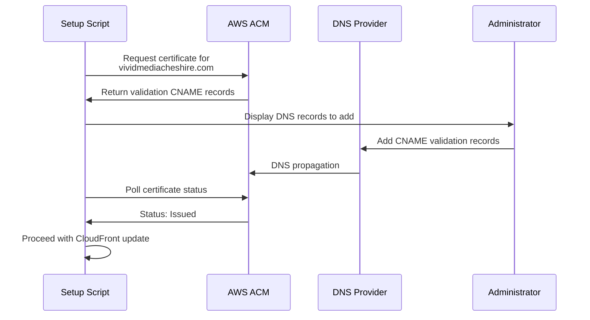

# Design Document: CloudFront Custom Domain Setup

## Overview

This design implements custom domain configuration for the existing CloudFront distribution (E2IBMHQ3GCW6ZK), enabling the site to be accessed via vividmediacheshire.com instead of the default CloudFront domain d15sc9fc739ev2.cloudfront.net. This change is critical for IndexNow API integration, which requires the submission host domain to match the key location URL domain.

The implementation follows AWS best practices for custom domain setup with CloudFront, including SSL/TLS certificate provisioning via AWS Certificate Manager (ACM), DNS configuration, and automated deployment scripts. The design maintains all existing security configurations including Origin Access Control (OAC) and ensures zero downtime during the transition.

### Key Design Decisions

1. **ACM Certificate in us-east-1**: CloudFront requires ACM certificates to be in the us-east-1 region regardless of where other resources are located. This is a CloudFront-specific requirement.

2. **DNS Validation Method**: We use DNS validation instead of email validation because it's more automated, doesn't require email access, and can be easily integrated into infrastructure-as-code workflows.

3. **Both Apex and WWW Domains**: We configure both vividmediacheshire.com and www.vividmediacheshire.com to provide flexibility and handle both common access patterns.

4. **Automated Setup Script**: A Node.js script automates the entire process to ensure consistency, reduce manual errors, and provide clear documentation of the configuration steps.

5. **Preserve Existing Configuration**: The CloudFront distribution update preserves all existing settings (OAC, cache behaviors, origin settings) to avoid disrupting current functionality.

## Architecture

### Component Diagram



### Request Flow

1. **DNS Resolution**: User requests https://vividmediacheshire.com
2. **DNS Lookup**: DNS provider returns CloudFront distribution domain (d15sc9fc739ev2.cloudfront.net)
3. **TLS Handshake**: CloudFront presents ACM certificate for vividmediacheshire.com
4. **Request Processing**: CloudFront processes request using existing cache behaviors
5. **Origin Request**: If cache miss, CloudFront requests from S3 using OAC authentication
6. **Response**: Content served to user with security headers

### Certificate Validation Flow



## Components and Interfaces

### 1. ACM Certificate Manager

**Purpose**: Provision and manage SSL/TLS certificates for the custom domain.

**Configuration**:
```javascript
{
  DomainName: 'vividmediacheshire.com',
  SubjectAlternativeNames: ['www.vividmediacheshire.com'],
  ValidationMethod: 'DNS',
  Region: 'us-east-1'
}
```

**Key Operations**:
- `requestCertificate()`: Request new certificate with DNS validation
- `describeCertificate()`: Get certificate status and validation records
- `waitForCertificateValidation()`: Poll until certificate is issued

**Validation Records Format**:
```javascript
{
  Name: '_abc123.vividmediacheshire.com',
  Type: 'CNAME',
  Value: '_xyz789.acm-validations.aws.'
}
```

### 2. CloudFront Distribution Configuration

**Purpose**: Update existing distribution to accept custom domain requests.

**Current Configuration** (to be preserved):
- Distribution ID: E2IBMHQ3GCW6ZK
- Origin Access Control: E3OSELXP6A7ZL6
- Cache behaviors: All existing patterns
- Security headers: All existing policies
- Custom error responses: 404/403 → index.html

**New Configuration** (to be added):
```javascript
{
  Aliases: [
    'vividmediacheshire.com',
    'www.vividmediacheshire.com'
  ],
  ViewerCertificate: {
    ACMCertificateArn: 'arn:aws:acm:us-east-1:...',
    SSLSupportMethod: 'sni-only',
    MinimumProtocolVersion: 'TLSv1.2_2021'
  }
}
```

**Key Operations**:
- `getDistributionConfig()`: Retrieve current configuration
- `updateDistribution()`: Apply custom domain changes
- `waitForDeployment()`: Poll until deployment completes

### 3. DNS Configuration

**Purpose**: Route custom domain requests to CloudFront distribution.

**Required DNS Records**:

```
# Certificate Validation (temporary, provided by ACM)
_abc123.vividmediacheshire.com.  CNAME  _xyz789.acm-validations.aws.
_abc123.www.vividmediacheshire.com.  CNAME  _xyz789.acm-validations.aws.

# Domain Routing (permanent)
vividmediacheshire.com.  A  ALIAS d15sc9fc739ev2.cloudfront.net
www.vividmediacheshire.com.  CNAME  d15sc9fc739ev2.cloudfront.net
```

**Note**: If the DNS provider doesn't support ALIAS records for apex domains, use CNAME for both:
```
vividmediacheshire.com.  CNAME  d15sc9fc739ev2.cloudfront.net
www.vividmediacheshire.com.  CNAME  d15sc9fc739ev2.cloudfront.net
```

### 4. Setup Automation Script

**Purpose**: Automate the entire custom domain setup process.

**Script Location**: `scripts/setup-custom-domain.js`

**Interface**:
```javascript
class CustomDomainSetup {
  constructor(options) {
    this.domainName = options.domainName;
    this.distributionId = options.distributionId;
    this.region = 'us-east-1'; // Required for ACM
  }

  async run() {
    // 1. Request ACM certificate
    const certificate = await this.requestCertificate();
    
    // 2. Display DNS validation records
    this.displayValidationRecords(certificate);
    
    // 3. Wait for certificate validation
    await this.waitForCertificateValidation(certificate.CertificateArn);
    
    // 4. Update CloudFront distribution
    await this.updateCloudFrontDistribution(certificate.CertificateArn);
    
    // 5. Display DNS routing records
    this.displayRoutingRecords();
    
    // 6. Verify custom domain accessibility
    await this.verifyCustomDomain();
  }
}
```

**Error Handling**:
- Certificate request failures: Provide clear error message and check IAM permissions
- Validation timeout: Suggest DNS record verification steps
- CloudFront update failures: Provide rollback instructions
- Verification failures: Suggest DNS propagation wait time

### 5. IndexNow Integration Updates

**Purpose**: Update IndexNow configuration to use custom domain.

**Configuration Changes**:
```javascript
// Before
{
  host: 'd15sc9fc739ev2.cloudfront.net',
  keyLocation: 'https://d15sc9fc739ev2.cloudfront.net/{key}.txt'
}

// After
{
  host: 'vividmediacheshire.com',
  keyLocation: 'https://vividmediacheshire.com/{key}.txt'
}
```

**Files to Update**:
- `scripts/submit-indexnow.js`: Update host and keyLocation
- `.github/workflows/s3-cloudfront-deploy.yml`: Update environment variables
- `docs/indexnow-integration-readme.md`: Update documentation

## Data Models

### Certificate Configuration

```typescript
interface CertificateConfig {
  DomainName: string;              // Primary domain
  SubjectAlternativeNames: string[]; // Additional domains
  ValidationMethod: 'DNS' | 'EMAIL';
  Region: string;                  // Must be us-east-1 for CloudFront
}

interface CertificateValidationRecord {
  Name: string;                    // DNS record name
  Type: 'CNAME';
  Value: string;                   // DNS record value
  Status: 'PENDING_VALIDATION' | 'SUCCESS' | 'FAILED';
}

interface Certificate {
  CertificateArn: string;
  DomainName: string;
  Status: 'PENDING_VALIDATION' | 'ISSUED' | 'INACTIVE' | 'EXPIRED' | 'VALIDATION_TIMED_OUT' | 'REVOKED' | 'FAILED';
  DomainValidationOptions: CertificateValidationRecord[];
  CreatedAt: Date;
  IssuedAt?: Date;
}
```

### CloudFront Distribution Configuration

```typescript
interface DistributionConfig {
  Id: string;
  DomainName: string;              // CloudFront domain
  Aliases: string[];               // Custom domains (CNAMEs)
  ViewerCertificate: {
    ACMCertificateArn?: string;
    CloudFrontDefaultCertificate?: boolean;
    SSLSupportMethod?: 'sni-only' | 'vip';
    MinimumProtocolVersion: string;
  };
  Origins: Origin[];
  DefaultCacheBehavior: CacheBehavior;
  CacheBehaviors: CacheBehavior[];
  CustomErrorResponses: CustomErrorResponse[];
  Status: 'InProgress' | 'Deployed';
}

interface Origin {
  Id: string;
  DomainName: string;
  OriginAccessControlId: string;
  ConnectionAttempts: number;
  ConnectionTimeout: number;
}
```

### DNS Record Configuration

```typescript
interface DNSRecord {
  Name: string;                    // Record name (e.g., vividmediacheshire.com)
  Type: 'A' | 'CNAME' | 'ALIAS';
  Value: string;                   // Target (e.g., d15sc9fc739ev2.cloudfront.net)
  TTL: number;                     // Time to live in seconds
  Purpose: 'validation' | 'routing';
}

interface DNSConfiguration {
  validationRecords: DNSRecord[];  // Temporary records for ACM validation
  routingRecords: DNSRecord[];     // Permanent records for domain routing
}
```

### Setup Script State

```typescript
interface SetupState {
  step: 'certificate_request' | 'validation_wait' | 'cloudfront_update' | 'dns_config' | 'verification' | 'complete';
  certificateArn?: string;
  certificateStatus?: string;
  distributionStatus?: string;
  verificationResults?: {
    apexDomain: boolean;
    wwwDomain: boolean;
    certificateValid: boolean;
    indexNowKeyAccessible: boolean;
  };
  errors: string[];
}
```

