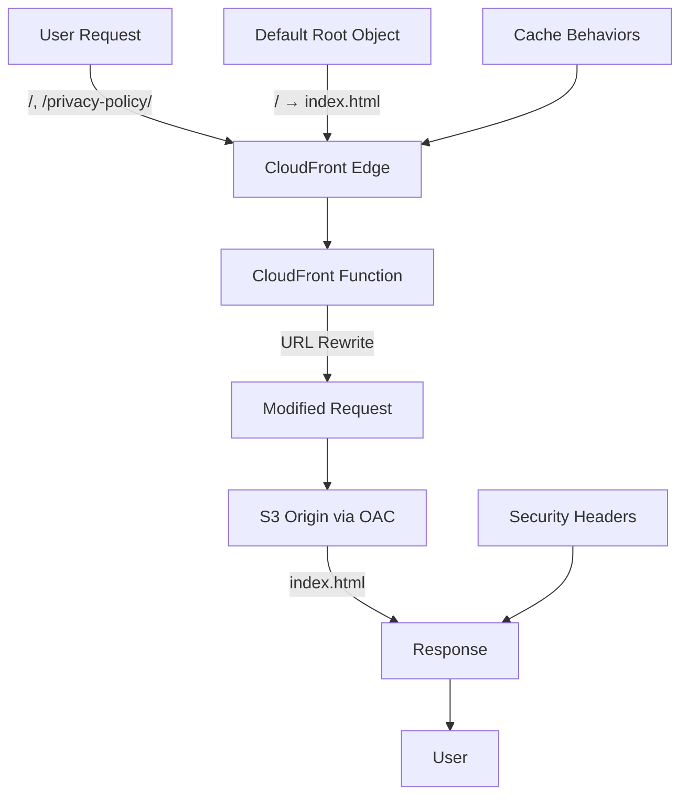

# Design Document

## Overview

This design document outlines the implementation approach for fixing CloudFront default root object configuration and enabling pretty URLs for a Next.js static site. The solution uses CloudFront Functions for URL rewriting while maintaining the existing secure S3 + CloudFront architecture with Origin Access Control (OAC).

## Architecture

### Current State Analysis

**Problem**: CloudFront distribution lacks proper configuration for:
- Default Root Object not set to `index.html`
- No URL rewriting for directory paths (`/privacy-policy/` → `/privacy-policy/index.html`)
- S3 REST API origin doesn't auto-append `index.html` for subdirectories

**Current Infrastructure**:
- S3 Bucket: `mobile-marketing-site-prod-1759705011281-tyzuo9`
- CloudFront Distribution: `E2IBMHQ3GCW6ZK`
- Domain: `https://d15sc9fc739ev2.cloudfront.net`
- Origin: S3 REST endpoint with OAC (secure)

### Solution Architecture



### Component Integration

#### 1. CloudFront Distribution Updates
- **Default Root Object**: Set to `index.html`
- **CloudFront Function**: Attached to viewer-request event
- **Cache Behaviors**: Preserved existing settings
- **Security**: Maintain OAC and security headers

#### 2. URL Rewriting Logic
```javascript
function handler(event) {
    var request = event.request;
    var uri = request.uri;
    
    // Handle directory paths (ending with /)
    if (uri.endsWith('/')) {
        request.uri += 'index.html';
    }
    // Handle paths without file extensions
    else if (!uri.includes('.') && !uri.endsWith('/')) {
        request.uri += '/index.html';
    }
    
    return request;
}
```

## Components and Interfaces

### 1. CloudFront Function

**Purpose**: URL rewriting for pretty URLs and directory index serving

**Function Specification**:
```javascript
// CloudFront Function: pretty-urls-rewriter
function handler(event) {
    var request = event.request;
    var uri = request.uri;
    
    // Skip rewriting for files with extensions (except directories)
    if (uri.includes('.') && !uri.endsWith('/')) {
        return request;
    }
    
    // Append index.html to directory paths
    if (uri.endsWith('/')) {
        request.uri += 'index.html';
    }
    // Convert extensionless paths to directory + index.html
    else if (!uri.includes('.')) {
        request.uri += '/index.html';
    }
    
    return request;
}
```

**Attachment Configuration**:
- **Event Type**: `viewer-request`
- **Cache Behavior**: Default (`*`)
- **Function ARN**: Auto-generated on creation

### 2. CloudFront Distribution Configuration

**Default Root Object Update**:
```json
{
  "distributionConfig": {
    "defaultRootObject": "index.html",
    "origins": [
      {
        "domainName": "mobile-marketing-site-prod-1759705011281-tyzuo9.s3.us-east-1.amazonaws.com",
        "originAccessControlId": "E3OSELXP6A7ZL6"
      }
    ],
    "defaultCacheBehavior": {
      "functionAssociations": [
        {
          "eventType": "viewer-request",
          "functionARN": "arn:aws:cloudfront::function/pretty-urls-rewriter"
        }
      ]
    }
  }
}
```

### 3. Deployment Script Enhancement

**Enhanced `deploy-full-site-simple.bat`**:
```batch
@echo off
echo Starting CloudFront configuration update...

REM Set environment variables
set DISTRIBUTION_ID=E2IBMHQ3GCW6ZK
set FUNCTION_NAME=pretty-urls-rewriter

REM Update default root object and attach function
node scripts/configure-cloudfront-pretty-urls.js

REM Continue with existing deployment
echo Proceeding with file upload...
REM ... existing upload logic ...

REM Invalidate cache after configuration changes
aws cloudfront create-invalidation --distribution-id %DISTRIBUTION_ID% --paths "/*"

echo Deployment complete with pretty URLs enabled
```

### 4. Configuration Management Script

**New Script**: `scripts/configure-cloudfront-pretty-urls.js`

**Key Functions**:
- Check if CloudFront Function exists
- Create function if needed
- Update distribution configuration
- Attach function to cache behavior
- Set default root object
- Validate configuration

**Interface**:
```javascript
class CloudFrontPrettyURLsConfigurator {
  async configureDistribution(distributionId) {
    // 1. Get current distribution config
    // 2. Create/update CloudFront Function
    // 3. Update default root object
    // 4. Attach function to cache behavior
    // 5. Deploy configuration changes
    // 6. Validate functionality
  }
  
  async createCloudFrontFunction(functionName, code) {
    // Create and publish CloudFront Function
  }
  
  async updateDistributionConfig(distributionId, config) {
    // Update distribution with new settings
  }
  
  async validatePrettyURLs(domain) {
    // Test URL patterns work correctly
  }
}
```

## Data Models

### 1. CloudFront Function Configuration

```typescript
interface CloudFrontFunctionConfig {
  name: string;
  code: string;
  runtime: 'cloudfront-js-1.0';
  comment: string;
  stage: 'DEVELOPMENT' | 'LIVE';
}
```

### 2. Distribution Update Configuration

```typescript
interface DistributionUpdateConfig {
  distributionId: string;
  defaultRootObject: string;
  functionAssociations: FunctionAssociation[];
  preserveExistingConfig: boolean;
}

interface FunctionAssociation {
  eventType: 'viewer-request' | 'viewer-response' | 'origin-request' | 'origin-response';
  functionARN: string;
}
```

### 3. URL Validation Test Cases

```typescript
interface URLTestCase {
  url: string;
  expectedPath: string;
  description: string;
  shouldSucceed: boolean;
}

const testCases: URLTestCase[] = [
  {
    url: '/',
    expectedPath: '/index.html',
    description: 'Root URL serves index.html',
    shouldSucceed: true
  },
  {
    url: '/privacy-policy/',
    expectedPath: '/privacy-policy/index.html',
    description: 'Directory URL serves directory index',
    shouldSucceed: true
  },
  {
    url: '/about',
    expectedPath: '/about/index.html',
    description: 'Extensionless URL serves directory index',
    shouldSucceed: true
  }
];
```

## Error Handling

### 1. CloudFront Function Errors

**Scenario**: Function creation or update fails
**Detection**: AWS API error responses
**Response**:
- Log detailed error information
- Attempt retry with exponential backoff
- Provide manual configuration instructions
- Maintain existing functionality

### 2. Distribution Update Failures

**Scenario**: Distribution configuration update fails
**Detection**: CloudFront API errors or timeout
**Response**:
- Rollback to previous configuration
- Validate current state
- Provide specific error remediation steps
- Alert operations team

### 3. URL Rewriting Edge Cases

**Scenario**: Function processes unexpected URL patterns
**Handling in Function**:
```javascript
function handler(event) {
    try {
        var request = event.request;
        var uri = request.uri;
        
        // Validate URI format
        if (!uri || uri.length === 0) {
            return request; // Pass through invalid URIs
        }
        
        // Apply rewriting logic with safety checks
        if (uri.endsWith('/') && uri.length > 1) {
            request.uri += 'index.html';
        } else if (!uri.includes('.') && !uri.endsWith('/') && uri !== '/') {
            request.uri += '/index.html';
        }
        
        return request;
    } catch (error) {
        // Log error and pass through original request
        console.log('URL rewriting error:', error);
        return event.request;
    }
}
```

### 4. Validation Failures

**Scenario**: Post-deployment URL tests fail
**Detection**: HTTP status codes, response content validation
**Response**:
- Detailed test result reporting
- Specific failure analysis
- Rollback recommendations
- Manual verification steps

## Testing Strategy

### 1. CloudFront Function Testing

**Local Testing**:
```javascript
// Test function logic locally
const testFunction = require('./cloudfront-function-code');

const testCases = [
    { uri: '/', expected: '/index.html' },
    { uri: '/privacy-policy/', expected: '/privacy-policy/index.html' },
    { uri: '/about', expected: '/about/index.html' },
    { uri: '/styles.css', expected: '/styles.css' }, // No change
];

testCases.forEach(test => {
    const result = testFunction({ request: { uri: test.uri } });
    console.assert(result.request.uri === test.expected);
});
```

**CloudFront Testing Environment**:
- Deploy to DEVELOPMENT stage first
- Test with CloudFront test framework
- Validate against real distribution

### 2. Integration Testing

**End-to-End URL Testing**:
```javascript
const urlTests = [
    'https://d15sc9fc739ev2.cloudfront.net/',
    'https://d15sc9fc739ev2.cloudfront.net/privacy-policy/',
    'https://d15sc9fc739ev2.cloudfront.net/about/',
    'https://d15sc9fc739ev2.cloudfront.net/contact/',
];

async function validateURLs() {
    for (const url of urlTests) {
        const response = await fetch(url);
        console.assert(response.status === 200);
        console.assert(response.headers.get('content-type').includes('text/html'));
    }
}
```

### 3. Performance Testing

**Function Performance**:
- Measure function execution time
- Test with various URL patterns
- Validate cache hit ratios remain optimal
- Monitor CloudWatch metrics

**Cache Behavior Validation**:
- Verify cache keys work correctly with rewritten URLs
- Test cache invalidation patterns
- Validate TTL settings remain effective

### 4. Security Testing

**Security Validation**:
- Ensure function doesn't bypass security headers
- Validate OAC access remains secure
- Test for path traversal vulnerabilities
- Verify HTTPS redirect functionality

## Performance Considerations

### 1. CloudFront Function Optimization

**Function Efficiency**:
- Minimal string operations
- Early returns for non-applicable requests
- No external dependencies
- Optimized for CloudFront's JavaScript runtime

**Execution Time**:
- Target: <1ms execution time
- Monitoring: CloudWatch function metrics
- Optimization: Profile and optimize hot paths

### 2. Cache Behavior Impact

**Cache Key Considerations**:
- Rewritten URLs maintain cache effectiveness
- Directory and extensionless URLs cache separately
- Static assets bypass function processing
- Cache hit ratio monitoring

**Invalidation Strategy**:
- Target specific paths for invalidation
- Minimize wildcard invalidations
- Cost-effective cache management

### 3. Global Performance

**Edge Location Impact**:
- Function executes at all edge locations
- Minimal latency addition
- Regional performance monitoring
- Optimization based on usage patterns

## Security Implementation

### 1. Function Security

**Code Security**:
- No external API calls
- Input validation and sanitization
- Error handling prevents information disclosure
- Minimal attack surface

**Access Control**:
- Function execution limited to CloudFront
- No direct external access
- IAM permissions follow least privilege
- Audit logging enabled

### 2. URL Security

**Path Traversal Prevention**:
```javascript
// Prevent directory traversal attacks
if (uri.includes('..') || uri.includes('//')) {
    return request; // Pass through without modification
}
```

**Input Validation**:
- URI format validation
- Length limits
- Character restrictions
- Malformed URL handling

### 3. Monitoring and Alerting

**Security Monitoring**:
- Function execution errors
- Unusual URL patterns
- Performance anomalies
- Access pattern analysis

**Alert Configuration**:
- Function error rate thresholds
- Performance degradation alerts
- Security event notifications
- Cost monitoring for function usage

## Deployment Strategy

### 1. Phased Rollout

**Phase 1: Function Creation**
- Create CloudFront Function in DEVELOPMENT stage
- Test function logic locally and in development
- Validate function code and performance

**Phase 2: Distribution Update**
- Update default root object setting
- Attach function to cache behavior
- Deploy configuration changes

**Phase 3: Validation and Monitoring**
- Execute comprehensive URL testing
- Monitor performance metrics
- Validate security configurations

### 2. Rollback Plan

**Immediate Rollback**:
- Remove function association from cache behavior
- Revert default root object if needed
- Invalidate cache to clear function effects

**Configuration Backup**:
- Store previous distribution configuration
- Maintain function version history
- Document rollback procedures

### 3. Monitoring and Maintenance

**Ongoing Monitoring**:
- CloudWatch metrics for function performance
- URL accessibility monitoring
- Cache hit ratio tracking
- Cost impact analysis

**Maintenance Tasks**:
- Regular function performance review
- Security audit of URL patterns
- Documentation updates
- Team training on new configuration