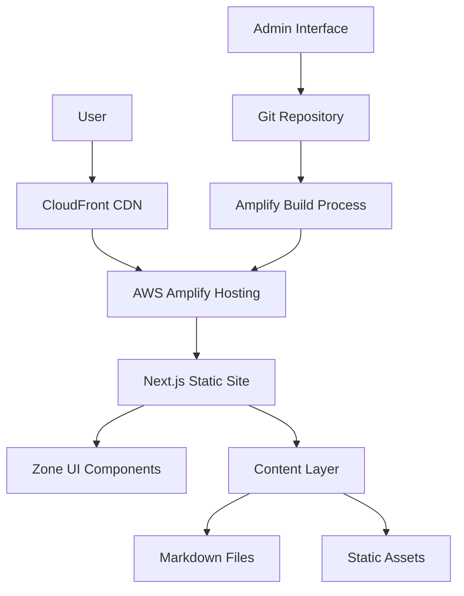

# Design Document

## Overview

The Mobile-First Marketing Website will be built using the Zone UI kit template
with Next.js and Tailwind CSS, optimized for mobile devices and hosted on AWS
Amplify. The design prioritizes mobile user experience (70% of traffic) while
maintaining desktop functionality. The architecture follows a static site
generation approach with Git-based content management for optimal performance
and SEO.

## Architecture

### High-Level Architecture



### Technology Stack

- **Frontend Framework**: Next.js 13+ with App Router
- **UI Framework**: Zone UI Kit + Tailwind CSS
- **Content Management**: Git-based with Markdown files
- **Hosting**: AWS Amplify with CloudFront CDN
- **Build Process**: Static Site Generation (SSG)
- **Performance**: Image optimization, code splitting, lazy loading

## Components and Interfaces

### 1. Layout System

#### Mobile-First Layout Component

```typescript
interface LayoutProps {
  children: React.ReactNode;
  showBottomNav?: boolean;
  pageTitle?: string;
  metaDescription?: string;
}

interface NavigationItem {
  label: string;
  href: string;
  icon: React.ComponentType;
  mobileOnly?: boolean;
}
```

**Design Decisions:**

- Bottom navigation bar for mobile (app-like experience)
- Collapsible hamburger menu for secondary navigation
- Sticky header with minimal height on mobile
- Progressive enhancement for desktop layouts

#### Responsive Breakpoints

```typescript
const breakpoints = {
  mobile: '0px', // Mobile-first default
  tablet: '768px', // iPad and larger tablets
  desktop: '1024px', // Desktop and laptops
  wide: '1280px', // Large desktop screens
};
```

### 2. Page Components

#### Homepage Component

```typescript
interface HomepageProps {
  services: Service[];
  featuredPosts: BlogPost[];
  testimonials: Testimonial[];
}

interface HeroSection {
  title: string;
  subtitle: string;
  ctaButtons: CTAButton[];
  backgroundImage?: string;
  mobileOptimized: boolean;
}
```

**Mobile-First Design:**

- Hero section optimized for vertical mobile screens
- Service cards in single column on mobile, grid on desktop
- Touch-optimized CTA buttons (minimum 44px height)
- Testimonials carousel with swipe gestures

#### Service Pages Component

```typescript
interface ServicePageProps {
  service: Service;
  relatedServices: Service[];
  testimonials: Testimonial[];
}

interface Service {
  slug: string;
  title: string;
  shortDescription: string;
  content: string;
  featuredImage: string;
  icon: string;
  order: number;
  features: string[];
  pricing?: PricingInfo;
}
```

### 3. Content Management Layer

#### Content Processing System

```typescript
interface ContentProcessor {
  getAllPosts(): BlogPost[];
  getPostBySlug(slug: string): BlogPost;
  getAllServices(): Service[];
  getServiceBySlug(slug: string): Service;
  getAllTestimonials(): Testimonial[];
  markdownToHtml(content: string): Promise<string>;
}

interface BlogPost {
  slug: string;
  title: string;
  date: string;
  author: string;
  excerpt: string;
  content: string;
  featuredImage?: string;
  categories: string[];
  tags: string[];
  featured: boolean;
}
```

### 4. Performance Optimization Components

#### Image Optimization Component

```typescript
interface OptimizedImageProps {
  src: string;
  alt: string;
  width: number;
  height: number;
  priority?: boolean;
  mobileBreakpoint?: number;
  className?: string;
}
```

**Mobile Optimization Features:**

- Responsive image sizing based on device
- WebP format with JPEG/PNG fallbacks
- Lazy loading for non-critical images
- Blur-up placeholder technique
- Optimized sizes for mobile-first delivery

## Data Models

### Content Models

#### Blog Post Model

```typescript
interface BlogPost {
  slug: string;
  title: string;
  date: string;
  author: string;
  excerpt: string;
  content: string;
  featuredImage?: string;
  categories: string[];
  tags: string[];
  featured: boolean;
  readingTime?: number;
  seoTitle?: string;
  metaDescription?: string;
}
```

#### Service Model

```typescript
interface Service {
  slug: string;
  title: string;
  shortDescription: string;
  content: string;
  featuredImage: string;
  icon: string;
  order: number;
  features: string[];
  benefits: string[];
  pricing?: {
    startingPrice: number;
    currency: string;
    billingPeriod: string;
  };
  gallery?: string[];
  faqs?: FAQ[];
}
```

#### Testimonial Model

```typescript
interface Testimonial {
  id: string;
  author: string;
  position: string;
  company?: string;
  avatar?: string;
  content: string;
  rating: number;
  featured: boolean;
  order: number;
  serviceRelated?: string[];
}
```

### Configuration Models

#### Site Configuration

```typescript
interface SiteConfig {
  title: string;
  description: string;
  url: string;
  logo: string;
  favicon: string;
  socialMedia: {
    facebook?: string;
    twitter?: string;
    linkedin?: string;
    instagram?: string;
  };
  contact: {
    email: string;
    phone: string;
    address?: string;
  };
  analytics: {
    googleAnalyticsId?: string;
    facebookPixelId?: string;
  };
}
```

## Error Handling

### Client-Side Error Handling

1. **Network Errors**
   - Implement retry mechanisms for failed requests
   - Show user-friendly error messages
   - Provide offline fallback content where possible

2. **Content Loading Errors**
   - Graceful degradation when content fails to load
   - Skeleton loading states for better UX
   - Error boundaries to prevent app crashes

3. **Form Validation Errors**
   - Real-time validation feedback
   - Clear error messages with correction guidance
   - Accessibility-compliant error announcements

### Build-Time Error Handling

1. **Content Validation**
   - Validate Markdown frontmatter structure
   - Check for required fields in content files
   - Ensure image references are valid

2. **Build Process Errors**
   - Comprehensive error logging in Amplify
   - Rollback mechanisms for failed deployments
   - Pre-build validation scripts

## Testing Strategy

### Mobile-First Testing Approach

1. **Device Testing**
   - Test on actual mobile devices (iOS and Android)
   - Use browser dev tools for responsive testing
   - Test on various screen sizes and orientations

2. **Performance Testing**
   - Lighthouse audits for mobile performance
   - Core Web Vitals monitoring
   - Network throttling tests for slower connections

3. **Usability Testing**
   - Touch interaction testing
   - Navigation flow validation
   - Form submission testing on mobile

### Automated Testing

1. **Unit Tests**
   - Component rendering tests
   - Content processing function tests
   - Utility function validation

2. **Integration Tests**
   - Page navigation flows
   - Form submission processes
   - Content loading and display

3. **E2E Tests**
   - Critical user journeys
   - Mobile-specific interactions
   - Cross-browser compatibility

### Performance Monitoring

1. **Core Web Vitals Tracking**
   - Largest Contentful Paint (LCP) < 2.5s
   - First Input Delay (FID) < 100ms
   - Cumulative Layout Shift (CLS) < 0.1

2. **Mobile-Specific Metrics**
   - Time to Interactive on mobile devices
   - Mobile page speed scores
   - Touch response times

## AWS Amplify Integration

### Build Configuration

```yaml
# amplify.yml
version: 1
frontend:
  phases:
    preBuild:
      commands:
        - npm ci
        - npm run content:validate
    build:
      commands:
        - npm run build
        - npm run export
  artifacts:
    baseDirectory: out
    files:
      - '**/*'
  cache:
    paths:
      - node_modules/**/*
      - .next/cache/**/*
```

### Environment Configuration

1. **Environment Variables**
   - `NEXT_PUBLIC_SITE_URL`: Site base URL
   - `NEXT_PUBLIC_GA_ID`: Google Analytics ID
   - `CONTACT_EMAIL`: Contact form recipient
   - `AMPLIFY_BRANCH`: Current deployment branch

2. **Custom Headers**
   - Cache control for static assets
   - Security headers (CSP, HSTS)
   - Performance optimization headers

### Deployment Strategy

1. **Branch-Based Deployments**
   - Main branch: Production deployment
   - Develop branch: Staging environment
   - Feature branches: Preview deployments

2. **Content Updates**
   - Automatic rebuilds on content changes
   - Webhook integration for external content updates
   - Rollback capabilities for content issues

## Mobile Optimization Strategies

### 1. Touch-First Interface Design

- **Navigation**: Bottom tab bar for primary navigation
- **Buttons**: Minimum 44px touch targets
- **Forms**: Large input fields with proper spacing
- **Gestures**: Swipe support for carousels and galleries

### 2. Performance Optimization

- **Critical CSS**: Inline critical styles for above-the-fold content
- **Resource Hints**: Preload critical resources
- **Code Splitting**: Route-based and component-based splitting
- **Image Optimization**: Responsive images with modern formats

### 3. Content Strategy

- **Mobile-First Content**: Shorter paragraphs, scannable text
- **Progressive Disclosure**: Show essential info first, expand on demand
- **Visual Hierarchy**: Clear headings and spacing for mobile reading
- **Call-to-Actions**: Prominent, thumb-friendly CTA placement

### 4. Loading Strategy

- **Above-the-Fold Priority**: Load critical content first
- **Lazy Loading**: Defer non-critical images and components
- **Skeleton Screens**: Show loading placeholders
- **Progressive Enhancement**: Basic functionality first, enhancements second
