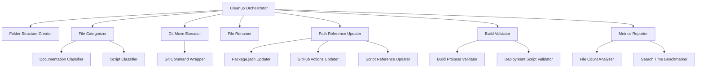

# Design Document: Repository Cleanup and Organization

## Overview

This design specifies a Node.js-based automation system for organizing a Next.js marketing website repository that has accumulated hundreds of documentation files, deployment summaries, validation reports, and scripts at the root level. The system will systematically categorize and relocate files into a logical folder structure, rename files with consistent date conventions, consolidate scripts by purpose, and validate that all runtime dependencies remain intact.

The cleanup system operates as a series of sequential Node.js scripts that can be executed individually or orchestrated together. Each script performs a specific phase of the cleanup (folder creation, file categorization, git moves, renaming, path updates, validation) and creates atomic git commits for easy review and rollback.

### Key Design Principles

1. **Git History Preservation**: All file moves use `git mv` to maintain file history and blame information
2. **Non-Destructive Operations**: Protected files and runtime folders (src/, config/, public/, node_modules/, out/, build-*) are never modified
3. **Incremental Execution**: Each phase can be run independently with clear success/failure reporting
4. **Validation-First**: Build process and deployment scripts are validated after cleanup to ensure no breakage
5. **Atomic Commits**: Each logical phase creates a separate git commit with descriptive messages
6. **Metrics-Driven**: Success is measured quantitatively (root file reduction, search time improvement)

### Scope

**In Scope:**
- Root-level documentation files (deployment summaries, validation reports, architecture docs, quick references)
- Root-level scripts (deployment, validation, testing, monitoring, setup scripts)
- File renaming with date standardization (YYYY-MM-DD format)
- Path reference updates in package.json, GitHub Actions workflows, and deployment scripts
- Build validation (npm run build)
- Deployment script validation
- Navigation index creation (docs/README.md)
- Cleanup metrics reporting

**Out of Scope:**
- Modification of source code in src/ directory
- Changes to configuration files in config/ directory
- Modification of public assets in public/ directory
- Changes to generated folders (node_modules/, out/, build-*, playwright-report/, test-results/, temp-*)
- Content changes to documentation (only location and naming)
- Refactoring of script logic (only location and path references)

## Architecture

### System Components



### Component Responsibilities

**Cleanup Orchestrator** (`scripts/cleanup-orchestrator.js`)
- Coordinates execution of all cleanup phases
- Manages phase dependencies and execution order
- Creates git commits after each phase
- Handles error recovery and rollback
- Generates final summary report

**Folder Structure Creator** (`scripts/cleanup/create-folders.js`)
- Creates docs/ subdirectories (summaries, audits, architecture, decisions, archive)
- Creates scripts/ subdirectories (fixes, migrations, utilities)
- Validates folder creation success
- Reports created folder structure

**File Categorizer** (`scripts/cleanup/categorize-files.js`)
- Scans root directory for documentation and script files
- Classifies files by pattern matching (deployment summaries, validation reports, etc.)
- Identifies files older than 90 days for archival
- Protects governance files (aws-security-standards.md, deployment-standards.md, project-deployment-config.md)
- Generates categorization manifest (JSON file mapping source → destination)

**Git Move Executor** (`scripts/cleanup/git-move-files.js`)
- Reads categorization manifest
- Executes `git mv` commands for each file
- Validates each move operation
- Reports move success/failure
- Creates atomic git commit for moves

**File Renamer** (`scripts/cleanup/rename-files.js`)
- Extracts dates from filenames (various formats)
- Standardizes to YYYY-MM-DD prefix format
- Uses file modification timestamp when no date found
- Executes `git mv` for renames
- Creates atomic git commit for renames

**Path Reference Updater** (`scripts/cleanup/update-references.js`)
- Scans package.json for script path references
- Scans .github/workflows/*.yml for script paths
- Scans scripts/*.js for relative path imports
- Updates all references to new locations
- Creates atomic git commit for reference updates

**Build Validator** (`scripts/cleanup/validate-build.js`)
- Executes `npm run build`
- Validates out/ directory creation
- Checks for expected static files
- Reports build success/failure with details

**Metrics Reporter** (`scripts/cleanup/generate-metrics.js`)
- Counts root-level files before/after
- Calculates percentage reduction
- Reports files moved to each category
- Measures documentation search time improvement
- Generates cleanup summary report

### Data Flow

1. **Phase 1: Folder Creation**
   - Input: Target folder structure specification
   - Output: Created folders, folder creation report
   - Commit: "chore(cleanup): create organized folder structure"

2. **Phase 2: File Categorization**
   - Input: Root directory file list, categorization rules
   - Output: Categorization manifest (JSON)
   - No commit (planning phase)

3. **Phase 3: Documentation Moves**
   - Input: Categorization manifest (documentation files)
   - Output: Moved files, move operation report
   - Commit: "chore(cleanup): organize documentation files"

4. **Phase 4: Script Consolidation**
   - Input: Categorization manifest (script files)
   - Output: Moved scripts, move operation report
   - Commit: "chore(cleanup): consolidate scripts by category"

5. **Phase 5: File Renaming**
   - Input: Moved files, date extraction rules
   - Output: Renamed files, rename operation report
   - Commit: "chore(cleanup): standardize file naming with dates"

6. **Phase 6: Path Reference Updates**
   - Input: Old → new path mappings
   - Output: Updated package.json, workflows, scripts
   - Commit: "chore(cleanup): update path references"

7. **Phase 7: Build Validation**
   - Input: Updated repository state
   - Output: Build validation report
   - No commit (validation phase)

8. **Phase 8: Metrics Generation**
   - Input: Before/after repository state
   - Output: Cleanup metrics report
   - No commit (reporting phase)

### Technology Stack

- **Runtime**: Node.js 22.x (project standard)
- **File System Operations**: Node.js `fs/promises` module
- **Git Operations**: Node.js `child_process.execSync` for `git mv` commands
- **Path Manipulation**: Node.js `path` module
- **Date Parsing**: Custom date extraction with fallback to file stats
- **JSON Processing**: Native JSON.parse/stringify for manifests
- **Build Validation**: `child_process.execSync` for `npm run build`

## Components and Interfaces

### Cleanup Orchestrator

**Interface:**
```javascript
// scripts/cleanup-orchestrator.js

/**
 * Main orchestrator for repository cleanup workflow
 * Executes all phases in sequence with git commits
 */
async function runCleanup(options = {}) {
  // options: { dryRun: boolean, skipValidation: boolean }
  // Returns: { success: boolean, phases: PhaseResult[], metrics: CleanupMetrics }
}

async function runPhase(phaseName, phaseFunction) {
  // Executes a single phase with error handling
  // Creates git commit if phase succeeds
  // Returns: PhaseResult
}

function createGitCommit(message, files = []) {
  // Creates atomic git commit with descriptive message
  // Returns: { success: boolean, commitHash: string }
}
```

**Responsibilities:**
- Coordinate phase execution order
- Handle phase failures and rollback
- Create git commits after successful phases
- Generate final summary report
- Provide dry-run mode for testing

### Folder Structure Creator

**Interface:**
```javascript
// scripts/cleanup/create-folders.js

/**
 * Creates organized folder structure for documentation and scripts
 */
async function createFolderStructure() {
  // Returns: { success: boolean, foldersCreated: string[], errors: string[] }
}

function getFolderStructure() {
  // Returns: { docs: string[], scripts: string[] }
  // docs: ['summaries', 'audits', 'architecture', 'decisions', 'archive']
  // scripts: ['fixes', 'migrations', 'utilities']
}
```

**Folder Structure:**
```
docs/
  summaries/       # Deployment and status summaries
  audits/          # Validation reports and test results
  architecture/    # Infrastructure and design documentation
  decisions/       # Implementation decisions and quick references
  archive/         # Historical documentation (>90 days old)
  README.md        # Navigation index

scripts/
  fixes/           # Bug fix and correction scripts
  migrations/      # One-time migration and setup scripts
  utilities/       # Reusable utility scripts
  lib/             # Shared libraries (preserved)
```

### File Categorizer

**Interface:**
```javascript
// scripts/cleanup/categorize-files.js

/**
 * Categorizes root-level files by pattern matching
 */
async function categorizeFiles() {
  // Returns: CategorizationManifest
}

function classifyDocumentation(filename) {
  // Returns: 'summaries' | 'audits' | 'architecture' | 'decisions' | 'archive' | 'protected' | null
}

function classifyScript(filename) {
  // Returns: 'fixes' | 'migrations' | 'utilities' | 'lib' | null
}

function isProtectedFile(filename) {
  // Returns: boolean
  // Protected: aws-security-standards.md, deployment-standards.md, project-deployment-config.md
}

function isOlderThan90Days(filepath) {
  // Returns: boolean
}
```

**CategorizationManifest Type:**
```typescript
interface CategorizationManifest {
  documentation: {
    summaries: string[];
    audits: string[];
    architecture: string[];
    decisions: string[];
    archive: string[];
    protected: string[];
  };
  scripts: {
    fixes: string[];
    migrations: string[];
    utilities: string[];
  };
  timestamp: string;
  totalFiles: number;
}
```

**Classification Rules:**

Documentation:
- **summaries**: Files matching `*DEPLOYMENT*`, `*SUMMARY*`, `*STATUS*`, `*COMPLETE*`
- **audits**: Files matching `*validation-report*`, `*test-results*`, `*audit*`, `*verification*`
- **architecture**: Files matching `*GUIDE*`, `*ARCHITECTURE*`, `*INFRASTRUCTURE*`, `AWS_*`
- **decisions**: Files matching `*QUICK-REFERENCE*`, `*CHECKLIST*`, `*INSTRUCTIONS*`
- **archive**: Files older than 90 days (any category)
- **protected**: `aws-security-standards.md`, `deployment-standards.md`, `project-deployment-config.md`

Scripts:
- **fixes**: Files matching `fix-*.js`, `*-fix.js`, `repair-*.js`
- **migrations**: Files matching `deploy-*.js`, `setup-*.js`, `configure-*.js`, `migrate-*.js`
- **utilities**: Files matching `validate-*.js`, `test-*.js`, `verify-*.js`, `check-*.js`, `monitor-*.js`

### Git Move Executor

**Interface:**
```javascript
// scripts/cleanup/git-move-files.js

/**
 * Executes git mv commands to preserve file history
 */
async function moveFiles(manifest, category) {
  // category: 'documentation' | 'scripts'
  // Returns: MoveResult
}

function gitMove(source, destination) {
  // Executes: git mv <source> <destination>
  // Returns: { success: boolean, error: string | null }
}

function validateMove(source, destination) {
  // Verifies file was moved successfully
  // Returns: boolean
}
```

**MoveResult Type:**
```typescript
interface MoveResult {
  success: boolean;
  moved: Array<{ source: string; destination: string }>;
  failed: Array<{ source: string; error: string }>;
  totalMoved: number;
  totalFailed: number;
}
```

### File Renamer

**Interface:**
```javascript
// scripts/cleanup/rename-files.js

/**
 * Renames files with standardized date prefixes
 */
async function renameFiles(directory) {
  // Returns: RenameResult
}

function extractDate(filename) {
  // Extracts date from various formats:
  // - FEB-22-2026, NOV-11-2025, DEC-18-2025
  // - 2025-10-15, 20251014
  // - 1760532969283 (timestamp)
  // Returns: Date | null
}

function formatDate(date) {
  // Returns: string (YYYY-MM-DD format)
}

function generateNewFilename(oldFilename, date) {
  // Returns: string (YYYY-MM-DD-purpose-topic.ext)
}

function getFileModificationDate(filepath) {
  // Fallback when no date in filename
  // Returns: Date
}
```

**Date Extraction Patterns:**
```javascript
const DATE_PATTERNS = [
  /(\w{3})-(\d{1,2})-(\d{4})/,           // FEB-22-2026
  /(\d{4})-(\d{2})-(\d{2})/,             // 2025-10-15
  /(\d{8})/,                              // 20251014
  /(\d{13})/,                             // 1760532969283 (timestamp)
];
```

### Path Reference Updater

**Interface:**
```javascript
// scripts/cleanup/update-references.js

/**
 * Updates path references in package.json, workflows, and scripts
 */
async function updateAllReferences(pathMappings) {
  // pathMappings: Map<oldPath, newPath>
  // Returns: UpdateResult
}

async function updatePackageJson(pathMappings) {
  // Updates "scripts" section
  // Returns: { updated: number, errors: string[] }
}

async function updateGitHubWorkflows(pathMappings) {
  // Updates .github/workflows/*.yml
  // Returns: { updated: number, errors: string[] }
}

async function updateScriptReferences(pathMappings) {
  // Updates require() and import statements in scripts/
  // Returns: { updated: number, errors: string[] }
}

function findReferences(content, oldPath) {
  // Returns: string[] (line numbers with references)
}
```

### Build Validator

**Interface:**
```javascript
// scripts/cleanup/validate-build.js

/**
 * Validates build process after cleanup
 */
async function validateBuild() {
  // Returns: BuildValidationResult
}

function runBuild() {
  // Executes: npm run build
  // Returns: { success: boolean, output: string, error: string | null }
}

function validateOutputDirectory() {
  // Checks out/ directory exists and contains expected files
  // Returns: { valid: boolean, missingFiles: string[] }
}

function analyzeBreakage(buildError) {
  // Attempts to identify which moved files caused build failure
  // Returns: string[] (suspected file paths)
}
```

**BuildValidationResult Type:**
```typescript
interface BuildValidationResult {
  success: boolean;
  buildOutput: string;
  outputDirectoryValid: boolean;
  missingFiles: string[];
  suspectedBreakage: string[];
  recommendations: string[];
}
```

### Metrics Reporter

**Interface:**
```javascript
// scripts/cleanup/generate-metrics.js

/**
 * Generates cleanup success metrics
 */
async function generateMetrics(beforeState, afterState) {
  // Returns: CleanupMetrics
}

function countRootFiles(directory) {
  // Returns: number
}

function measureSearchTime(searchTerm) {
  // Simulates finding a documentation file
  // Returns: number (milliseconds)
}

function calculateReduction(before, after) {
  // Returns: number (percentage)
}
```

**CleanupMetrics Type:**
```typescript
interface CleanupMetrics {
  rootFilesBefore: number;
  rootFilesAfter: number;
  reductionPercentage: number;
  filesMoved: {
    summaries: number;
    audits: number;
    architecture: number;
    decisions: number;
    archive: number;
    fixes: number;
    migrations: number;
    utilities: number;
  };
  searchTimeBefore: number;  // milliseconds
  searchTimeAfter: number;   // milliseconds
  searchTimeImprovement: number;  // percentage
  success: boolean;
  timestamp: string;
}
```

### Navigation Index Creator

**Interface:**
```javascript
// scripts/cleanup/create-navigation-index.js

/**
 * Creates docs/README.md navigation index
 */
async function createNavigationIndex(manifest) {
  // Returns: { success: boolean, path: string }
}

function generateIndexContent(manifest) {
  // Returns: string (Markdown content)
}
```

**Navigation Index Structure:**
```markdown
# Documentation Navigation

## Quick Links
- [AWS Security Standards](../aws-security-standards.md)
- [Deployment Standards](../deployment-standards.md)
- [Project Deployment Config](../project-deployment-config.md)

## Documentation Categories

### Summaries
Deployment summaries, status reports, and completion documents.
Examples: deployment summaries, implementation complete docs

### Audits
Validation reports, test results, and verification documents.
Examples: validation reports, test summaries, audit results

### Architecture
Infrastructure guides, architecture documentation, and setup instructions.
Examples: AWS guides, CloudFront configuration, infrastructure docs

### Decisions
Quick references, checklists, and implementation decisions.
Examples: quick reference guides, deployment checklists

### Archive
Historical documentation older than 90 days.

## Date Convention
All files use YYYY-MM-DD prefix format for chronological sorting.
Example: 2026-02-22-deployment-summary.md

## Common Tasks
- Find deployment summary: Check `summaries/` folder
- Find validation report: Check `audits/` folder
- Find setup guide: Check `architecture/` folder
- Find quick reference: Check `decisions/` folder
```

## Data Models

### File Classification

```typescript
interface FileClassification {
  filename: string;
  path: string;
  category: 'documentation' | 'script' | 'protected' | 'ignored';
  subcategory: string;  // summaries, audits, fixes, etc.
  age: number;  // days since modification
  hasDate: boolean;
  extractedDate: Date | null;
  protected: boolean;
}
```

### Path Mapping

```typescript
interface PathMapping {
  oldPath: string;
  newPath: string;
  type: 'documentation' | 'script';
  renamed: boolean;
  references: PathReference[];
}

interface PathReference {
  file: string;
  lineNumber: number;
  context: string;
}
```

### Phase Result

```typescript
interface PhaseResult {
  phase: string;
  success: boolean;
  duration: number;  // milliseconds
  filesProcessed: number;
  errors: string[];
  warnings: string[];
  commitHash: string | null;
}
```

### Cleanup State

```typescript
interface CleanupState {
  startTime: string;
  endTime: string | null;
  phases: PhaseResult[];
  manifest: CategorizationManifest;
  pathMappings: PathMapping[];
  metrics: CleanupMetrics | null;
  success: boolean;
}
```


## Correctness Properties

A property is a characteristic or behavior that should hold true across all valid executions of a system—essentially, a formal statement about what the system should do. Properties serve as the bridge between human-readable specifications and machine-verifiable correctness guarantees.

### Property Reflection

After analyzing all 67 acceptance criteria, I identified several opportunities for consolidation:

**Consolidation 1**: Requirements 1.1-1.8 (folder creation) are all testing the same behavior—that specific directories exist after running the system. These can be combined into a single property that verifies all required folders are created.

**Consolidation 2**: Requirements 5.1-5.10 (protected directories) all test the same behavior—that certain directories are never modified. These can be combined into a single property.

**Consolidation 3**: Requirements 5.11-5.13 (protected files) all test the same behavior—that specific files remain at root. These can be combined into a single property.

**Consolidation 4**: Requirements 2.2-2.5 (file categorization) all test the same pattern—that files matching certain patterns get categorized correctly. These can be combined into a single property about categorization rules.

**Consolidation 5**: Requirements 4.1-4.5 (script categorization) all test the same pattern—that scripts matching certain patterns get categorized correctly. These can be combined into a single property.

**Consolidation 6**: Requirements 6.2-6.6 (navigation index content) all test the same thing—that the navigation index contains expected sections. These can be combined into a single example test.

**Consolidation 7**: Requirements 9.1-9.5 (git commits) all test the same behavior—that separate commits are created for each phase. These can be combined into a single property.

**Consolidation 8**: Requirements 10.1-10.4 (metrics collection) all test the same behavior—that metrics are collected and reported. These can be combined into a single example test.

### Property 1: Git history preservation for file moves

*For any* documentation or script file that is moved during cleanup, the move operation should use `git mv` command so that file history is preserved and can be verified through `git log --follow`.

**Validates: Requirements 2.1**

### Property 2: File categorization by pattern matching

*For any* file matching a categorization pattern (deployment summary, validation report, infrastructure guide, quick reference, bug fix script, deployment script, validation script, monitoring script), the file should be categorized to its corresponding destination directory according to the classification rules.

**Validates: Requirements 2.2, 2.3, 2.4, 2.5, 4.1, 4.2, 4.3, 4.4, 4.5**

### Property 3: Archive categorization by file age

*For any* file older than 90 days (based on modification timestamp), the file should be categorized to docs/archive regardless of its pattern-based category.

**Validates: Requirements 2.6**

### Property 4: Protected file preservation

*For any* file in the protected files list (aws-security-standards.md, deployment-standards.md, project-deployment-config.md), the file should never be moved from the root directory.

**Validates: Requirements 2.7, 5.11, 5.12, 5.13**

### Property 5: Protected directory preservation

*For any* directory in the protected directories list (node_modules, out, build-*, playwright-report, test-results, temp-build, temp-privacy, src, config, public), no files within that directory should be modified or moved during cleanup.

**Validates: Requirements 5.1, 5.2, 5.3, 5.4, 5.5, 5.6, 5.7, 5.8, 5.9, 5.10**

### Property 6: Date extraction from filenames

*For any* filename containing a date in a recognized format (FEB-22-2026, 2025-10-15, 20251014, timestamp), the date extraction function should correctly parse and return the date.

**Validates: Requirements 3.1**

### Property 7: Date formatting standardization

*For any* extracted or fallback date, the formatted date should follow YYYY-MM-DD format.

**Validates: Requirements 3.2**

### Property 8: Filename renaming pattern compliance

*For any* file being renamed, the new filename should follow the pattern YYYY-MM-DD-purpose-topic.ext where the date is either extracted from the original filename or derived from file modification timestamp.

**Validates: Requirements 3.3, 3.4, 3.6**

### Property 9: File extension preservation during rename

*For any* file being renamed, the file extension should be preserved exactly as it was in the original filename.

**Validates: Requirements 3.5**

### Property 10: Scripts/lib directory preservation

*For any* file in the scripts/lib directory, the file should not be moved or categorized during script consolidation.

**Validates: Requirements 4.6**

### Property 11: Path reference updates in package.json

*For any* script path reference in package.json that points to a moved script, the reference should be updated to the new path location.

**Validates: Requirements 4.7, 8.5**

### Property 12: Path reference detection in deployment scripts

*For any* deployment script containing hardcoded file paths, those paths should be detected and updated if they reference moved files.

**Validates: Requirements 8.1, 8.2**

### Property 13: Commit message pattern compliance

*For any* git commit created during cleanup, the commit message should follow the pattern "chore(cleanup): [category] - [description]".

**Validates: Requirements 9.6, 9.7**

### Example Tests

The following acceptance criteria are best tested as specific examples rather than universal properties:

**Example 1: Required folder structure creation**
After running the cleanup system, verify that all required directories exist:
- docs/summaries, docs/audits, docs/architecture, docs/decisions, docs/archive
- scripts/fixes, scripts/migrations, scripts/utilities

**Validates: Requirements 1.1, 1.2, 1.3, 1.4, 1.5, 1.6, 1.7, 1.8**

**Example 2: Navigation index creation and content**
After running the cleanup system, verify that docs/README.md exists and contains:
- List of all documentation subdirectories with descriptions
- Examples of file types in each category
- Quick reference section for common tasks
- Links to protected files at root level
- Section explaining the date convention

**Validates: Requirements 6.1, 6.2, 6.3, 6.4, 6.5, 6.6**

**Example 3: Build validation execution**
After cleanup completes, verify that:
- `npm run build` is executed
- If build fails, error report identifies potentially broken dependencies
- If build succeeds, out/ directory exists with expected static files
- Success/failure is reported appropriately

**Validates: Requirements 7.1, 7.2, 7.3, 7.4, 7.5**

**Example 4: Critical path reference validation**
After cleanup completes, verify that:
- scripts/deploy.js references are intact
- GitHub Actions workflow paths are correct
- package.json script paths are updated

**Validates: Requirements 8.3, 8.4, 8.5**

**Example 5: Phase-based git commit creation**
After running the cleanup system, verify that separate commits exist for:
- Folder structure creation
- Documentation moves
- Script consolidation
- File renames
- Path reference updates

**Validates: Requirements 9.1, 9.2, 9.3, 9.4, 9.5**

**Example 6: Cleanup metrics report generation**
After cleanup completes, verify that the metrics report contains:
- Root-level file count before cleanup
- Root-level file count after cleanup
- Percentage reduction in root-level files
- Number of files moved to each category
- Search time measurements before and after
- Success determination (80% search time improvement threshold)

**Validates: Requirements 10.1, 10.2, 10.3, 10.4, 10.5, 10.6, 10.7**

## Error Handling

### Error Categories

**File System Errors**
- Directory creation failures (permissions, disk space)
- File move failures (locked files, missing source)
- File read/write failures (permissions, corruption)

**Git Operation Errors**
- Git mv command failures (uncommitted changes, conflicts)
- Git commit failures (nothing to commit, merge conflicts)
- Git history verification failures

**Build Validation Errors**
- Build process failures (syntax errors, missing dependencies)
- Output directory validation failures (missing files)
- Deployment script validation failures (broken references)

**Data Validation Errors**
- Invalid date formats in filenames
- Malformed path references
- Invalid categorization patterns

### Error Handling Strategies

**Graceful Degradation**
```javascript
// If date extraction fails, fall back to file modification timestamp
function extractDateWithFallback(filename, filepath) {
  try {
    const extractedDate = extractDate(filename);
    if (extractedDate) return extractedDate;
  } catch (error) {
    console.warn(`Date extraction failed for ${filename}: ${error.message}`);
  }
  
  // Fallback to file modification time
  return getFileModificationDate(filepath);
}
```

**Atomic Operations with Rollback**
```javascript
// Each phase creates a git commit, allowing easy rollback
async function runPhaseWithRollback(phaseName, phaseFunction) {
  const beforeCommit = getCurrentGitCommit();
  
  try {
    const result = await phaseFunction();
    
    if (result.success) {
      await createGitCommit(`chore(cleanup): ${phaseName}`);
      return { success: true, result };
    } else {
      // Phase failed, rollback to before commit
      await gitReset(beforeCommit);
      return { success: false, error: result.error };
    }
  } catch (error) {
    // Unexpected error, rollback to before commit
    await gitReset(beforeCommit);
    throw error;
  }
}
```

**Validation Before Execution**
```javascript
// Validate preconditions before starting cleanup
async function validatePreconditions() {
  const errors = [];
  
  // Check git repository is clean
  if (hasUncommittedChanges()) {
    errors.push('Git repository has uncommitted changes');
  }
  
  // Check Node.js version
  if (!isNodeVersionCompatible()) {
    errors.push('Node.js version must be 22.x or higher');
  }
  
  // Check required directories exist
  if (!fs.existsSync('src') || !fs.existsSync('scripts')) {
    errors.push('Required directories (src, scripts) not found');
  }
  
  // Check protected files exist
  const protectedFiles = [
    'aws-security-standards.md',
    'deployment-standards.md',
    'project-deployment-config.md'
  ];
  
  for (const file of protectedFiles) {
    if (!fs.existsSync(file)) {
      errors.push(`Protected file not found: ${file}`);
    }
  }
  
  return { valid: errors.length === 0, errors };
}
```

**Detailed Error Reporting**
```javascript
// Provide actionable error messages
function reportError(phase, error, context) {
  const report = {
    phase,
    error: error.message,
    context,
    timestamp: new Date().toISOString(),
    recommendations: []
  };
  
  // Add specific recommendations based on error type
  if (error.code === 'EACCES') {
    report.recommendations.push('Check file permissions');
    report.recommendations.push('Run with appropriate user privileges');
  } else if (error.code === 'ENOENT') {
    report.recommendations.push('Verify file exists before operation');
    report.recommendations.push('Check for typos in file path');
  } else if (error.message.includes('git')) {
    report.recommendations.push('Ensure git repository is initialized');
    report.recommendations.push('Check for uncommitted changes');
    report.recommendations.push('Verify git is installed and accessible');
  }
  
  return report;
}
```

**Dry Run Mode**
```javascript
// Allow testing without making actual changes
async function runCleanup(options = {}) {
  const { dryRun = false } = options;
  
  if (dryRun) {
    console.log('Running in DRY RUN mode - no changes will be made');
  }
  
  // Execute phases
  for (const phase of phases) {
    const result = await phase.execute({ dryRun });
    
    if (dryRun) {
      console.log(`[DRY RUN] ${phase.name}: ${result.filesAffected} files would be affected`);
    } else {
      console.log(`${phase.name}: ${result.filesAffected} files processed`);
    }
  }
}
```

### Error Recovery Procedures

**Phase Failure Recovery**
1. Identify failed phase from error report
2. Review phase-specific error details
3. Fix underlying issue (permissions, disk space, etc.)
4. Rollback to before failed phase: `git reset --hard <commit-hash>`
5. Re-run cleanup from beginning or specific phase

**Build Validation Failure Recovery**
1. Review build error output
2. Identify suspected broken file references
3. Manually verify path references in reported files
4. Update incorrect references
5. Re-run build validation: `npm run build`
6. If build succeeds, commit fixes and continue

**Partial Completion Recovery**
1. Review cleanup state file (JSON)
2. Identify completed phases
3. Skip completed phases in next run
4. Resume from next incomplete phase
5. Validate final state after completion

## Testing Strategy

### Dual Testing Approach

This feature requires both unit tests and property-based tests for comprehensive coverage:

**Unit Tests**: Verify specific examples, edge cases, and error conditions
- Specific folder creation scenarios
- Navigation index content validation
- Build validation with known good/bad states
- Git commit message format examples
- Metrics report structure validation

**Property-Based Tests**: Verify universal properties across all inputs
- File categorization rules for randomly generated filenames
- Date extraction for various date formats
- Filename renaming pattern compliance
- Protected file/directory preservation
- Path reference updates for random script paths
- Git history preservation verification

### Property-Based Testing Configuration

**Library**: fast-check (JavaScript property-based testing library)

**Configuration**:
- Minimum 100 iterations per property test
- Each test tagged with feature name and property reference
- Tag format: `Feature: repo-cleanup-scram, Property {number}: {property_text}`

**Example Property Test Structure**:
```javascript
import fc from 'fast-check';

// Feature: repo-cleanup-scram, Property 2: File categorization by pattern matching
test('files matching deployment summary patterns are categorized to docs/summaries', () => {
  fc.assert(
    fc.property(
      fc.string().filter(s => s.includes('DEPLOYMENT') || s.includes('SUMMARY')),
      (filename) => {
        const category = classifyDocumentation(filename);
        return category === 'summaries';
      }
    ),
    { numRuns: 100 }
  );
});

// Feature: repo-cleanup-scram, Property 6: Date extraction from filenames
test('dates in recognized formats are extracted correctly', () => {
  fc.assert(
    fc.property(
      fc.date(),
      (date) => {
        const filename = `DEPLOYMENT-${formatDateForFilename(date)}.md`;
        const extracted = extractDate(filename);
        return extracted && isSameDay(extracted, date);
      }
    ),
    { numRuns: 100 }
  );
});

// Feature: repo-cleanup-scram, Property 9: File extension preservation during rename
test('file extensions are preserved during renaming', () => {
  fc.assert(
    fc.property(
      fc.string({ minLength: 1 }),
      fc.constantFrom('.md', '.js', '.json', '.txt', '.html'),
      (basename, ext) => {
        const originalFilename = basename + ext;
        const renamed = generateNewFilename(originalFilename, new Date());
        return renamed.endsWith(ext);
      }
    ),
    { numRuns: 100 }
  );
});
```

### Unit Testing Focus Areas

**Folder Structure Creation**
```javascript
test('creates all required documentation folders', async () => {
  await createFolderStructure();
  
  expect(fs.existsSync('docs/summaries')).toBe(true);
  expect(fs.existsSync('docs/audits')).toBe(true);
  expect(fs.existsSync('docs/architecture')).toBe(true);
  expect(fs.existsSync('docs/decisions')).toBe(true);
  expect(fs.existsSync('docs/archive')).toBe(true);
});

test('creates all required script folders', async () => {
  await createFolderStructure();
  
  expect(fs.existsSync('scripts/fixes')).toBe(true);
  expect(fs.existsSync('scripts/migrations')).toBe(true);
  expect(fs.existsSync('scripts/utilities')).toBe(true);
});
```

**Navigation Index Content**
```javascript
test('navigation index contains all required sections', async () => {
  const manifest = await categorizeFiles();
  await createNavigationIndex(manifest);
  
  const content = fs.readFileSync('docs/README.md', 'utf-8');
  
  expect(content).toContain('## Documentation Categories');
  expect(content).toContain('### Summaries');
  expect(content).toContain('### Audits');
  expect(content).toContain('### Architecture');
  expect(content).toContain('### Decisions');
  expect(content).toContain('### Archive');
  expect(content).toContain('## Date Convention');
  expect(content).toContain('## Common Tasks');
});

test('navigation index links to protected files', async () => {
  await createNavigationIndex({});
  
  const content = fs.readFileSync('docs/README.md', 'utf-8');
  
  expect(content).toContain('[AWS Security Standards](../aws-security-standards.md)');
  expect(content).toContain('[Deployment Standards](../deployment-standards.md)');
  expect(content).toContain('[Project Deployment Config](../project-deployment-config.md)');
});
```

**Build Validation**
```javascript
test('build validation succeeds when build passes', async () => {
  const result = await validateBuild();
  
  expect(result.success).toBe(true);
  expect(result.outputDirectoryValid).toBe(true);
  expect(result.missingFiles).toHaveLength(0);
});

test('build validation reports suspected breakage on failure', async () => {
  // Simulate build failure by breaking a path reference
  fs.writeFileSync('scripts/deploy.js', 'require("./nonexistent.js")');
  
  const result = await validateBuild();
  
  expect(result.success).toBe(false);
  expect(result.suspectedBreakage.length).toBeGreaterThan(0);
  expect(result.recommendations.length).toBeGreaterThan(0);
});
```

**Git Commit Creation**
```javascript
test('creates separate commits for each phase', async () => {
  const beforeCommits = getGitCommitCount();
  
  await runCleanup();
  
  const afterCommits = getGitCommitCount();
  const expectedPhases = 5; // folder creation, doc moves, script moves, renames, path updates
  
  expect(afterCommits - beforeCommits).toBe(expectedPhases);
});

test('commit messages follow required pattern', async () => {
  await runCleanup();
  
  const recentCommits = getRecentGitCommits(5);
  
  for (const commit of recentCommits) {
    expect(commit.message).toMatch(/^chore\(cleanup\): .+ - .+$/);
  }
});
```

**Metrics Report Generation**
```javascript
test('metrics report contains all required fields', async () => {
  const metrics = await generateMetrics(beforeState, afterState);
  
  expect(metrics).toHaveProperty('rootFilesBefore');
  expect(metrics).toHaveProperty('rootFilesAfter');
  expect(metrics).toHaveProperty('reductionPercentage');
  expect(metrics).toHaveProperty('filesMoved');
  expect(metrics).toHaveProperty('searchTimeBefore');
  expect(metrics).toHaveProperty('searchTimeAfter');
  expect(metrics).toHaveProperty('searchTimeImprovement');
  expect(metrics).toHaveProperty('success');
});

test('success is determined by 80% search time improvement', () => {
  const metrics = {
    searchTimeBefore: 1000,
    searchTimeAfter: 150,
    searchTimeImprovement: 85
  };
  
  expect(determineSuccess(metrics)).toBe(true);
  
  metrics.searchTimeImprovement = 75;
  expect(determineSuccess(metrics)).toBe(false);
});
```

### Edge Cases and Error Conditions

**Edge Case: Files with no date in filename**
```javascript
test('uses file modification timestamp when no date in filename', () => {
  const filename = 'README.md';
  const filepath = '/path/to/README.md';
  
  const date = extractDateWithFallback(filename, filepath);
  
  expect(date).toBeInstanceOf(Date);
  expect(date.getTime()).toBeCloseTo(fs.statSync(filepath).mtime.getTime(), -1000);
});
```

**Edge Case: Files with multiple date formats**
```javascript
test('extracts first valid date from filename with multiple dates', () => {
  const filename = 'DEPLOYMENT-NOV-11-2025-UPDATED-DEC-15-2025.md';
  
  const date = extractDate(filename);
  
  expect(date.getFullYear()).toBe(2025);
  expect(date.getMonth()).toBe(10); // November (0-indexed)
  expect(date.getDate()).toBe(11);
});
```

**Error Condition: Git repository not initialized**
```javascript
test('fails gracefully when git repository not initialized', async () => {
  // Remove .git directory
  fs.rmSync('.git', { recursive: true, force: true });
  
  const result = await runCleanup();
  
  expect(result.success).toBe(false);
  expect(result.errors).toContain('Git repository not initialized');
});
```

**Error Condition: Uncommitted changes**
```javascript
test('fails validation when uncommitted changes exist', async () => {
  // Create uncommitted change
  fs.writeFileSync('test-file.txt', 'uncommitted content');
  
  const validation = await validatePreconditions();
  
  expect(validation.valid).toBe(false);
  expect(validation.errors).toContain('Git repository has uncommitted changes');
});
```

**Error Condition: Protected file in move list**
```javascript
test('prevents moving protected files', () => {
  const protectedFile = 'aws-security-standards.md';
  
  const category = classifyDocumentation(protectedFile);
  
  expect(category).toBe('protected');
  expect(isProtectedFile(protectedFile)).toBe(true);
});
```

### Integration Testing

**End-to-End Cleanup Workflow**
```javascript
test('complete cleanup workflow executes successfully', async () => {
  // Setup: Create test repository state
  await setupTestRepository();
  
  // Execute: Run full cleanup
  const result = await runCleanup();
  
  // Verify: Check all phases completed
  expect(result.success).toBe(true);
  expect(result.phases).toHaveLength(5);
  expect(result.phases.every(p => p.success)).toBe(true);
  
  // Verify: Check folder structure
  expect(fs.existsSync('docs/summaries')).toBe(true);
  expect(fs.existsSync('scripts/fixes')).toBe(true);
  
  // Verify: Check files moved
  expect(fs.existsSync('docs/summaries/2026-02-22-deployment-summary.md')).toBe(true);
  
  // Verify: Check build still works
  const buildResult = await validateBuild();
  expect(buildResult.success).toBe(true);
  
  // Verify: Check metrics
  expect(result.metrics.reductionPercentage).toBeGreaterThan(80);
});
```

### Test Execution

**Run all tests:**
```bash
npm test
```

**Run property-based tests only:**
```bash
npm test -- --testNamePattern="Property"
```

**Run unit tests only:**
```bash
npm test -- --testNamePattern="^(?!.*Property)"
```

**Run with coverage:**
```bash
npm test -- --coverage
```

### Test Coverage Goals

- **Line Coverage**: Minimum 90%
- **Branch Coverage**: Minimum 85%
- **Function Coverage**: Minimum 95%
- **Property Test Coverage**: All 13 properties implemented
- **Example Test Coverage**: All 6 example scenarios implemented

## Implementation Notes

### Execution Order

The cleanup system must execute phases in this specific order:

1. **Precondition Validation**: Verify git repository is clean, Node.js version is compatible
2. **Folder Structure Creation**: Create all required directories
3. **File Categorization**: Scan and classify all root-level files
4. **Documentation Moves**: Move documentation files using git mv
5. **Script Consolidation**: Move script files using git mv
6. **File Renaming**: Rename files with date prefixes using git mv
7. **Path Reference Updates**: Update package.json, workflows, and script references
8. **Navigation Index Creation**: Generate docs/README.md
9. **Build Validation**: Run npm run build and verify output
10. **Metrics Generation**: Calculate and report cleanup metrics

### Performance Considerations

**Batch Git Operations**
```javascript
// Instead of individual git mv commands, batch them
async function batchGitMove(moves) {
  const batchSize = 50;
  
  for (let i = 0; i < moves.length; i += batchSize) {
    const batch = moves.slice(i, i + batchSize);
    const commands = batch.map(m => `git mv "${m.source}" "${m.destination}"`);
    
    await execSync(commands.join(' && '));
  }
}
```

**Parallel File Processing**
```javascript
// Process file categorization in parallel
async function categorizeFilesParallel(files) {
  const results = await Promise.all(
    files.map(async (file) => {
      const category = await classifyFile(file);
      return { file, category };
    })
  );
  
  return results;
}
```

**Incremental State Saving**
```javascript
// Save state after each phase for recovery
async function runPhaseWithStateCheckpoint(phase) {
  const result = await phase.execute();
  
  await saveCleanupState({
    completedPhases: [...state.completedPhases, phase.name],
    timestamp: new Date().toISOString()
  });
  
  return result;
}
```

### Dry Run Mode

The cleanup system should support a dry-run mode that:
- Simulates all operations without making changes
- Reports what would be done
- Validates preconditions
- Generates preview of final state

```bash
node scripts/cleanup-orchestrator.js --dry-run
```

### Rollback Support

Each phase creates a git commit, allowing easy rollback:

```bash
# Rollback to before cleanup
git log --oneline | grep "chore(cleanup)"
git reset --hard <commit-before-cleanup>

# Rollback specific phase
git revert <phase-commit-hash>
```

### Logging and Monitoring

**Structured Logging**
```javascript
const logger = {
  info: (message, context) => console.log(JSON.stringify({ level: 'info', message, context, timestamp: new Date().toISOString() })),
  warn: (message, context) => console.warn(JSON.stringify({ level: 'warn', message, context, timestamp: new Date().toISOString() })),
  error: (message, context) => console.error(JSON.stringify({ level: 'error', message, context, timestamp: new Date().toISOString() }))
};
```

**Progress Reporting**
```javascript
// Report progress during long-running operations
async function moveFilesWithProgress(files) {
  const total = files.length;
  let completed = 0;
  
  for (const file of files) {
    await gitMove(file.source, file.destination);
    completed++;
    
    if (completed % 10 === 0) {
      console.log(`Progress: ${completed}/${total} files moved (${Math.round(completed/total*100)}%)`);
    }
  }
}
```

### Configuration

**Cleanup Configuration File** (`scripts/cleanup/config.json`)
```json
{
  "protectedFiles": [
    "aws-security-standards.md",
    "deployment-standards.md",
    "project-deployment-config.md"
  ],
  "protectedDirectories": [
    "node_modules",
    "out",
    "build-*",
    "playwright-report",
    "test-results",
    "temp-build",
    "temp-privacy",
    "src",
    "config",
    "public"
  ],
  "archiveThresholdDays": 90,
  "dateFormats": [
    "MMM-DD-YYYY",
    "YYYY-MM-DD",
    "YYYYMMDD",
    "timestamp"
  ],
  "categorization": {
    "documentation": {
      "summaries": ["*DEPLOYMENT*", "*SUMMARY*", "*STATUS*", "*COMPLETE*"],
      "audits": ["*validation-report*", "*test-results*", "*audit*", "*verification*"],
      "architecture": ["*GUIDE*", "*ARCHITECTURE*", "*INFRASTRUCTURE*", "AWS_*"],
      "decisions": ["*QUICK-REFERENCE*", "*CHECKLIST*", "*INSTRUCTIONS*"]
    },
    "scripts": {
      "fixes": ["fix-*.js", "*-fix.js", "repair-*.js"],
      "migrations": ["deploy-*.js", "setup-*.js", "configure-*.js", "migrate-*.js"],
      "utilities": ["validate-*.js", "test-*.js", "verify-*.js", "check-*.js", "monitor-*.js"]
    }
  }
}
```

### Success Criteria

The cleanup is considered successful when:
1. All required folders are created
2. All files are categorized and moved correctly
3. All protected files and directories remain untouched
4. All path references are updated correctly
5. Build process succeeds (npm run build)
6. Root-level file count is reduced by at least 80%
7. Documentation search time is reduced by at least 80%
8. All git commits are created with proper messages
9. Navigation index is created with all required content
10. Metrics report is generated with all required fields

### Maintenance Considerations

**Future File Additions**
- New files added to root should be manually categorized or follow naming conventions
- Consider adding a pre-commit hook to warn about root-level file additions

**Pattern Updates**
- Categorization patterns may need updates as new file types are added
- Configuration file allows easy pattern updates without code changes

**Periodic Re-runs**
- Cleanup can be re-run periodically to organize new files
- Idempotent design allows safe re-execution

**Documentation Updates**
- Navigation index should be regenerated when new categories are added
- Consider automating navigation index updates
