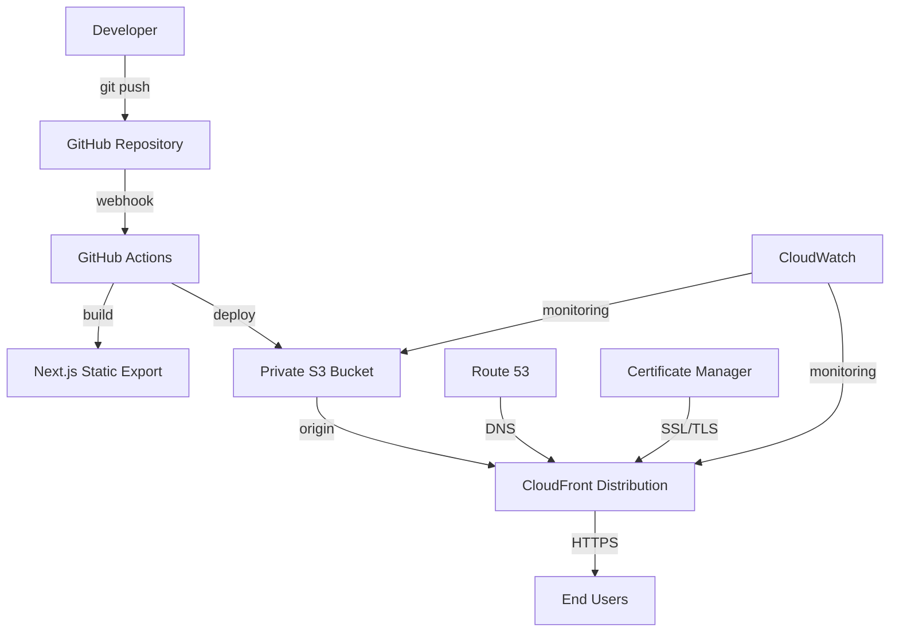

# Design Document

## Overview

This design document outlines the architecture and implementation approach for
migrating from AWS Amplify to a secure S3 + CloudFront deployment solution. The
solution addresses the persistent Next.js SSR detection issues in Amplify by
using purpose-built static hosting infrastructure.

## Architecture

### High-Level Architecture



### Component Architecture

#### 1. Source Control and CI/CD

- **GitHub Repository**: Source code management
- **GitHub Actions**: Automated build and deployment pipeline
- **Secrets Management**: AWS credentials stored in GitHub Secrets

#### 2. Build Process

- **Next.js Static Export**: Generates static HTML, CSS, and JS files
- **Asset Optimization**: Compression and optimization of static assets
- **Build Validation**: Automated testing and validation before deployment

#### 3. Storage Layer

- **Private S3 Bucket**: Secure storage for static assets
- **Bucket Policies**: Restrict access to CloudFront only
- **Lifecycle Policies**: Automatic cleanup of old versions

#### 4. Content Delivery Network

- **CloudFront Distribution**: Global content delivery
- **Origin Access Control (OAC)**: Secure access to S3 bucket
- **Cache Behaviors**: Optimized caching for different content types
- **Security Headers**: Enhanced security through response headers

#### 5. DNS and SSL

- **Route 53**: DNS management (optional)
- **AWS Certificate Manager**: SSL/TLS certificate management
- **Custom Domain**: Professional domain configuration

#### 6. Monitoring and Logging

- **CloudWatch**: Metrics and monitoring
- **CloudTrail**: API call auditing
- **S3 Access Logs**: Request logging for analysis

## Components and Interfaces

### 1. GitHub Actions Workflow

**Purpose**: Automated build and deployment pipeline

**Interface**:

```yaml
# Triggers: push to main branch, manual dispatch
# Inputs: branch, environment
# Outputs: deployment status, site URL
```

**Key Functions**:

- Build Next.js static export
- Run tests and validation
- Upload to S3 with proper cache headers
- Invalidate CloudFront cache
- Send deployment notifications

### 2. S3 Bucket Configuration

**Purpose**: Secure storage for static website files

**Configuration**:

```json
{
  "bucketName": "mobile-marketing-site-{environment}",
  "region": "us-east-1",
  "publicAccessBlock": {
    "blockPublicAcls": true,
    "blockPublicPolicy": true,
    "ignorePublicAcls": true,
    "restrictPublicBuckets": true
  },
  "versioning": "enabled",
  "encryption": "AES256"
}
```

**Bucket Policy**: Allows access only from CloudFront OAC

### 3. CloudFront Distribution

**Purpose**: Global content delivery with security and performance optimization

**Configuration**:

```json
{
  "origins": [
    {
      "domainName": "bucket-name.s3.region.amazonaws.com",
      "originAccessControl": "OAC-ID",
      "customHeaders": []
    }
  ],
  "cacheBehaviors": [
    {
      "pathPattern": "*.html",
      "ttl": 300,
      "compress": true
    },
    {
      "pathPattern": "/_next/static/*",
      "ttl": 31536000,
      "compress": true
    }
  ],
  "customErrorResponses": [
    {
      "errorCode": 404,
      "responseCode": 200,
      "responsePagePath": "/index.html"
    }
  ]
}
```

### 4. Deployment Scripts

**Purpose**: Automated deployment and management tools

**Components**:

- `deploy-to-s3.js`: Main deployment script
- `setup-infrastructure.js`: Initial AWS resource setup
- `rollback.js`: Deployment rollback functionality
- `cache-invalidation.js`: CloudFront cache management

### 5. Monitoring Dashboard

**Purpose**: Real-time monitoring and alerting

**Metrics**:

- Deployment success/failure rates
- CloudFront cache hit ratios
- S3 request patterns
- Error rates and response times
- Cost tracking and optimization

## Data Models

### 1. Deployment Configuration

```typescript
interface DeploymentConfig {
  environment: 'development' | 'staging' | 'production';
  bucketName: string;
  distributionId: string;
  customDomain?: string;
  certificateArn?: string;
  cacheSettings: CacheSettings;
  securityHeaders: SecurityHeaders;
}
```

### 2. Cache Settings

```typescript
interface CacheSettings {
  htmlTtl: number; // 5 minutes for HTML
  staticAssetTtl: number; // 1 year for static assets
  apiTtl: number; // No cache for API responses
  compressionEnabled: boolean;
  gzipTypes: string[];
}
```

### 3. Security Configuration

```typescript
interface SecurityHeaders {
  strictTransportSecurity: string;
  contentTypeOptions: string;
  frameOptions: string;
  xssProtection: string;
  referrerPolicy: string;
  contentSecurityPolicy?: string;
}
```

## Error Handling

### 1. Build Failures

**Detection**: GitHub Actions build step failure **Response**:

- Stop deployment process
- Notify developers via GitHub/Slack
- Maintain previous working version
- Log detailed error information

### 2. Upload Failures

**Detection**: S3 upload errors or timeouts **Response**:

- Retry with exponential backoff
- Partial upload recovery
- Rollback to previous version if critical
- Alert operations team

### 3. CloudFront Issues

**Detection**: Distribution errors or high error rates **Response**:

- Automatic cache invalidation retry
- Fallback to S3 direct access (emergency only)
- Health check monitoring
- Escalation procedures

### 4. DNS/SSL Issues

**Detection**: Certificate expiration or DNS resolution failures **Response**:

- Automated certificate renewal
- DNS health monitoring
- Backup certificate management
- Emergency contact procedures

## Testing Strategy

### 1. Unit Testing

**Scope**: Deployment scripts and utility functions **Tools**: Jest, Node.js
testing frameworks **Coverage**: 90%+ code coverage for critical deployment
logic

### 2. Integration Testing

**Scope**: End-to-end deployment process **Environment**: Dedicated testing AWS
account **Tests**:

- Complete deployment pipeline
- Rollback procedures
- Cache invalidation
- Security header validation

### 3. Performance Testing

**Scope**: Site performance and CDN effectiveness **Metrics**:

- Page load times from multiple regions
- Cache hit ratios
- Time to first byte (TTFB)
- Core Web Vitals compliance

### 4. Security Testing

**Scope**: Infrastructure and application security **Tests**:

- S3 bucket access validation
- CloudFront security headers
- SSL/TLS configuration
- Penetration testing (quarterly)

### 5. Disaster Recovery Testing

**Scope**: Backup and recovery procedures **Frequency**: Monthly **Scenarios**:

- Complete infrastructure failure
- Data corruption recovery
- Regional outage response
- Security incident response

## Performance Considerations

### 1. Caching Strategy

**Static Assets**: 1-year cache with versioned filenames **HTML Files**:
5-minute cache for content updates **API Responses**: No cache to ensure
freshness **Images**: Optimized formats with long cache times

### 2. Compression

**Gzip/Brotli**: Enabled for all text-based content **Image Optimization**: WebP
format with fallbacks **Minification**: CSS, JS, and HTML minification **Bundle
Splitting**: Optimal chunk sizes for caching

### 3. Global Distribution

**Edge Locations**: Utilize all CloudFront edge locations **Regional
Optimization**: Optimize for primary user regions **Latency Monitoring**: Track
performance from key markets **Failover Strategy**: Multi-region backup
capabilities

### 4. Cost Optimization

**Storage Classes**: Use appropriate S3 storage classes **Cache Optimization**:
Maximize cache hit ratios **Data Transfer**: Minimize origin requests **Resource
Cleanup**: Automated cleanup of old versions

## Security Implementation

### 1. Access Control

**S3 Bucket**: Private with OAC-only access **IAM Roles**: Least privilege for
all operations **API Keys**: No long-term access keys in CI/CD **Network
Security**: VPC endpoints where applicable

### 2. Data Protection

**Encryption**: S3 server-side encryption (SSE-S3) **Transit Security**:
HTTPS/TLS 1.2+ only **Backup Security**: Encrypted backups with retention
**Audit Logging**: Complete audit trail of all operations

### 3. Application Security

**Security Headers**: Comprehensive security header implementation **Content
Security Policy**: Strict CSP for XSS prevention **Input Validation**:
Sanitization of all user inputs **Dependency Security**: Regular security
updates and scanning

### 4. Monitoring and Alerting

**Real-time Monitoring**: CloudWatch dashboards and alarms **Security Events**:
Automated detection and response **Compliance Monitoring**: AWS Config rules for
compliance **Incident Response**: Documented procedures and contacts
