# Design Document: SCRAM Proof-Driven Conversion

## Overview

This design covers the third SCRAM evolution pass, transforming the Vivid Media Cheshire site into a proof-driven enquiry system. The pass narrows the homepage to two core services (website redesign and hosting), introduces new proof-driven and decision-support components including SpeedProofBlock, NYCCProofBlock, TheFeedGroupProofBlock, StockPhotographyProofBlock, AuthorityProofBlock, and ThisIsForYouIf, unifies the CTA system site-wide, restores authority proof on the photography page, rewrites the hosting page, strengthens the website design page, and tightens copy and CTAs on pricing, about, contact, and services pages.

The site is a Next.js static export (no server-side rendering at runtime) deployed via S3 + CloudFront. All changes are TSX component modifications and new component creation. No backend, API, or database changes are involved.

### Design Principles

1. Proof placement follows the Proof Hierarchy: speed > NYCC > THEFEEDGROUP > photography publication > stock photography demand
2. Every proof block answers three questions: what changed, by how much, and why it matters
3. CTA system is unified: "Send me your website" + "Email me directly" everywhere except photography
4. The site must feel lighter after changes, not heavier
5. Copy rules: short sentences, first person ("I"), no em dashes, no filler

### Key Decisions

- New proof block components are created as standalone files in `src/components/scram/` to match the existing component pattern
- The existing `CTABlock`, `ProblemHero`, `WhyWebsitesFail`, and selected SCRAM components are reused where their current structure still supports the proof-driven flow. Page-level changes should prefer prop-driven updates over component rewrites unless the component itself blocks correct implementation.
- The `SpeedToEnquiries` component is replaced on the homepage by the new `SpeedProofBlock` which includes before/after data and source attribution
- Homepage section order is enforced by TSX render order in `src/app/page.tsx`
- The hosting page implementation currently lives at `src/app/services/hosting/page.tsx`, but the live canonical route must be `/services/website-hosting/`. All links, metadata, schema, breadcrumbs, and sitemap references must use the canonical route consistently.

---

## Architecture

### Component Architecture

```mermaid
graph TD
    subgraph Pages
        HP[page.tsx - Homepage]
        PP[photography/page.tsx]
        WD[website-design/page.tsx]
        HO[hosting/page.tsx]
        PR[pricing/page.tsx]
        AB[about/page.tsx]
        CO[contact/page.tsx]
        SV[services/page.tsx]
    end

    subgraph Existing SCRAM Components
        PH[ProblemHero]
        CTA[CTABlock]
        PM[ProblemMirror]
        WWF[WhyWebsitesFail]
        STE[SpeedToEnquiries]
        NS[NumberedSteps]
        OH[ObjectionHandler]
        AAB[AntiAgencyBlock]
        SEG[ServiceEntryGuide]
    end

    subgraph New Proof Components
        SPB[SpeedProofBlock]
        NPB[NYCCProofBlock]
        TFG[TheFeedGroupProofBlock]
        STP[StockPhotographyProofBlock]
        APB[AuthorityProofBlock]
        TIFY[ThisIsForYouIf]
    end

    HP --> PH
    HP --> CTA
    HP --> WWF
    HP --> SPB
    HP --> NPB
    HP --> TFG
    HP --> STP

    PP --> PH
    PP --> CTA
    PP --> APB
    PP --> STP

    WD --> PH
    WD --> CTA
    WD --> SPB
    WD --> TIFY

    HO --> PH
    HO --> CTA
```



### File Structure for New Components

```
src/components/scram/
├── SpeedProofBlock.tsx        (NEW)
├── NYCCProofBlock.tsx         (NEW)
├── TheFeedGroupProofBlock.tsx (NEW)
├── StockPhotographyProofBlock.tsx (NEW)
├── AuthorityProofBlock.tsx    (NEW)
├── ThisIsForYouIf.tsx         (NEW)
├── CTABlock.tsx               (UNCHANGED)
├── ProblemHero.tsx            (UNCHANGED)
├── WhyWebsitesFail.tsx        (UNCHANGED)
├── ProblemMirror.tsx          (UNCHANGED)
├── NumberedSteps.tsx          (UNCHANGED)
├── ObjectionHandler.tsx       (UNCHANGED)
├── AntiAgencyBlock.tsx        (UNCHANGED)
├── SpeedToEnquiries.tsx       (UNCHANGED - retained only if needed elsewhere, not used on homepage in this pass)
├── ServiceEntryGuide.tsx      (UNCHANGED)
└── BlogPostCTA.tsx            (UNCHANGED)
```

---

## Components and Interfaces

### New Component: SpeedProofBlock

Displays before/after speed improvement data with source attribution.

```typescript
interface SpeedProofBlockProps {
  /** Variant controls visual size: 'full' for homepage, 'compact' for service pages */
  variant?: 'full' | 'compact';
  /** Source attribution text, e.g. "Data from my own photography website migration" */
  sourceAttribution: string;
}
```

Renders:
- Before metric: 14+ seconds load time, performance score 56
- After metric: under 2 seconds load time, performance score 99
- Outcome connection: links speed to people staying, seeing the offer, higher enquiry chance
- Source attribution line (visible, not hidden)
- `sourceAttribution` is required in both `full` and `compact` variants and must remain visibly rendered.
- Full variant: larger visual with chart-style before/after bars
- Compact variant: inline before/after with smaller footprint (for website-design page)

### New Component: NYCCProofBlock

Displays NYCC operational proof with prioritised metrics.

```typescript
interface NYCCProofBlockProps {
  /** Optional heading override */
  heading?: string;
}
```

Renders (in priority order):
1. Reduced admin time: 8 hours per year saved
2. Clearer booking and information structure, fewer confused enquiries
3. Social growth: 270 followers, 66 posts, 475 reactions in 90 days
4. Optional client quote or praise line
- Any quote or praise line is supporting proof only and must not visually outrank the operational proof.
- Answers: what changed, by how much, why it matters
- Attributed to NYCC project

### New Component: TheFeedGroupProofBlock

Displays THEFEEDGROUP campaign data with the message that traffic alone does not fix a weak website.

```typescript
interface TheFeedGroupProofBlockProps {
  /** Optional heading override */
  heading?: string;
}
```

Renders:
- 40 clicks, 1.25K impressions, ~3.14% CTR, ~£3.58 average CPC
- Message: traffic does not fix a weak website; the page has to match what people search for
- Attributed to THEFEEDGROUP Google Ads campaign
- Uses one consistent figure set (no mixing rounded alternatives)
- The component must use one approved final figure set only. No alternate rounded values may appear in props, copy, or schema.

### New Component: StockPhotographyProofBlock

Compact proof section showing stock photography revenue growth as behaviour/consistency proof.

```typescript
interface StockPhotographyProofBlockProps {
  /** Variant: 'homepage' renders smaller/lower hierarchy, 'photography' renders with more detail */
  variant?: 'homepage' | 'photography';
}
```

Renders:
- Revenue growth: $2.36 to $1,166.07
- One revenue trend chart or image
- One or two top-selling image examples
- Include a short interpretation line conveying that Joe learns from repeated demand rather than guesswork.
- Homepage variant: visually smaller, lower hierarchy than SpeedProofBlock and NYCCProofBlock
- Photography variant: includes heading "Proof that I know what people repeatedly need" and more image examples

### New Component: AuthorityProofBlock

Displays publication authority proof for the photography page.

```typescript
interface AuthorityProofBlockProps {
  /** Array of publication proof items */
  publications: Array<{
    name: string;
    imageSrc: string;
    imageAlt: string;
    caption: string;
  }>;
}
```

Renders:
- Named publications with proof images (not hidden behind expandable sections)
- Each item shows the publication name, image, and caption describing the context
- Framed as "images used in real media, commercial, and editorial contexts"
- Each publication item must be supported by visible portfolio or proof content on the page. Unsupported publication names must not be rendered.

### New Component: ThisIsForYouIf

Decision-language section for the website design page.

```typescript
interface ThisIsForYouIfProps {
  /** Array of condition strings */
  conditions: string[];
  /** Optional heading override */
  heading?: string;
}
```

Renders:
- Heading: "This is for you if" (or override)
- List of conditions with check marks
- Stronger decision language than the existing "Who this is for" section

---

## Page-Level Changes

### Homepage (Priority 1) — `src/app/page.tsx`

New section order (10 sections):

| # | Section | Component | Status |
|---|---------|-----------|--------|
| 1 | Hero | `ProblemHero` | Modify props |
| 2 | Above-fold CTA | `CTABlock` | Keep as-is |
| 3 | Why websites fail | `WhyWebsitesFail` | Keep as-is |
| 4 | Speed proof | `SpeedProofBlock` (NEW) | Replace `SpeedToEnquiries` |
| 5 | NYCC proof | `NYCCProofBlock` (NEW) | Replace `ProblemMirror` |
| 6 | Two services | Inline JSX (2-card grid) | Replace 5-card grid |
| 7 | THEFEEDGROUP proof | `TheFeedGroupProofBlock` (NEW) | Replace `NumberedSteps` |
| 8 | Final CTA | `CTABlock` | Keep, add "what happens next" body |
| 9 | Stock photography proof | `StockPhotographyProofBlock` (NEW) | Replace `ObjectionHandler` |
| 10 | Blog | Existing blog section | Move to end |

This stock photography proof section must be visually subordinate to the speed and NYCC proof blocks.

The StockPhotographyProofBlock is intentionally placed after the final CTA as supporting authority content. It must not interrupt the main conversion path.

Sections to remove from homepage:
- `ProblemMirror` (replaced by NYCC proof)
- `NumberedSteps` "How it works" (replaced by THEFEEDGROUP proof)
- `ObjectionHandler` "You might be wondering" (replaced by stock photography proof)
- Remove any intermediate CTA block that duplicates the same action without adding new information or proof context.
- Pricing range + location H2 section
- `ServiceEntryGuide`
- `AntiAgencyBlock`
- `TestimonialsCarousel`
- Pricing Teaser section
- Contact Form section

FAQ changes:
- Keep only: redesign, hosting, speed, enquiry clarity questions
- Remove: Google Ads, areas covered, timelines questions
- Move Google Ads FAQ content to ad-campaigns service page
- The homepage FAQ schema must be derived from the same trimmed visible FAQ content to avoid mismatch.

Schema changes:
- Update `buildFAQPage` to match trimmed FAQ list
- Keep all other schemas

### Photography Page (Priority 2) — `src/app/services/photography/page.tsx`

Changes:
- Add `AuthorityProofBlock` with BBC, FT, Business Insider, CNN, AutoTrader, The Times (only those supported by visible portfolio images)
- Add `StockPhotographyProofBlock` with `variant="photography"`
- Change CTA system: replace "Call Joe" / "Discuss your shoot" with "Book your photoshoot" (primary) and "View portfolio" (secondary)
- Remove hidden or expandable media proof. Display all required proof images visibly on the page. The gallery may still use a grid layout that keeps the page light and scannable.
- Keep gallery but reframe captions for editorial/commercial presentation

### Website Design Page (Priority 3) — `src/app/services/website-design/page.tsx`

Changes:
- Add `SpeedProofBlock` with `variant="compact"` and appropriate source attribution
- Replace existing "Who this is for" section with `ThisIsForYouIf` component using stronger decision language: "your website gets visits but no enquiries", "people ask basic questions instead of using the site", "your site looks fine but does not move people to act"
- Strengthen proof section with named examples
- Verify CTA system uses "Send me your website" + "Email me directly" (already correct)
- The compact speed proof variant must not visually duplicate the homepage proof block. It should reuse the same data with a shorter footprint.

### Hosting Page (Priority 4) — `src/app/services/hosting/page.tsx`

Full rewrite:
- Hero must use the framing: "Your website is slow. People leave."
- Delete: "What I tested and what worked" section (current Core Pitch equivalent)
- Replace current case study blocks with three outcome-led blocks:
  1. "People stop leaving before the page loads"
  2. "Your website becomes easier to trust"
  3. "You do not have to manage the technical side"
- Keep performance before/after screenshots but simplify intro copy
- Replace current FAQ-style "How It Works" with a clean 3-column grid (3 steps, short copy, no circles, no floating badges)
- Keep CTA system (already correct)
- Connect speed improvement to enquiry generation throughout

### Pricing Page (Priority 5) — `src/app/pricing/page.tsx`

Changes:
- Keep hero framing: "Most websites do not need a small tweak. They need fixing."
- Replace above-fold CTA: change "Call Joe" to "Send me your website", change "Email me your project" to "Email me directly"
- Replace mid-page CTA secondary: change "Email me your project" to "Email me directly"
- Replace end-of-page CTA secondary: change "Email me your project" to "Email me directly"
- Visually prioritise website redesign and hosting sections (move them first, add visual emphasis)
- Keep "Who this is for / not for" section
- Remove "Call Joe" as any CTA label

### About Page (Priority 6) — `src/app/about/page.tsx`

Changes:
- Replace above-fold CTA: change "Call Joe" to "Send me your website"
- Tighten ProblemMirror: make statement more grounded, less broad
- Trim "Real work, not theory" section: remove generic/broad messaging, keep concrete proof
- Keep credentials and work context images

### Contact Page (Priority 7) — `src/app/contact/page.tsx`

Changes:
- If a CTA block is retained above the form on the Contact_Page, its primary action should scroll to the form anchor on the same page. If no such block is retained, the page title and form itself should serve as the primary action without redundant CTA routing.
- Replace mid-page CTA: change "Call Joe now" to "Send me your website", change secondary to "Email me directly"
- Replace end-of-page CTA: change "Call Joe" secondary to "Email me directly"
- Tighten support copy to: "Send the URL and tell me what feels wrong."
- Keep phone number in contact details sidebar (not as major CTA)

### Services Page (Priority 8) — `src/app/services/page.tsx`

Changes:
- Shorten support copy to reduce duplication between hero and CTA
- Review CTA deduplication: hero already points to primary action, avoid repeating same ask without new value
- Replace end-of-page CTA primary label "Get in touch" with "Send me your website"
- Keep all five service cards

---

## Data Models

No new database or API data models are required. Proof data used across multiple pages should be stored in shared constants and passed into components via props where appropriate.

### Proof Data Constants

Proof data shared across multiple components or pages should be stored in a shared constants file rather than duplicated inside component internals.

```typescript
// SpeedProofBlock internal data
const SPEED_PROOF = {
  before: { loadTime: '14+', performanceScore: 56 },
  after: { loadTime: '<2', performanceScore: 99 },
  unit: 'seconds',
};

// NYCCProofBlock internal data
const NYCC_PROOF = {
  adminTimeSaved: '8 hours per year',
  outcomes: ['Clearer booking and information structure', 'Fewer confused enquiries'],
  social: { followers: 270, posts: 66, reactions: 475, period: '90 days' },
  attribution: 'NYCC project',
};

// TheFeedGroupProofBlock internal data
const THEFEEDGROUP_PROOF = {
  clicks: 40,
  impressions: '1.25K',
  ctr: '3.14%',
  avgCpc: '£3.58',
  attribution: 'THEFEEDGROUP Google Ads campaign',
};

// StockPhotographyProofBlock internal data
const STOCK_PROOF = {
  revenueStart: '$2.36',
  revenueEnd: '$1,166.07',
  interpretation: 'I do not guess what people click on. I have built this by learning what people repeatedly need.',
};
```

### CTA System Data

```typescript
// Standard CTA pair (all pages except photography)
const STANDARD_CTA = {
  primaryLabel: 'Send me your website',
  primaryHref: '/contact/',
  secondaryLabel: 'Email me directly',
  secondaryHref: 'mailto:joe@vividmediacheshire.com',
};

// Photography CTA pair
const PHOTOGRAPHY_CTA = {
  primaryLabel: 'Book your photoshoot',
  primaryHref: '#contact',
  secondaryLabel: 'View portfolio',
  secondaryHref: '#gallery',
};
```


---

## Correctness Properties

*A property is a characteristic or behavior that should hold true across all valid executions of a system — essentially, a formal statement about what the system should do. Properties serve as the bridge between human-readable specifications and machine-verifiable correctness guarantees.*

### Property 1: Primary CTA consistency across non-photography pages

*For any* page in the site except the Photography Page, every CTA block's primary label should be "Send me your website" and its primary href should point to `/contact/`.

**Validates: Requirements 12.1, 14.3, 15.6**

### Property 2: Secondary CTA consistency across all pages

*For any* page in the site, every CTA block's secondary label should be "Email me directly" and its secondary href should be `mailto:joe@vividmediacheshire.com`, except on the Photography Page where the secondary label should be "View portfolio".

**Validates: Requirements 12.2**

### Property 3: No deprecated CTA labels on any page

*For any* page in the site, the strings "Book a free call", "Get started", "Request a review", "Check availability", and "Call Joe" shall not appear as CTA button labels (primary or secondary) in any CTA block, except where phone contact appears in non-CTA contact details, footer, metadata, or schema.

**Validates: Requirements 12.3, 12.8**

### Property 4: CTA block action consistency within a page

*For any* page containing multiple CTA blocks, all CTA blocks on that page shall use the same primary label and the same secondary label, ensuring a single dominant action per page.

**Validates: Requirements 12.5, 12.6**

### Property 5: Speed proof source attribution

*For any* page displaying speed proof data (load time or performance score metrics), the page shall contain visible source attribution text identifying whether the data comes from Joe's own website or a client project.

**Validates: Requirements 4.7, 20.1**

### Property 6: Publication proof requires visible support

*For any* publication name displayed in the authority proof section of the Photography Page, there shall exist visible supporting proof on the same page linking that publication name to a portfolio image, caption, or authority proof item.

**Validates: Requirements 16.3**

### Property 7: Flyer ROI context restriction

*For any* page in the site, the Vivid Auto flyer campaign data (£13,563.92 revenue, £546 cost, 2,380% ROI) shall not appear outside of a section explicitly framed as a flyer or offline campaign context.

**Validates: Requirements 20.4**

### Property 8: Proof hierarchy ordering

Where multiple proof blocks appear on the same page, their order should follow the Proof Hierarchy unless a page-specific design requirement intentionally lowers a supporting proof block, such as stock photography proof on the homepage or photography authority proof on the photography page.

**Validates: Requirements 20.7**

### Property 9: Copy rules — no "we" and no em dashes

*For any* new or modified text content rendered on any page, the content shall not contain the word "we" used in first-person context (excluding quoted third-party text), and shall not contain em dash characters (—).

**Validates: Requirements 22.2, 22.3**

### Property 10: Reassurance and phrase repetition limits

*For any* page in the site, each of the following phrases shall appear at most once: "I reply the same day", "based in Nantwich and Crewe", "you deal directly with me", and "I fix that" (or close variants like "I fix that for").

**Validates: Requirements 23.1, 23.2, 23.3, 24.3**

### Property 11: Proof block spacing — no excessive stacking

Consecutive proof-heavy sections shall either be separated by a non-proof section or clearly differentiated by visual hierarchy, spacing, and narrative role so the page does not feel heavy.

**Validates: Requirements 24.1**

### Property 12: CTA spacing — no clustered CTA pressure

Pages shall avoid clustered CTA pressure. No two adjacent sections should both function primarily as CTA sections unless one serves a distinct transitional role.

**Validates: Requirements 24.2**

### Property 13: At least one proof element before final CTA

*For any* major page modified in this pass (Homepage, Photography, Website Design, Hosting, Pricing), the page shall contain at least one proof element or proof block that appears before the final (end-of-page) CTA block.

**Validates: Requirements 25.8**

---

## Error Handling

This feature involves static page restructuring with no runtime error paths. Error handling considerations are limited to build-time and content integrity:

1. **Build-time validation**: The Next.js static export build (`npm run build`) will catch any TSX syntax errors, missing imports, or broken component references. If a new proof component is imported but the file does not exist, the build fails.

2. **Image loading failures**: New proof block components reference image paths. If an image file is missing, the Next.js `<Image>` component renders a broken image. The deployment validator script (`scripts/deployment-validator.js`) should be extended to check that all referenced image paths exist in the build output.

3. **Link integrity**: CTA blocks link to `/contact/` and `mailto:` addresses. These are static and do not fail at runtime. The existing link validation in the CI/CD pipeline covers this.

4. **Schema consistency**: Updated FAQ schemas must match the visible FAQ content. If the schema lists questions that are not visible on the page, Google may flag a structured data mismatch. The schema arrays should be derived from the same data source as the visible FAQ items.

5. **Content mismatch**: Proof data (speed metrics, NYCC metrics, THEFEEDGROUP metrics) is hardcoded in component internals. If the same data needs to appear in multiple places (e.g., speed proof on homepage and website-design page), it should be imported from a shared constant to prevent drift.

6. **Asset path verification**: All new proof components must use verified existing asset paths before deployment.

---

## Testing Strategy

### Dual Testing Approach

This feature requires both unit tests and property-based tests:

- **Unit tests**: Verify specific page structures, section ordering, content presence, and component rendering for concrete examples
- **Property-based tests**: Verify universal rules that must hold across all pages (CTA consistency, copy rules, phrase limits, proof ordering)

### Property-Based Testing Configuration

- **Library**: `fast-check` (already available in the project via vitest)
- **Minimum iterations**: 100 per property test
- **Tag format**: Each test tagged with `Feature: scram-proof-driven-conversion, Property {number}: {property_text}`

### Unit Test Coverage

Unit tests should cover:
- Homepage 10-section order verification
- Each new proof component renders correct data points
- Photography page authority proof displays all supported publications
- Hosting page rewrite contains outcome-led blocks and 3-column grid
- FAQ trimming: homepage FAQs cover only approved topics
- Each page's CTA labels match the approved system
- Homepage service scope reduced to redesign and hosting only
- Stock photography proof block rendered in a visually lower hierarchy than primary homepage proof blocks
- Proof attribution correctness for homepage and photography page contexts

### Property Test Coverage

Each of the 13 correctness properties maps to a single property-based test:

| Property | Test Strategy |
|----------|--------------|
| 1. Primary CTA consistency | Generate random non-photography page, verify primary CTA label |
| 2. Secondary CTA consistency | Generate random page, verify secondary CTA label |
| 3. No deprecated labels | Generate random page, verify no banned strings in CTA blocks |
| 4. CTA block consistency | For pages with multiple CTA blocks, verify all use same labels |
| 5. Speed proof attribution | For pages with speed data, verify attribution text present |
| 6. Publication proof support | For each publication name, verify matching image exists |
| 7. Flyer ROI restriction | For all pages, verify flyer data absent outside flyer context |
| 8. Proof hierarchy ordering | For pages with multiple proofs, verify correct order |
| 9. Copy rules | For generated text samples, verify no "we" or em dashes |
| 10. Phrase repetition | For each page, count phrase occurrences, verify max 1 |
| 11. Proof spacing | For pages with multiple proof-heavy sections, verify they are either separated by a non-proof section or clearly differentiated by hierarchy and spacing |
| 12. CTA spacing | For all pages, verify adjacent sections do not create clustered CTA pressure unless one serves a distinct transitional role |
| 13. Proof before final CTA | For major pages, verify proof exists before end-of-page CTA |

### Test File Structure

```
tests/
├── scram-proof-conversion-properties.test.ts   (property-based tests for all 13 properties)
├── scram-proof-homepage.test.ts                (unit tests for homepage structure)
├── scram-proof-components.test.ts              (unit tests for new proof components)
└── scram-proof-pages.test.ts                   (unit tests for page-specific changes)
```
