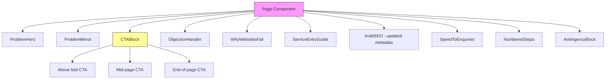

# Design Document: SCRAM Website Overhaul

## Overview

This design covers the full SCRAM (Structure, Copy, Reassurance, Authority, Meta) overhaul of the Vivid Media Cheshire Next.js static site. The overhaul transforms the site from feature-led messaging to problem-led messaging centred on the core question: "Not getting enquiries from your website?"

The site is a Next.js static export deployed via S3 + CloudFront. All changes are to existing React page components (`src/app/`), shared UI components (`src/components/`), and metadata configuration (`src/lib/seo.ts`, `src/config/metadata.config.ts`). No new routes are introduced. No backend changes are required.

The implementation follows the mandated priority order:
1. Homepage (`src/app/page.tsx`)
2. Website Design Service Page (`src/app/services/website-design/page.tsx`)
3. Services Overview Page (`src/app/services/page.tsx`)
4. CTA System (global components)
5. Blog CTA implementation
6. Remaining service pages (hosting, ad-campaigns, analytics, photography)
7. Metadata updates across all pages

## Architecture

### Current Architecture

The site is a standard Next.js App Router static export:

```
src/
├── app/                          # Page routes (static export)
│   ├── page.tsx                  # Homepage
│   ├── layout.tsx                # Root layout (brand suffix in title)
│   ├── services/
│   │   ├── page.tsx              # Services overview
│   │   ├── website-design/       # Primary service
│   │   ├── hosting/              # Hosting service
│   │   ├── ad-campaigns/         # Ads service
│   │   ├── analytics/            # Analytics service
│   │   └── photography/          # Photography service
│   ├── blog/                     # Blog listing + [slug] posts
│   ├── about/                    # About page
│   ├── contact/                  # Contact page
│   ├── pricing/                  # Pricing page
│   └── free-audit/               # Free audit page
├── components/
│   ├── layout/                   # Header, Footer, MobileMenu
│   ├── sections/                 # Reusable page sections
│   ├── ui/                       # UI primitives (sticky bars, buttons)
│   ├── seo/                      # Schema.org components
│   └── ...                       # Individual components
├── config/
│   ├── site.ts                   # Site-wide config
│   └── metadata.config.ts        # Social sharing metadata config
└── lib/
    ├── seo.ts                    # buildSEO() metadata builder
    ├── metadata-generator.ts     # Social metadata generator
    └── blog-api.ts               # Blog content API
```

### Architectural Approach

This overhaul is a content and component refactor, not a structural migration. The approach:

1. **In-place page rewrites**: Each page component is rewritten to follow the problem → solution → next step flow. No new routes.
2. **New shared components**: A small set of reusable SCRAM components are created to enforce consistency across pages.
3. **Metadata updates**: All `buildSEO()` and `generateSocialMetadata()` calls are updated to use problem-led titles and pain + location + outcome descriptions.
4. **No infrastructure changes**: Deployment remains S3 + CloudFront via `scripts/deploy.js` and GitHub Actions.



## Components and Interfaces

### New Shared Components

These components enforce SCRAM consistency across all pages. They live in `src/components/scram/`.

#### 1. `ProblemHero`

Replaces the current feature-led hero sections with a problem-led hero following the Positioning_Stack.

```typescript
// src/components/scram/ProblemHero.tsx
interface ProblemHeroProps {
  /** Problem-led heading, e.g. "Not getting enquiries from your website?" */
  heading: string;
  /** Subline with local reference, e.g. "I fix websites for South Cheshire businesses..." */
  subline: string;
  /** Above-the-fold CTA label */
  ctaLabel: string;
  /** CTA href (anchor or route) */
  ctaHref: string;
  /** Optional proof element text, e.g. "Tested in real Cheshire businesses" */
  proofText?: string;
  /** Optional hero image src */
  imageSrc?: string;
  /** Optional hero image alt */
  imageAlt?: string;
}
```

Renders: heading, subline with local reference, CTA button, optional proof element, optional image. All above the fold. Mobile-first layout with problem statement + CTA visible without scrolling. On the Homepage, `proofText` MUST be provided to satisfy the above-the-fold proof requirement (Requirement 21). The proof element should use one of: an ROI stat with context, a real project reference, or "Tested in real businesses" positioning. No exaggerated or unverifiable claims.

#### 2. `CTABlock`

A reusable call-to-action block offering multiple low-friction contact options.

```typescript
// src/components/scram/CTABlock.tsx
interface CTABlockProps {
  /** Heading text for the CTA block */
  heading: string;
  /** Supporting copy */
  body?: string;
  /** Primary CTA label, e.g. "Book a call" */
  primaryLabel: string;
  /** Primary CTA href */
  primaryHref: string;
  /** Secondary CTA label, e.g. "Email me directly" */
  secondaryLabel: string;
  /** Secondary CTA href */
  secondaryHref: string;
  /** Visual variant for different page positions */
  variant: 'above-fold' | 'mid-page' | 'end-of-page';
  /** Optional reassurance line, e.g. "I reply the same day" */
  reassurance?: string;
}
```

Renders: heading, body, two contact options (call + email minimum), reassurance line. All buttons meet 44x44px minimum tap target. Variant controls background colour and spacing to differentiate the three positions per page.

#### 3. `ProblemMirror`

Displays a visitor frustration statement that mirrors what the visitor is likely thinking.

```typescript
// src/components/scram/ProblemMirror.tsx
interface ProblemMirrorProps {
  /** The frustration statement, e.g. "My website looks fine but no one contacts me" */
  statement: string;
  /** Optional follow-up that connects to the solution */
  followUp?: string;
}
```

Renders: a styled quote-like block with the frustration statement and optional follow-up. Uses a left border accent and italic styling to visually distinguish from regular copy.

#### 4. `ObjectionHandler`

Addresses common visitor objections with real-experience-based responses.

```typescript
// src/components/scram/ObjectionHandler.tsx
interface Objection {
  question: string;
  answer: string;
}

interface ObjectionHandlerProps {
  /** Section heading */
  heading?: string;
  /** Array of objection Q&A pairs */
  objections: Objection[];
}
```

Renders: a section with objection questions and active-voice answers. Used on Homepage and Website Design page. Addresses: "Will this work for my business?", "Is this worth the cost?", "I've tried marketing before and it didn't work".

#### 5. `WhyWebsitesFail`

Explains why websites fail to generate enquiries, leading into the solution.

```typescript
// src/components/scram/WhyWebsitesFail.tsx
interface WhyWebsitesFailProps {
  /** Optional custom heading */
  heading?: string;
  /** Whether to include the solution CTA at the end */
  showSolutionCTA?: boolean;
  /** Optional custom CTA heading when showSolutionCTA is true */
  solutionCtaHeading?: string;
}
```

Renders: a section covering slow performance, poor structure, and unclear messaging as reasons websites fail. Uses real business language, not technical jargon. Leads directly into the solution offering when `showSolutionCTA` is true. Used on Homepage and Website Design page (Requirements 27.1, 27.2).

#### 5a. `SpeedToEnquiries`

Connects website speed to enquiry generation, framing speed as a business outcome rather than a technical feature.

```typescript
// src/components/scram/SpeedToEnquiries.tsx
interface SpeedToEnquiriesProps {
  /** Optional custom heading */
  heading?: string;
  /** Optional supporting copy override */
  body?: string;
}
```

Renders: a section that directly links faster load times to increased enquiries. Default copy connects speed to business outcomes (e.g. "A slow site loses enquiries before visitors even see what you offer"). Used on Homepage and Website Design page (Requirements 22.1, 22.3, 22.4).

#### 5b. `NumberedSteps`

Replaces circle-based step indicators with clean, left-aligned numbered steps.

```typescript
// src/components/scram/NumberedSteps.tsx
interface Step {
  /** Step number (displayed as "1.", "2.", etc.) */
  number: number;
  /** Step title */
  title: string;
  /** Step description */
  description: string;
}

interface NumberedStepsProps {
  /** Section heading, e.g. "How It Works" */
  heading?: string;
  /** Array of steps */
  steps: Step[];
}
```

Renders: a left-aligned list of numbered steps with title and description. No circle-based UI elements, no centred step indicators. Simple, scannable layout (Requirements 4.1, 4.2).

#### 6. `BlogPostCTA`

Mandatory end-of-post CTA for all blog posts.

```typescript
// src/components/scram/BlogPostCTA.tsx
interface BlogPostCTAProps {
  /** Problem reminder text */
  problemReminder: string;
  /** Solution statement */
  solutionStatement: string;
}
```

Renders: problem reminder, solution statement, and link to `/services/website-design/`. Always links to the Website Design service page as the primary conversion path.

#### 7. `ServiceEntryGuide`

A "Start here" guidance section that maps visitor problems to specific services.

```typescript
// src/components/scram/ServiceEntryGuide.tsx
// No props needed — content is static
```

Renders: a section with three paths:
- "Not getting enquiries?" → Website Design
- "Site too slow?" → Hosting (performance fixes)
- "Ads not working?" → Ad Campaigns

#### 8. `AntiAgencyBlock`

Positioning section comparing direct service delivery with agency structure.

```typescript
// src/components/scram/AntiAgencyBlock.tsx
// No props needed — content is static
```

Renders: a professional comparison highlighting direct communication, no account managers, and practical implementation. Maintains professional tone without negative language about agencies.

### Existing Components Modified

| Component | File | Change |
|---|---|---|
| `HeroWithCharts` | `src/components/HeroWithCharts.tsx` | Replaced by `ProblemHero` on homepage |
| `StickyCTA` | `src/components/StickyCTA.tsx` | Updated copy from "Ready to grow your business?" to problem-led variants |
| `Header` | `src/components/layout/Header.tsx` | No structural change; navigation order already correct (Services first) |
| `Footer` | `src/components/layout/Footer.tsx` | No change |
| `ServiceCard` | `src/components/services/ServiceCard.tsx` | Updated descriptions to problem-led copy |
| `BlogHeroImage` | `src/components/blog/BlogHeroImage.tsx` | No change |

### Page-Level Changes Summary

| Page | Key Changes |
|---|---|
| Homepage | Replace `HeroWithCharts` with `ProblemHero` (proof element required above fold, Req 21). Add `WhyWebsitesFail` (Req 27.1), `SpeedToEnquiries` (Req 22.3), `ObjectionHandler` (Req 23.1), `ServiceEntryGuide` (Req 28), `AntiAgencyBlock` (Req 24), `NumberedSteps` for "How It Works" replacing circle-based indicators (Req 4.1). Three `CTABlock` positions (Req 26.1). Pricing range statement (Req 10.1). Problem mirrors (Req 8.1). Local references throughout (Req 7.2). Location-specific H2 (Req 18.2). Mobile-first: problem + proof + CTA in first viewport (Req 30.1). |
| Website Design | Rewrite hero to problem-led with `ProblemHero`. Add `WhyWebsitesFail` (Req 27.2), `SpeedToEnquiries` (Req 22.4), `ObjectionHandler` (Req 23.1), `ProblemMirror` (Req 8.3). Three `CTABlock` positions. "Who this is for" / "Who this is NOT for" (Req 10.2, 10.3). Micro-proof elements (Req 13.3). Location-specific H2 (Req 18.1). Cross-links to related services (Req 17.2). Personal service reassurance (Req 11.1, 11.2). |
| Services Overview | Rewrite header to problem-led. Add `ServiceEntryGuide` (Req 28). Pricing range (Req 10.1). Three `CTABlock` positions. Local H2 headings (Req 18.1). Website Design listed first (Req 3.1). Service cards use problem-led descriptions. |
| Hosting | Reposition as "Fix a slow or expensive website" (Req 3.2). Problem-led hero via `ProblemHero`. `ProblemMirror` (Req 8.3). Cross-link to Website Design (Req 17.2). Three `CTABlock` positions. Personal service reassurance (Req 11.1, 11.2). Location-specific H2 (Req 18.1). Micro-proof (Req 13.3). |
| Ad Campaigns | Problem-led hero ("Ads not bringing in leads?"). `ProblemMirror` (Req 8.3). Cross-link to Website Design and Analytics (Req 17.2). Three `CTABlock` positions. Personal service reassurance (Req 11.1, 11.2). Location-specific H2 (Req 18.1). Micro-proof (Req 13.3). |
| Analytics | Problem-led hero ("Not sure what's working?"). `ProblemMirror` (Req 8.3). Cross-link to Website Design and Ads (Req 17.2). Three `CTABlock` positions. Personal service reassurance (Req 11.1, 11.2). Location-specific H2 (Req 18.1). Micro-proof (Req 13.3). |
| Photography | Maintain existing content guidelines: photography-hero.webp, only "3,500+ licensed images" and "90+ countries", narrative copy, no legacy metric grids (Req 19). Add problem-led framing, `ProblemMirror`, `CTABlock` positions, local references. |
| Blog [slug] | Add `BlogPostCTA` at end of every post (Req 25.1, 25.2). Ensure internal link to Website Design (Req 16.1). Contextual links to relevant services (Req 16.2). |
| About | Add local credibility signals — Nantwich, NYCC work (Req 14.1). "Tested in real business environments" positioning (Req 13.1). Problem-led framing. `CTABlock` positions. |
| Contact | Three `CTABlock` positions. Low-friction contact options (Req 12.3). Personal service reassurance (Req 11.2). Local references. |
| Pricing | Pricing range with "who this is for" / "who this is NOT for" (Req 10.2, 10.3). Three `CTABlock` positions. Problem-led framing. |
| Free Audit | Problem-led framing. Three `CTABlock` positions. Local references. |
| All pages | Update `buildSEO()` calls with pain + location + outcome metadata (Req 15, 20). Ensure 140-160 char descriptions (Req 15.5). All CTA buttons 44x44px minimum tap target (Req 30.2). No absolute claims (Req 29.2). Active voice throughout (Req 6.2). |


## Data Models

### Metadata Structure

All page metadata follows the existing `buildSEO()` interface from `src/lib/seo.ts`. No schema changes are needed. The changes are to the content passed to these functions.

**Current metadata pattern** (feature-led):
```typescript
export const metadata = buildSEO({
  intent: "Website Hosting & Migration",
  description: "Secure cloud hosting with 82% faster load times...",
  canonicalPath: "/services/website-hosting/",
});
```

**New metadata pattern** (pain + location + outcome):
```typescript
export const metadata = buildSEO({
  intent: "Fix a Slow or Expensive Website",
  description: "Is your website slow and costing too much? I fix hosting for South Cheshire businesses. Faster load times, lower costs, and more enquiries. Based in Nantwich.",
  canonicalPath: "/services/hosting/",
});
```

### Metadata Constraints

The existing `buildSEO()` function enforces:
- Title: max 36 characters (before " | Vivid Media Cheshire" suffix added by layout)
- Description: 140-155 characters (validated and truncated)
- Canonical URLs: trailing slash normalisation

The requirements specify 140-160 characters for meta descriptions. The current `cleanDescription()` function truncates at 155. This is within the 140-160 range and does not need changing — 155 is the optimal length for search display.

### Page Content Data

No new data models are introduced. All content is hardcoded in page components as JSX, following the existing pattern. The SCRAM components accept content via props (strings and arrays), not from external data sources.

### Blog Post CTA Data

The `BlogPostCTA` component receives its content via props. A default set of props will be defined as constants:

```typescript
// src/components/scram/BlogPostCTA.tsx
const DEFAULT_PROBLEM = "Still not getting enquiries from your website?";
const DEFAULT_SOLUTION = "I design fast, problem-led websites that turn visitors into enquiries for South Cheshire businesses.";
```

These defaults can be overridden per blog post if needed, but the standard pattern covers most cases.

### Navigation Data

The navigation items in `src/components/layout/Header.tsx` remain unchanged:
```typescript
const navigationItems = [
  { label: 'Home', href: '/' },
  { label: 'Services', href: '/services' },
  { label: 'Pricing', href: '/pricing' },
  { label: 'Blog', href: '/blog' },
  { label: 'About', href: '/about' },
  { label: 'Contact', href: '/contact' },
];
```

Website Design is already the first service listed in the Services overview page. The navigation structure does not need modification.


## Correctness Properties

*A property is a characteristic or behavior that should hold true across all valid executions of a system — essentially, a formal statement about what the system should do. Properties serve as the bridge between human-readable specifications and machine-verifiable correctness guarantees.*

### Property 1: Every service page leads with a problem statement

*For any* service page in the site (`website-design`, `hosting`, `ad-campaigns`, `analytics`, `photography`), the first content section after the page header must contain a problem-led statement (referencing visitor pain, not features) before any feature descriptions or technical details appear.

**Validates: Requirements 2.1, 2.2**

### Property 2: No feature-first headings remain on any page

*For any* page in the site, no H1 or H2 heading should match known feature-first patterns (e.g. "Websites, Ads & Analytics", "Website Hosting & Migration", "Strategic Ad Campaigns"). All headings should be problem-led or outcome-led.

**Validates: Requirements 2.3, 6.1, 20.1, 20.2**

### Property 3: Every page has CTAs in three positions

*For any* page in the site (excluding privacy-policy and thank-you), the page must contain at least three `CTABlock` instances or equivalent CTA elements: one in the hero/above-fold area, one in the mid-page area, and one before the footer.

**Validates: Requirements 5.1, 5.3, 5.4, 26.1**

### Property 4: Every CTA offers at least two contact options including email

*For any* `CTABlock` component rendered on the site, it must present at least two contact options, and one of those options must be an email or direct message option.

**Validates: Requirements 5.2, 12.1, 12.2**

### Property 5: CTA wording varies across positions on each page

*For any* page with three CTA blocks, the heading text of each CTA block must be distinct from the other two on the same page.

**Validates: Requirements 26.2**

### Property 6: All CTA buttons meet minimum tap target size

*For any* CTA button element rendered by `CTABlock` or equivalent CTA components, the element must have a minimum tap target of 44x44 pixels (enforced via CSS classes `min-w-[44px] min-h-[44px]` or `min-h-[48px]` equivalent).

**Validates: Requirements 26.3, 30.2**

### Property 7: Every page contains at least one specific local reference

*For any* page in the site (excluding privacy-policy), the rendered content must contain at least one of: "South Cheshire", "Nantwich", or "Crewe".

**Validates: Requirements 7.1, 7.3**

### Property 8: Problem mirrors appear on homepage and every service page

*For any* page in the set {homepage, website-design, hosting, ad-campaigns, analytics, photography}, the page must contain at least one `ProblemMirror` component or equivalent problem-mirroring statement that reflects a common visitor frustration.

**Validates: Requirements 8.1, 8.3**

### Property 9: No absolute guarantee language on any page

*For any* page in the site, the rendered content must not contain absolute guarantee phrases such as "guaranteed results", "100% success rate", "always works", or "guaranteed".

**Validates: Requirements 9.3, 29.1, 29.2**

### Property 10: Service pages with pricing include audience fit statements

*For any* service page that displays pricing information, the page must include both a "who this is for" statement and a "who this is NOT for" statement.

**Validates: Requirements 10.2, 10.3**

### Property 11: Personal service reassurance on every service page

*For any* service page, the page must contain both "deal directly with me" (or equivalent first-person direct service) messaging and "reply the same day" (or equivalent response time) messaging.

**Validates: Requirements 11.1, 11.2**

### Property 12: Micro-proof elements on every service page

*For any* service page, the page must contain at least one micro-proof element: an ROI figure with context, a campaign learning, a performance metric, or a real project reference.

**Validates: Requirements 13.3**

### Property 13: Location-specific H2 headings on every service page

*For any* service page, at least one H2 heading must contain a location-specific term ("South Cheshire", "Nantwich", or "Crewe").

**Validates: Requirements 14.3, 18.1, 18.3**

### Property 14: Meta descriptions follow pain + location + outcome structure

*For any* page in the site, the meta description must contain at least one location reference ("South Cheshire", "Nantwich", or "Crewe") and must not match known feature-led patterns.

**Validates: Requirements 15.1, 15.2, 15.3, 20.3**

### Property 15: Meta description length within bounds

*For any* page in the site, the meta description must be between 140 and 160 characters in length.

**Validates: Requirements 15.5, 15.6**

### Property 16: Every blog post links to Website Design service page

*For any* blog post rendered on the site, the post content or end CTA must contain at least one link to `/services/website-design/`.

**Validates: Requirements 16.1, 17.1**

### Property 17: Blog post end CTA contains required elements

*For any* blog post, the end-of-post CTA must contain a problem reminder statement, a solution statement, and a link to `/services/website-design/`.

**Validates: Requirements 25.1, 25.2**

### Property 18: Cross-links between related service pages

*For any* service page, the page must contain at least one internal link to another service page (e.g. hosting links to website-design, ads links to analytics).

**Validates: Requirements 17.2**

### Property 19: Photography page content guidelines

*For any* render of the photography service page, the page must reference "photography-hero.webp" as the hero image, must contain only the approved statistics ("3,500+ licensed images" and "90+ countries"), and must not contain legacy metric values ("3+", "50+", "100+" as standalone statistics).

**Validates: Requirements 19.1, 19.2, 19.4**

### Property 20: Website Design is the primary service in all listings

*For any* service listing or navigation element that displays multiple services, Website Design must appear first in the list, before hosting, ads, analytics, and photography.

**Validates: Requirements 3.1, 3.3, 3.4**

### Property 21: No circle-based step indicators on any page

*For any* page in the site that displays process steps (e.g. "How It Works"), the steps must use left-aligned numbered layout and must not use circle-based UI elements (no rounded-full step indicators, no centred step circles).

**Validates: Requirements 4.1, 4.2**

### Property 22: Pricing range displayed on homepage and services overview

*For any* render of the homepage or services overview page, the page must contain a pricing range statement (referencing a range such as "£500" and "£1,200" or equivalent).

**Validates: Requirements 10.1, 10.4**

### Property 23: Homepage hero contains above-the-fold proof element

*For any* render of the homepage, the hero section must contain a proof element (an ROI stat with context, a real project reference, or "Tested in real businesses" positioning) within the above-the-fold area, and the proof element must not contain exaggerated or unverifiable claims.

**Validates: Requirements 21.1, 21.2, 21.3, 21.4**

### Property 24: Speed-to-enquiries connection on key pages

*For any* render of the homepage or website design service page, the page must contain copy that directly connects website speed to enquiry generation (referencing both speed/performance and enquiries/leads in the same section).

**Validates: Requirements 22.1, 22.3, 22.4**

### Property 25: Objection handling on homepage and website design page

*For any* render of the homepage or website design service page, the page must contain an objection-handling section with at least three objection-response pairs addressing visitor concerns.

**Validates: Requirements 23.1, 23.2**

### Property 26: WhyWebsitesFail section leads into solution

*For any* page that contains a "Why Websites Fail" section, the section must be immediately followed by a solution offering or CTA element (not by unrelated content).

**Validates: Requirements 27.3**

### Property 27: Case studies include context and limitations

*For any* case study or ROI figure displayed on the site, the content must include contextual information (conditions, limitations, or realistic expectations) alongside the result. No ROI figure should appear without accompanying context.

**Validates: Requirements 9.2, 29.3**


## Error Handling

### Build-Time Validation

Since this is a static site, most errors are caught at build time:

1. **Missing CTA enforcement**: The blog post rendering pipeline (`src/app/blog/[slug]/page.tsx`) must include `BlogPostCTA` as a mandatory element. If a blog post template omits it, the build should still succeed but the component is hardcoded into the template — not conditionally rendered.

2. **Metadata validation**: The existing `buildSEO()` function in `src/lib/seo.ts` already validates description length (truncates at 155 chars) and normalises canonical URLs. No additional error handling needed.

3. **Image fallbacks**: The `ProblemHero` component should gracefully handle missing `imageSrc` by rendering without an image (text-only hero). The photography page must always specify `photography-hero.webp`.

### Runtime Considerations

Since the site is a static export deployed via S3 + CloudFront:

- No server-side errors to handle — all pages are pre-rendered HTML
- Client-side JavaScript errors in interactive components (forms, mobile menu) are handled by existing error boundaries in the root layout
- Contact form submissions go to external services; form components already handle submission errors with user-facing messages
- CloudFront serves cached static files; 404s are handled by the existing `not-found.tsx` page

### Content Integrity

- The `ProblemMirror`, `ObjectionHandler`, and `WhyWebsitesFail` components receive content via props — if props are missing or empty, the components should render nothing rather than broken UI
- The `CTABlock` component requires `heading`, `primaryLabel`, `primaryHref`, `secondaryLabel`, and `secondaryHref` as required props — TypeScript enforces this at build time
- The `NumberedSteps` component requires a non-empty `steps` array — an empty array renders nothing


## Testing Strategy

### Dual Testing Approach

This overhaul uses both unit tests and property-based tests for comprehensive coverage:

- **Unit tests**: Verify specific examples, edge cases, and integration points
- **Property tests**: Verify universal properties across all pages and components

### Property-Based Testing Configuration

- **Library**: `fast-check` (already available in the project via vitest)
- **Minimum iterations**: 100 per property test
- **Tag format**: `Feature: scram-website-overhaul, Property {number}: {property_text}`
- Each correctness property (Properties 1-27) is implemented by a single property-based test

### Unit Test Focus

Unit tests cover:
- Specific page renders (homepage hero contains expected text)
- Edge cases (empty props, missing optional fields)
- Integration points (blog post CTA links to correct URL)
- Metadata character counts for specific pages
- Photography page approved statistics only

### Property Test Focus

Property tests cover:
- Universal rules across all pages (local references, CTA positions, no feature-first headings)
- Component invariants (CTABlock always has two contact options, tap targets meet minimum size)
- Content constraints (no absolute claims, meta description length bounds)
- Structural rules (service pages lead with problem, cross-links exist)

### Test File Organisation

```
tests/
├── scram-homepage.test.ts              # Homepage-specific unit tests
├── scram-service-pages.test.ts         # Service page unit tests
├── scram-blog-cta.test.ts              # Blog CTA unit tests
├── scram-metadata.test.ts              # Metadata unit tests
├── scram-cta-properties.test.ts        # Properties 3-6 (CTA system)
├── scram-content-properties.test.ts    # Properties 1-2, 7-9 (content rules)
├── scram-service-properties.test.ts    # Properties 10-13, 18, 20 (service pages)
├── scram-meta-properties.test.ts       # Properties 14-15 (metadata)
├── scram-blog-properties.test.ts       # Properties 16-17 (blog)
├── scram-page-properties.test.ts       # Properties 19, 21-27 (page-specific)
└── scram-photography-properties.test.ts # Property 19 (photography)
```

### Pre-Deployment Validation

Before each deployment via `scripts/deploy.js` and the GitHub Actions pipeline (`.github/workflows/s3-cloudfront-deploy.yml`):
1. `npm run build` must succeed (Next.js static export)
2. All unit tests must pass (`vitest --run`)
3. All property tests must pass (`vitest --run`)
4. Build output is validated before S3 upload and CloudFront invalidation

