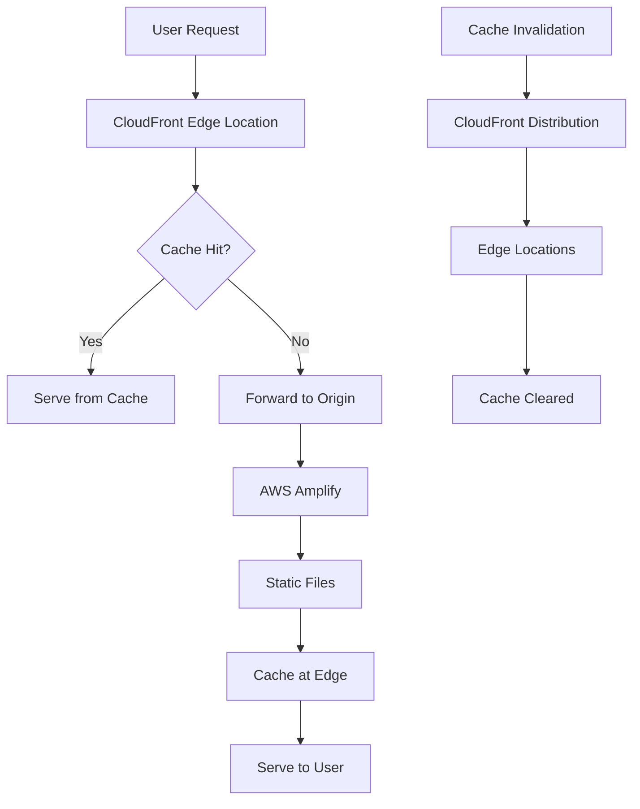

# CDN and Caching Strategy

This document outlines the comprehensive Content Delivery Network (CDN) and
caching strategy for the mobile-first marketing website.

## Overview

The caching strategy is designed to optimize performance for mobile users while
ensuring content freshness and security. It leverages AWS CloudFront CDN with
intelligent caching policies based on content type and user behavior.

## Architecture



## Caching Policies

### 1. Static Assets (Long-term Caching)

**Content Types:**

- JavaScript files (`.js`)
- CSS stylesheets (`.css`)
- Images (`.png`, `.jpg`, `.jpeg`, `.gif`, `.webp`, `.avif`)
- Fonts (`.woff`, `.woff2`, `.ttf`, `.eot`)
- Icons (`.ico`, `.svg`)

**Cache Configuration:**

```json
{
  "maxAge": 31536000,
  "immutable": true,
  "compress": true,
  "headers": {
    "Cache-Control": "public, max-age=31536000, immutable",
    "Vary": "Accept-Encoding"
  }
}
```

**Benefits:**

- 1-year cache duration reduces server load
- Immutable flag prevents unnecessary revalidation
- Compression reduces bandwidth usage
- Perfect for versioned assets

### 2. HTML Pages (Short-term Caching)

**Content Types:**

- HTML pages (`.html`)
- Dynamic content pages

**Cache Configuration:**

```json
{
  "maxAge": 3600,
  "mustRevalidate": true,
  "compress": true,
  "headers": {
    "Cache-Control": "public, max-age=3600, must-revalidate",
    "Vary": "Accept-Encoding"
  }
}
```

**Benefits:**

- 1-hour cache balances performance and freshness
- Must-revalidate ensures content accuracy
- Allows for quick content updates

### 3. API Routes (No Caching)

**Content Types:**

- API endpoints (`/api/*`)
- Dynamic server responses

**Cache Configuration:**

```json
{
  "maxAge": 0,
  "noCache": true,
  "noStore": true,
  "headers": {
    "Cache-Control": "no-cache, no-store, must-revalidate",
    "Pragma": "no-cache",
    "Expires": "0"
  }
}
```

**Benefits:**

- Ensures dynamic content is always fresh
- Prevents sensitive data caching
- Maintains API functionality

### 4. Service Worker (No Caching)

**Content Types:**

- Service worker files (`/sw.js`)
- Critical application logic

**Cache Configuration:**

```json
{
  "maxAge": 0,
  "noCache": true,
  "noStore": true,
  "headers": {
    "Cache-Control": "no-cache, no-store, must-revalidate"
  }
}
```

**Benefits:**

- Ensures service worker updates immediately
- Prevents application logic conflicts
- Maintains PWA functionality

### 5. Manifest Files (Medium-term Caching)

**Content Types:**

- Web app manifest (`/manifest.json`)
- Configuration files

**Cache Configuration:**

```json
{
  "maxAge": 86400,
  "compress": true,
  "headers": {
    "Cache-Control": "public, max-age=86400"
  }
}
```

**Benefits:**

- 24-hour cache for configuration stability
- Allows for daily updates if needed
- Balances performance and flexibility

## CloudFront Configuration

### Distribution Settings

**Global Configuration:**

- **Price Class:** All edge locations worldwide
- **HTTP Version:** HTTP/2 enabled
- **IPv6:** Enabled for modern connectivity
- **Compression:** Enabled for all text-based content
- **Security:** HTTPS redirect enforced

**Origin Configuration:**

- **Origin:** AWS Amplify hosting
- **Protocol:** HTTPS only
- **Timeout:** 30 seconds read, 5 seconds keepalive
- **SSL:** TLS 1.2 minimum

### Cache Behaviors

#### 1. Static Assets Behavior

```json
{
  "pathPattern": "*.{js,css,png,jpg,jpeg,gif,ico,svg,woff,woff2,ttf,eot,webp,avif}",
  "cachePolicyId": "static-assets-cache-policy",
  "compress": true,
  "viewerProtocolPolicy": "redirect-to-https",
  "allowedMethods": ["GET", "HEAD"],
  "precedence": 1
}
```

#### 2. HTML Pages Behavior

```json
{
  "pathPattern": "*.html",
  "cachePolicyId": "html-cache-policy",
  "compress": true,
  "viewerProtocolPolicy": "redirect-to-https",
  "allowedMethods": ["GET", "HEAD", "OPTIONS"],
  "precedence": 2
}
```

#### 3. API Routes Behavior

```json
{
  "pathPattern": "/api/*",
  "cachePolicyId": "no-cache-policy",
  "compress": false,
  "viewerProtocolPolicy": "redirect-to-https",
  "allowedMethods": [
    "GET",
    "HEAD",
    "OPTIONS",
    "PUT",
    "POST",
    "PATCH",
    "DELETE"
  ],
  "precedence": 3
}
```

### Security Headers

**Implemented Headers:**

- `Strict-Transport-Security`: Force HTTPS for 1 year
- `X-Frame-Options`: Prevent clickjacking (DENY)
- `X-Content-Type-Options`: Prevent MIME sniffing
- `X-XSS-Protection`: Enable XSS filtering
- `Referrer-Policy`: Control referrer information
- `Content-Security-Policy`: Comprehensive CSP
- `Permissions-Policy`: Restrict browser features

**Content Security Policy:**

```
default-src 'self';
script-src 'self' 'unsafe-inline' 'unsafe-eval' https://www.googletagmanager.com https://www.google-analytics.com;
style-src 'self' 'unsafe-inline' https://fonts.googleapis.com;
font-src 'self' https://fonts.gstatic.com;
img-src 'self' data: https:;
connect-src 'self' https://www.google-analytics.com;
frame-ancestors 'none';
```

## Performance Optimization

### Compression Strategy

**Enabled Formats:**

- Gzip compression for all text-based content
- Brotli compression for modern browsers
- Automatic format selection based on client support

**Compression Types:**

- HTML documents
- CSS stylesheets
- JavaScript files
- JSON data
- SVG images
- XML documents

**Benefits:**

- 60-80% size reduction for text content
- Faster page load times
- Reduced bandwidth costs
- Better mobile performance

### Image Optimization

**Modern Formats:**

- WebP format with JPEG/PNG fallbacks
- AVIF format for cutting-edge browsers
- Progressive JPEG for faster perceived loading
- Optimized PNG with reduced color palettes

**Responsive Images:**

- Multiple sizes for different screen densities
- Device-specific image delivery
- Lazy loading for below-the-fold images
- Blur-up placeholder technique

### Mobile-First Optimizations

**Mobile-Specific Features:**

- Prioritized mobile edge locations
- Optimized cache policies for mobile networks
- Reduced payload sizes for slower connections
- Touch-optimized resource loading

**Network Adaptation:**

- Adaptive image quality based on connection speed
- Progressive enhancement for faster networks
- Offline-first caching strategies
- Service worker integration

## Cache Invalidation Strategy

### Automatic Invalidation

**Triggers:**

- New deployment to main branch
- Content updates in CMS
- Critical security updates
- Performance optimization releases

**Invalidation Patterns:**

```json
{
  "paths": ["/*", "/index.html", "/sitemap.xml", "/robots.txt"]
}
```

### Manual Invalidation

**Use Cases:**

- Emergency content updates
- Bug fixes requiring immediate deployment
- Security patches
- Critical business announcements

**Process:**

1. Access AWS CloudFront Console
2. Select distribution
3. Create invalidation request
4. Specify paths or use wildcard
5. Monitor invalidation progress

### Selective Invalidation

**Targeted Invalidation:**

- Specific pages: `/blog/post-slug/`
- Content types: `*.html`
- Directories: `/services/*`
- API endpoints: `/api/contact`

**Benefits:**

- Faster invalidation completion
- Reduced CDN costs
- Preserved cache for unchanged content
- Minimal performance impact

## Monitoring and Analytics

### Performance Metrics

**Core Web Vitals:**

- Largest Contentful Paint (LCP) < 2.5s
- First Input Delay (FID) < 100ms
- Cumulative Layout Shift (CLS) < 0.1

**CDN Metrics:**

- Cache hit ratio (target: >90%)
- Origin response time
- Edge location performance
- Bandwidth usage

**Mobile Performance:**

- Mobile page speed scores
- Time to Interactive on mobile
- Mobile-specific error rates
- Touch response times

### Real-Time Monitoring

**CloudWatch Alarms:**

- High error rates (>5% 4xx errors)
- High latency (>3s origin response)
- Low cache hit ratio (<80%)
- Unusual traffic patterns

**Notification Channels:**

- Email alerts for critical issues
- Slack notifications for deployments
- Dashboard monitoring for trends
- Automated incident response

### Analytics Integration

**Google Analytics:**

- Page load performance tracking
- User experience metrics
- Geographic performance analysis
- Device-specific performance data

**Custom Metrics:**

- Cache performance tracking
- CDN cost optimization
- Content popularity analysis
- User behavior patterns

## Cost Optimization

### Caching Efficiency

**Strategies:**

- Maximize cache hit ratios
- Optimize cache durations
- Minimize origin requests
- Efficient invalidation patterns

**Cost Savings:**

- Reduced origin server load
- Lower bandwidth costs
- Decreased compute requirements
- Improved scalability

### Regional Optimization

**Edge Location Strategy:**

- All regions for global reach
- Optimized for target markets
- Cost-effective content delivery
- Reduced latency worldwide

**Traffic Analysis:**

- Geographic usage patterns
- Peak traffic identification
- Regional performance optimization
- Cost per region analysis

## Implementation Scripts

### Cache Optimization Script

**Location:** `scripts/cache-optimization.js`

**Features:**

- Automatic cache policy generation
- File hash generation for cache busting
- Cache manifest creation
- Performance report generation

**Usage:**

```bash
npm run cache:optimize
```

### CDN Configuration

**Location:** `aws-cloudfront-config.json`

**Features:**

- Complete CloudFront distribution configuration
- Cache policies and behaviors
- Security headers configuration
- Performance optimization settings

### Monitoring Integration

**Location:** `scripts/deployment-monitor.js`

**Features:**

- Deployment status monitoring
- Performance metrics collection
- Alert notification system
- Report generation

## Best Practices

### Content Strategy

**Static Assets:**

- Use versioned filenames for cache busting
- Implement proper asset bundling
- Optimize images before deployment
- Use modern image formats

**Dynamic Content:**

- Implement proper cache headers
- Use ETags for validation
- Consider stale-while-revalidate
- Optimize API response sizes

### Security Considerations

**Headers:**

- Implement comprehensive security headers
- Use strict Content Security Policy
- Enable HSTS with preload
- Restrict unnecessary permissions

**Access Control:**

- Limit origin access to CloudFront
- Implement proper CORS policies
- Use signed URLs for sensitive content
- Monitor access patterns

### Performance Monitoring

**Regular Audits:**

- Monthly performance reviews
- Quarterly cache optimization
- Annual strategy assessment
- Continuous improvement process

**Key Metrics:**

- Cache hit ratio trends
- Performance score improvements
- Cost optimization opportunities
- User experience metrics

## Troubleshooting

### Common Issues

#### Low Cache Hit Ratio

- **Cause:** Inconsistent cache headers
- **Solution:** Review cache policies and headers
- **Prevention:** Implement proper cache configuration

#### High Origin Load

- **Cause:** Frequent cache misses
- **Solution:** Optimize cache durations and patterns
- **Prevention:** Monitor cache performance regularly

#### Slow Performance

- **Cause:** Suboptimal edge location usage
- **Solution:** Review geographic distribution
- **Prevention:** Analyze user traffic patterns

### Debugging Tools

**AWS CloudFront:**

- Real-time logs analysis
- Cache statistics dashboard
- Performance metrics monitoring
- Error rate tracking

**Third-party Tools:**

- GTmetrix for performance analysis
- WebPageTest for detailed metrics
- Lighthouse for Core Web Vitals
- Pingdom for uptime monitoring

## Future Enhancements

### Planned Improvements

**Advanced Caching:**

- Edge-side includes (ESI)
- Lambda@Edge for dynamic caching
- Personalized content caching
- Machine learning optimization

**Performance:**

- HTTP/3 support when available
- Advanced compression algorithms
- Predictive prefetching
- Adaptive quality delivery

**Security:**

- Enhanced DDoS protection
- Advanced bot detection
- Geo-blocking capabilities
- Real-time threat response

### Technology Roadmap

**Short-term (3 months):**

- Implement advanced monitoring
- Optimize cache policies
- Enhance security headers
- Improve mobile performance

**Medium-term (6 months):**

- Lambda@Edge integration
- Advanced analytics
- Personalization features
- Cost optimization automation

**Long-term (12 months):**

- AI-powered optimization
- Predictive caching
- Advanced security features
- Next-generation protocols
