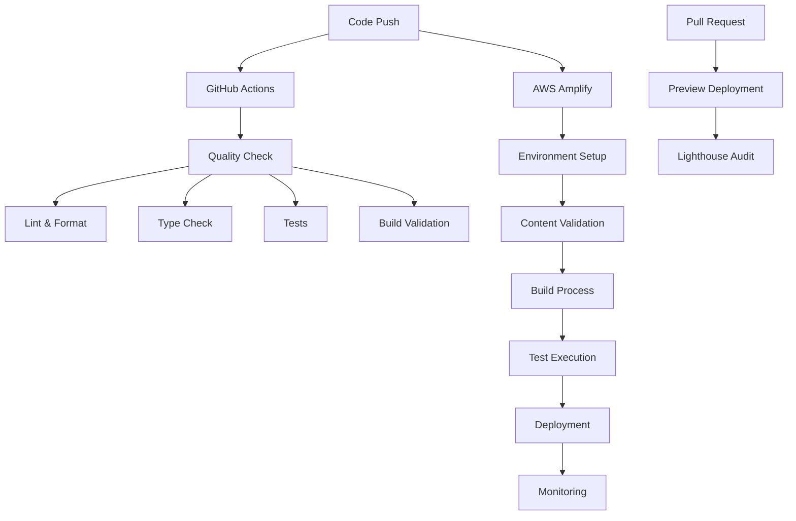

# CI/CD Pipeline Documentation

This document outlines the Continuous Integration and Continuous Deployment
(CI/CD) pipeline for the mobile-first marketing website.

## Overview

The CI/CD pipeline is designed to ensure code quality, performance, and reliable
deployments across different environments. It combines GitHub Actions for
quality checks with AWS Amplify for automated deployments.

## Pipeline Architecture



## GitHub Actions Workflows

### 1. Quality Check Workflow (`.github/workflows/quality-check.yml`)

**Triggers:**

- Push to main, staging, develop branches
- Pull requests to main, staging branches

**Jobs:**

- **quality-check**: Runs on Node.js 18 and 20
  - Code linting and formatting checks
  - TypeScript type checking
  - Content validation
  - Unit tests with coverage
  - Build validation
- **lighthouse-check**: Performance auditing
  - Builds application
  - Serves static files
  - Runs Lighthouse CI audits
  - Validates Core Web Vitals

**Quality Gates:**

- All linting rules must pass
- TypeScript compilation must succeed
- Test coverage must meet thresholds
- Lighthouse scores must meet minimum requirements

### 2. Preview Deployment Workflow (`.github/workflows/amplify-preview.yml`)

**Triggers:**

- Pull requests to main, staging branches

**Process:**

- Validates code quality
- Builds application
- Comments on PR with preview information
- Integrates with Amplify preview deployments

## AWS Amplify Pipeline

### Build Phases

#### 1. preBuild Phase

```bash
# Install dependencies
npm ci

# Optimize build configuration
npm run build:optimize

# Validate environment variables
npm run env:validate

# Validate content structure and integrity
npm run content:validate-structure
npm run content:validate

# Type check the project
npm run type-check

# Set environment variables
export NEXT_PUBLIC_SITE_URL=$AMPLIFY_APP_URL
export NODE_ENV=production
```

#### 2. Build Phase

```bash
# Build Next.js application with static export
npm run build

# Run test suite to ensure build quality
npm run test
```

#### 3. postBuild Phase

```bash
# Monitor deployment and generate reports
npm run deploy:monitor

# Verify build output
echo "Build completed successfully"
ls -la out/
```

### Environment Configuration

#### Production (main branch)

- Full optimization enabled
- Analytics tracking active
- Strict content validation
- Performance monitoring
- Security headers enforced

#### Staging (staging/develop branch)

- Optimization enabled
- Analytics disabled
- Relaxed validation
- Debug mode available
- Preview-specific configuration

#### Feature Branches

- Basic optimization
- No analytics
- Development-friendly settings
- Preview deployments

## Build Optimization

### Performance Optimizations

- **Memory Management**: 4GB Node.js heap size
- **Telemetry**: Disabled for faster builds
- **Caching**: Aggressive caching of dependencies and build artifacts
- **Compression**: Gzip compression for all assets
- **Minification**: CSS and JavaScript minification in production

### Build Scripts

#### `npm run build:optimize`

- Checks system requirements (Node.js version, memory, disk space)
- Applies environment-specific optimizations
- Generates build information metadata
- Sets performance flags

#### `npm run deploy:monitor`

- Monitors deployment status
- Generates deployment reports
- Sends notifications (Slack, email)
- Tracks performance metrics

## Quality Assurance

### Code Quality Checks

- **ESLint**: JavaScript/TypeScript linting
- **Prettier**: Code formatting consistency
- **TypeScript**: Type safety validation
- **Tests**: Unit and integration test execution

### Content Quality Checks

- **Structure Validation**: Markdown file structure
- **Content Validation**: Frontmatter schema validation
- **Link Validation**: Internal and external link checking
- **Image Optimization**: Image format and size validation

### Performance Checks

- **Lighthouse CI**: Automated performance auditing
- **Core Web Vitals**: LCP, FID, CLS monitoring
- **Bundle Analysis**: JavaScript bundle size tracking
- **Load Testing**: Performance under load

## Deployment Strategies

### Branch-Based Deployments

#### Main Branch → Production

- Full quality pipeline
- Performance validation
- Security scanning
- Automated deployment
- Post-deployment monitoring

#### Staging Branch → Staging Environment

- Quality checks
- Performance validation
- Preview testing
- Stakeholder review

#### Feature Branches → Preview Deployments

- Basic quality checks
- Preview generation
- Developer testing
- Code review facilitation

### Rollback Strategy

- **Automatic Rollback**: On critical failures
- **Manual Rollback**: Via Amplify Console
- **Version Tagging**: Git tags for release tracking
- **Backup Strategy**: Previous version preservation

## Monitoring and Notifications

### Deployment Monitoring

- **Build Status**: Success/failure tracking
- **Performance Metrics**: Build time, bundle size
- **Error Tracking**: Build and runtime errors
- **Uptime Monitoring**: Site availability

### Notification Channels

- **Slack Integration**: Real-time deployment updates
- **Email Notifications**: Critical alerts and summaries
- **GitHub Status**: PR status updates
- **Dashboard**: Centralized monitoring view

### Metrics Tracked

- **Build Performance**: Duration, success rate
- **Code Quality**: Test coverage, lint issues
- **Site Performance**: Core Web Vitals, Lighthouse scores
- **User Experience**: Error rates, load times

## Security Considerations

### Build Security

- **Dependency Scanning**: Vulnerability detection
- **Secret Management**: Environment variable security
- **Access Control**: Limited build permissions
- **Audit Logging**: Build activity tracking

### Deployment Security

- **HTTPS Enforcement**: SSL/TLS for all traffic
- **Security Headers**: CSP, HSTS, XSS protection
- **Content Validation**: Input sanitization
- **Rate Limiting**: API protection

## Troubleshooting

### Common Build Issues

#### Memory Errors

```bash
# Increase Node.js memory limit
export NODE_OPTIONS="--max-old-space-size=8192"
```

#### Dependency Issues

```bash
# Clear cache and reinstall
rm -rf node_modules package-lock.json
npm install
```

#### Content Validation Failures

```bash
# Validate content locally
npm run content:validate-structure
npm run content:validate
```

### Performance Issues

#### Slow Builds

- Check dependency cache configuration
- Optimize build scripts
- Review bundle analysis results

#### Failed Lighthouse Audits

- Review performance optimizations
- Check image optimization
- Validate Core Web Vitals

### Deployment Failures

#### Environment Variable Issues

```bash
# Validate environment configuration
npm run env:validate
```

#### Build Failures

- Check build logs in Amplify Console
- Validate local build process
- Review dependency compatibility

## Best Practices

### Code Quality

- Write comprehensive tests
- Follow linting rules consistently
- Use TypeScript for type safety
- Document complex functionality

### Performance

- Optimize images before committing
- Use dynamic imports for large components
- Monitor bundle size regularly
- Implement proper caching strategies

### Security

- Keep dependencies updated
- Use environment variables for secrets
- Implement proper CSP policies
- Regular security audits

### Monitoring

- Set up proper alerting
- Monitor key performance metrics
- Track deployment success rates
- Review error logs regularly

## Configuration Files

### GitHub Actions

- `.github/workflows/quality-check.yml`
- `.github/workflows/amplify-preview.yml`

### Build Configuration

- `amplify.yml` - Amplify build configuration
- `lighthouserc.json` - Lighthouse CI configuration
- `package.json` - Build scripts and dependencies

### Monitoring Scripts

- `scripts/build-optimization.js` - Build optimization
- `scripts/deployment-monitor.js` - Deployment monitoring
- `scripts/validate-env.js` - Environment validation

## Support and Resources

- [AWS Amplify Documentation](https://docs.amplify.aws/)
- [GitHub Actions Documentation](https://docs.github.com/en/actions)
- [Lighthouse CI Documentation](https://github.com/GoogleChrome/lighthouse-ci)
- [Next.js Deployment Guide](https://nextjs.org/docs/deployment)
