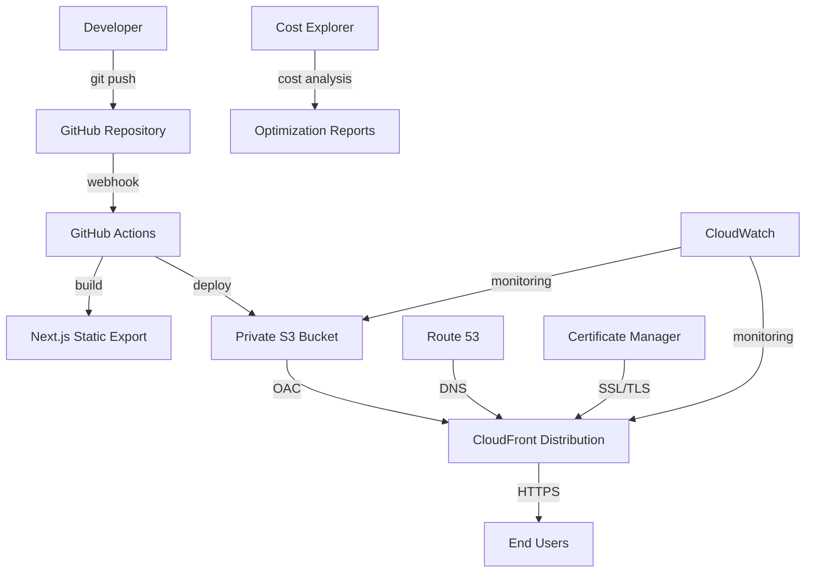

# Comprehensive Operational Runbook

## Overview

This comprehensive runbook provides complete operational procedures for the S3 + CloudFront deployment system. It serves as the definitive guide for day-to-day operations, maintenance, troubleshooting, and knowledge transfer.

## Table of Contents

1. [System Architecture](#system-architecture)
2. [Daily Operations](#daily-operations)
3. [Deployment Procedures](#deployment-procedures)
4. [Monitoring and Alerting](#monitoring-and-alerting)
5. [Troubleshooting Guide](#troubleshooting-guide)
6. [Security Procedures](#security-procedures)
7. [Performance Management](#performance-management)
8. [Incident Response](#incident-response)
9. [Change Management](#change-management)
10. [Knowledge Transfer](#knowledge-transfer)

## System Architecture

### Infrastructure Components



### Key Components

| Component | Purpose | Configuration |
|-----------|---------|---------------|
| **S3 Bucket** | Static file storage | Private, versioned, encrypted |
| **CloudFront** | Global CDN | OAC, security headers, caching |
| **GitHub Actions** | CI/CD pipeline | Automated build and deploy |
| **CloudWatch** | Monitoring | Metrics, logs, alarms |
| **Certificate Manager** | SSL/TLS certificates | Auto-renewal enabled |

### Environment Configuration

```bash
# Production Environment Variables
export S3_BUCKET_NAME="mobile-marketing-site-prod-1759705011281-tyzuo9"
export CLOUDFRONT_DISTRIBUTION_ID="E2IBMHQ3GCW6ZK"
export AWS_REGION="us-east-1"
export NEXT_PUBLIC_SITE_URL="https://d15sc9fc739ev2.cloudfront.net"
```

## Daily Operations

### Morning Health Check (15 minutes)

**Schedule**: Every business day at 9:00 AM
**Responsible**: On-call engineer

```bash
#!/bin/bash
# Daily health check routine
echo "=== Daily Health Check - $(date) ===" | tee -a logs/daily-health.log

# 1. System status overview
echo "1. Checking deployment status..." | tee -a logs/daily-health.log
node scripts/deployment-status-dashboard.js | tee -a logs/daily-health.log

# 2. Performance monitoring
echo "2. Monitoring performance..." | tee -a logs/daily-health.log
node scripts/performance-optimization-monitor.js | tee -a logs/daily-health.log

# 3. Security validation
echo "3. Validating security..." | tee -a logs/daily-health.log
node scripts/security-maintenance-monitor.js | tee -a logs/daily-health.log

# 4. Cost monitoring
echo "4. Analyzing costs..." | tee -a logs/daily-health.log
node scripts/cost-analysis-optimizer.js | tee -a logs/daily-health.log

echo "=== Health Check Complete ===" | tee -a logs/daily-health.log
```

**Health Check Checklist**:
- [ ] All services operational
- [ ] No critical alerts
- [ ] Performance within thresholds
- [ ] Security configurations valid
- [ ] Costs within budget
- [ ] Recent deployments successful

### Deployment Monitoring

**Continuous Monitoring Tasks**:

```bash
# Monitor active deployments
watch -n 30 'node scripts/deployment-status-dashboard.js'

# Check GitHub Actions status
gh run list --limit 5

# Verify site functionality
node scripts/validate-site-functionality.js
```

**Post-Deployment Verification**:

1. **Immediate Checks (< 5 minutes)**:
   ```bash
   # Verify deployment success
   node scripts/deployment-validator.js
   
   # Check site accessibility
   curl -I https://d15sc9fc739ev2.cloudfront.net
   
   # Validate core functionality
   node scripts/validate-core-functionality-quick.js
   ```

2. **Extended Validation (< 15 minutes)**:
   ```bash
   # Comprehensive functionality test
   node scripts/comprehensive-deployment-test.js
   
   # Performance validation
   node scripts/core-web-vitals-monitor.js
   
   # Security validation
   node scripts/security-headers-validator.js
   ```

## Deployment Procedures

### Standard Deployment Process

#### 1. Pre-Deployment Preparation

```bash
# Environment validation
node scripts/validate-production-env.js

# Dependency check
npm audit --audit-level moderate

# Build validation
npm run build
npm run export

# Pre-deployment tests
npm run test
node scripts/test-deployment-readiness.js
```

#### 2. Deployment Execution

**Automated Deployment (Recommended)**:
```bash
# Trigger via Git push
git add .
git commit -m "Deploy: [description of changes]"
git push origin main

# Monitor deployment
node scripts/deployment-monitor.js
```

**Manual Deployment (Emergency Only)**:
```bash
# Build and deploy manually
npm run build
npm run export
node scripts/deploy.js

# Verify deployment
node scripts/deployment-validator.js
```

#### 3. Post-Deployment Validation

```bash
# Comprehensive validation suite
node scripts/comprehensive-deployment-test.js

# Performance validation
node scripts/performance-benchmarking.js

# Security validation
node scripts/security-validation-suite.js

# Generate deployment report
node scripts/deployment-log-monitor.js
```

### Emergency Deployment Procedures

#### Hotfix Deployment

```bash
# Create hotfix branch
git checkout -b hotfix/critical-fix

# Make necessary changes
# ... edit files ...

# Test changes
npm run test
node scripts/validate-site-functionality.js

# Deploy hotfix
git add .
git commit -m "Hotfix: [description]"
git push origin hotfix/critical-fix

# Create pull request and merge to main
# Monitor deployment
node scripts/deployment-monitor.js
```

#### Rollback Procedures

```bash
# Emergency rollback
node scripts/rollback.js emergency

# Rollback to specific version
node scripts/rollback.js --version <version-id>

# Verify rollback
node scripts/deployment-validator.js
node scripts/validate-site-functionality.js
```

## Monitoring and Alerting

### Monitoring Dashboard

**Primary Monitoring Command**:
```bash
# Launch comprehensive monitoring dashboard
node scripts/deployment-status-dashboard.js
```

**Key Metrics to Monitor**:

| Metric | Threshold | Action |
|--------|-----------|--------|
| **Availability** | > 99.9% | Investigate if below |
| **Response Time** | < 2 seconds | Optimize if above |
| **Error Rate** | < 1% | Alert if above |
| **Cache Hit Ratio** | > 90% | Optimize if below |
| **Cost** | Within budget | Review if exceeded |

### Performance Monitoring

```bash
# Real-time performance monitoring
node scripts/performance-optimization-monitor.js

# Core Web Vitals tracking
node scripts/core-web-vitals-monitor.js

# Performance benchmarking
node scripts/performance-benchmarking.js
```

### Security Monitoring

```bash
# Continuous security monitoring
node scripts/security-maintenance-monitor.js

# SSL certificate monitoring
node scripts/ssl-certificate-validator.js

# Security configuration validation
node scripts/security-validation-suite.js
```

### Cost Monitoring

```bash
# Daily cost analysis
node scripts/cost-analysis-optimizer.js

# Cost trend analysis
node scripts/cost-trend-analyzer.js

# Budget alerts
node scripts/budget-alert-monitor.js
```

## Troubleshooting Guide

### Common Issues and Solutions

#### 1. Deployment Failures

**Symptoms**: GitHub Actions failing, deployment not completing

**Diagnosis**:
```bash
# Check deployment status
node scripts/deployment-status-dashboard.js

# Review GitHub Actions logs
gh run view --log

# Validate environment
node scripts/validate-production-env.js
```

**Solutions**:
1. **Build Failures**:
   ```bash
   # Local build test
   npm run build
   npm run export
   
   # Fix build issues and redeploy
   ```

2. **AWS Permission Issues**:
   ```bash
   # Verify AWS credentials
   aws sts get-caller-identity
   
   # Test S3 access
   aws s3 ls s3://$S3_BUCKET_NAME
   
   # Test CloudFront access
   aws cloudfront get-distribution --id $CLOUDFRONT_DISTRIBUTION_ID
   ```

3. **Network/Timeout Issues**:
   ```bash
   # Retry deployment
   node scripts/deploy.js --retry
   
   # Check AWS service status
   curl -s https://status.aws.amazon.com/
   ```

#### 2. Performance Issues

**Symptoms**: Slow loading times, poor Core Web Vitals

**Diagnosis**:
```bash
# Performance analysis
node scripts/performance-benchmarking.js

# Cache analysis
node scripts/caching-cdn-optimizer.js

# Core Web Vitals check
node scripts/core-web-vitals-monitor.js
```

**Solutions**:
1. **Cache Optimization**:
   ```bash
   # Optimize cache settings
   node scripts/configure-cloudfront-caching.js
   
   # Invalidate cache if needed
   node scripts/cache-invalidation-manager.js invalidate full
   ```

2. **Content Optimization**:
   ```bash
   # Compress assets
   node scripts/compression-performance-tester.js
   
   # Optimize images
   # (Manual process - optimize images before deployment)
   ```

#### 3. Security Issues

**Symptoms**: Security warnings, SSL errors, missing headers

**Diagnosis**:
```bash
# Security validation
node scripts/security-validation-suite.js

# SSL certificate check
node scripts/ssl-certificate-validator.js

# Security headers validation
node scripts/security-headers-validator.js
```

**Solutions**:
1. **SSL Certificate Issues**:
   ```bash
   # Renew certificate
   node scripts/setup-ssl-certificate.js
   
   # Update CloudFront configuration
   node scripts/configure-cloudfront-security.js
   ```

2. **Security Headers**:
   ```bash
   # Update security headers
   node scripts/cloudfront-security-headers-validator.js
   
   # Apply security configuration
   node scripts/configure-cloudfront-security.js
   ```

#### 4. Cost Issues

**Symptoms**: Unexpected cost increases, budget alerts

**Diagnosis**:
```bash
# Cost analysis
node scripts/cost-analysis-optimizer.js

# Usage analysis
# Check AWS Cost Explorer manually
```

**Solutions**:
1. **Cache Optimization**:
   ```bash
   # Improve cache hit ratio
   node scripts/caching-cdn-optimizer.js
   
   # Reduce invalidations
   # Review deployment process
   ```

2. **Storage Optimization**:
   ```bash
   # Analyze S3 usage
   aws s3api list-objects-v2 --bucket $S3_BUCKET_NAME --query 'sum(Contents[].Size)'
   
   # Implement lifecycle policies
   # (Manual configuration in AWS Console)
   ```

### Diagnostic Commands Reference

```bash
# System Health
node scripts/deployment-status-dashboard.js
node scripts/comprehensive-deployment-test.js
node scripts/validate-site-functionality.js

# Performance
node scripts/performance-optimization-monitor.js
node scripts/core-web-vitals-monitor.js
node scripts/performance-benchmarking.js

# Security
node scripts/security-maintenance-monitor.js
node scripts/security-validation-suite.js
node scripts/ssl-certificate-validator.js

# Infrastructure
node scripts/validate-s3-infrastructure.js
node scripts/cloudfront-security-validator.js
node scripts/validate-production-env.js

# Cost and Usage
node scripts/cost-analysis-optimizer.js
```

## Security Procedures

### Daily Security Tasks

```bash
# Security maintenance routine
node scripts/security-maintenance-monitor.js

# Certificate monitoring
node scripts/ssl-certificate-validator.js

# Vulnerability scanning
npm audit --audit-level moderate
```

### Weekly Security Tasks

```bash
# Comprehensive security validation
node scripts/security-validation-suite.js

# Penetration testing
node scripts/penetration-testing-suite.js

# Access control audit
node scripts/validate-access-control-audit.js
```

### Monthly Security Tasks

```bash
# Full security audit
node scripts/comprehensive-tls-validator.js
node scripts/security-validation-suite.js
node scripts/penetration-testing-suite.js

# Dependency updates
npm update
npm audit fix

# Security configuration review
node scripts/cloudfront-security-validator.js
```

### Security Incident Response

#### Immediate Response (< 15 minutes)

1. **Assess Threat Level**:
   ```bash
   # Quick security check
   node scripts/security-validation-suite.js
   
   # Check for active threats
   # Review CloudWatch logs
   ```

2. **Contain Threat**:
   ```bash
   # Disable distribution if necessary
   aws cloudfront update-distribution --id $CLOUDFRONT_DISTRIBUTION_ID --distribution-config file://emergency-disable.json
   
   # Block suspicious IPs (if applicable)
   # Update WAF rules (if configured)
   ```

3. **Notify Team**:
   - Send security alert to team
   - Escalate to security team if critical
   - Document incident start time

#### Investigation (< 2 hours)

1. **Gather Evidence**:
   ```bash
   # Export logs
   aws logs export-task --log-group-name /aws/cloudfront/distribution/$CLOUDFRONT_DISTRIBUTION_ID
   
   # Security analysis
   node scripts/security-validation-suite.js > security-incident-$(date +%Y%m%d-%H%M%S).log
   ```

2. **Analyze Impact**:
   - Determine scope of compromise
   - Identify affected systems
   - Assess data exposure risk

#### Recovery (< 4 hours)

1. **Apply Fixes**:
   ```bash
   # Update security configurations
   node scripts/configure-cloudfront-security.js
   
   # Apply security patches
   npm update
   npm audit fix
   
   # Redeploy with fixes
   git add .
   git commit -m "Security fix: [description]"
   git push origin main
   ```

2. **Verify Security**:
   ```bash
   # Comprehensive security validation
   node scripts/security-validation-suite.js
   
   # Penetration testing
   node scripts/penetration-testing-suite.js
   ```

## Performance Management

### Performance Monitoring

**Continuous Monitoring**:
```bash
# Automated performance monitoring
node scripts/performance-optimization-monitor.js

# Real-time Core Web Vitals
node scripts/core-web-vitals-monitor.js
```

**Performance Thresholds**:

| Metric | Target | Warning | Critical |
|--------|--------|---------|----------|
| **LCP** | < 2.5s | > 2.5s | > 4.0s |
| **FID** | < 100ms | > 100ms | > 300ms |
| **CLS** | < 0.1 | > 0.1 | > 0.25 |
| **TTFB** | < 600ms | > 600ms | > 1200ms |
| **Cache Hit Ratio** | > 95% | < 95% | < 85% |

### Performance Optimization

**Weekly Optimization Tasks**:
```bash
# Performance analysis
node scripts/performance-benchmarking.js

# Cache optimization
node scripts/caching-cdn-optimizer.js

# Compression optimization
node scripts/compression-performance-tester.js
```

**Monthly Optimization Review**:
```bash
# Comprehensive performance audit
node scripts/performance-optimization-monitor.js

# CloudFront analytics
node scripts/cloudfront-analytics-integration.js

# Performance budget validation
node scripts/performance-budget-validator.js
```

## Incident Response

### Incident Classification

| Severity | Description | Response Time | Escalation |
|----------|-------------|---------------|------------|
| **P1 - Critical** | Complete outage | 5 minutes | All hands |
| **P2 - High** | Major degradation | 15 minutes | Senior team |
| **P3 - Medium** | Minor issues | 1 hour | Team lead |
| **P4 - Low** | Cosmetic issues | 4 hours | Standard |

### Incident Response Process

#### 1. Detection and Alert (< 5 minutes)

```bash
# Automated detection
node scripts/deployment-status-dashboard.js

# Manual reporting
# Create incident ticket
echo "INCIDENT: $(date) - $DESCRIPTION" >> logs/incidents.log
```

#### 2. Initial Response (< 15 minutes)

```bash
# Assess severity
node scripts/comprehensive-deployment-test.js

# Notify team
# Send alert based on severity level

# Begin investigation
node scripts/validate-site-functionality.js
```

#### 3. Investigation and Diagnosis (< 30 minutes)

```bash
# Comprehensive diagnostics
node scripts/deployment-status-dashboard.js
node scripts/performance-optimization-monitor.js
node scripts/security-maintenance-monitor.js

# Review recent changes
git log --oneline -10

# Check AWS service status
curl -s https://status.aws.amazon.com/
```

#### 4. Resolution (< 2 hours)

```bash
# Apply fix or workaround
# Test resolution
node scripts/validate-site-functionality.js

# Monitor for stability
watch -n 60 'node scripts/deployment-status-dashboard.js'
```

#### 5. Post-Incident Review (< 24 hours)

- Document incident timeline
- Identify root cause
- Implement preventive measures
- Update procedures if needed

## Change Management

### Change Categories

**Standard Changes** (Pre-approved):
- Routine deployments
- Content updates
- Security patches
- Performance optimizations

**Normal Changes** (Approval required):
- Infrastructure modifications
- Configuration changes
- Major feature deployments
- Third-party integrations

**Emergency Changes** (Post-approval):
- Security incidents
- Critical bug fixes
- Service outages

### Change Process

#### 1. Change Planning

```bash
# Document change
echo "CHANGE REQUEST: $(date) - $DESCRIPTION" >> logs/changes.log

# Risk assessment
node scripts/validate-production-env.js

# Impact analysis
node scripts/comprehensive-deployment-test.js
```

#### 2. Change Implementation

```bash
# Pre-change validation
node scripts/deployment-status-dashboard.js

# Implement change
# (Specific to change type)

# Post-change validation
node scripts/comprehensive-deployment-test.js
```

#### 3. Change Verification

```bash
# Verify change success
node scripts/validate-site-functionality.js

# Monitor for issues
node scripts/performance-optimization-monitor.js

# Document results
echo "CHANGE COMPLETE: $(date) - $RESULTS" >> logs/changes.log
```

## Knowledge Transfer

### New Team Member Onboarding

#### Week 1: System Overview

**Day 1-2: Environment Setup**
```bash
# Clone repository
git clone [repository-url]
cd [repository-name]

# Install dependencies
npm install

# Configure AWS CLI
aws configure

# Set environment variables
cp .env.example .env.local
# Edit .env.local with appropriate values

# Verify setup
node scripts/validate-env.js
```

**Day 3-5: System Familiarization**
```bash
# Run health checks
node scripts/deployment-status-dashboard.js

# Explore monitoring
node scripts/performance-optimization-monitor.js
node scripts/security-maintenance-monitor.js

# Review documentation
# Read all files in /docs directory
```

#### Week 2: Hands-on Operations

**Day 1-3: Deployment Practice**
```bash
# Practice deployment process
# Make small test changes
# Deploy to staging environment

# Monitor deployments
node scripts/deployment-monitor.js

# Practice rollback
node scripts/rollback.js --test-mode
```

**Day 4-5: Troubleshooting Practice**
```bash
# Practice diagnostic commands
node scripts/comprehensive-deployment-test.js
node scripts/validate-site-functionality.js

# Review incident logs
cat logs/incidents.log

# Practice incident response procedures
```

#### Week 3: Advanced Operations

**Day 1-2: Performance Optimization**
```bash
# Performance analysis
node scripts/performance-benchmarking.js

# Cache optimization
node scripts/caching-cdn-optimizer.js

# Cost optimization
node scripts/cost-analysis-optimizer.js
```

**Day 3-5: Security Operations**
```bash
# Security validation
node scripts/security-validation-suite.js

# Penetration testing
node scripts/penetration-testing-suite.js

# Certificate management
node scripts/ssl-certificate-validator.js
```

#### Week 4: Independent Operations

**Day 1-3: Shadow Operations**
- Shadow experienced team member
- Perform operations under supervision
- Ask questions and clarify procedures

**Day 4-5: Independent Practice**
- Perform operations independently
- Document any issues or questions
- Receive feedback from team

### Knowledge Transfer Checklist

#### Technical Knowledge
- [ ] System architecture understanding
- [ ] Deployment process mastery
- [ ] Monitoring and alerting setup
- [ ] Troubleshooting procedures
- [ ] Security operations
- [ ] Performance optimization
- [ ] Cost management

#### Operational Knowledge
- [ ] Daily operations routine
- [ ] Incident response procedures
- [ ] Change management process
- [ ] Escalation procedures
- [ ] Documentation maintenance
- [ ] Team communication protocols

#### Tools and Scripts
- [ ] All monitoring scripts
- [ ] Deployment automation
- [ ] Diagnostic tools
- [ ] Security validation tools
- [ ] Performance analysis tools
- [ ] Cost optimization tools

### Training Materials

#### Documentation
- System architecture diagrams
- Operational procedures
- Troubleshooting guides
- Security procedures
- Performance optimization guides

#### Hands-on Exercises
- Deployment practice scenarios
- Incident response simulations
- Performance optimization exercises
- Security validation drills
- Cost optimization workshops

#### Assessment Criteria
- Can perform daily operations independently
- Can respond to incidents effectively
- Can troubleshoot common issues
- Can optimize performance and costs
- Can maintain security standards

### Continuous Learning

#### Monthly Training Topics
- New AWS features and services
- Security best practices updates
- Performance optimization techniques
- Cost management strategies
- Industry trends and innovations

#### Quarterly Assessments
- Technical knowledge review
- Operational skills assessment
- Incident response drill
- Documentation update review
- Process improvement suggestions

#### Annual Training Plan
- Advanced AWS certifications
- Security training and certifications
- Performance optimization workshops
- Leadership and communication skills
- Industry conferences and events

## Documentation Maintenance

### Documentation Standards

**Required Documentation**:
- Operational procedures (this document)
- Troubleshooting guides
- Security procedures
- Performance optimization guides
- Incident response procedures
- Change management procedures

**Documentation Format**:
- Markdown format for readability
- Version controlled in Git
- Regular review and updates
- Clear, actionable instructions
- Examples and code snippets

### Review Schedule

**Weekly Reviews**:
- Update operational logs
- Review recent incidents
- Update troubleshooting guides
- Check for outdated information

**Monthly Reviews**:
- Comprehensive documentation review
- Update procedures based on changes
- Add new troubleshooting scenarios
- Review and update training materials

**Quarterly Reviews**:
- Major documentation overhaul
- Process improvement integration
- Training material updates
- Knowledge transfer assessment

### Version Control

```bash
# Documentation updates
git add docs/
git commit -m "docs: Update operational procedures"
git push origin main

# Tag major documentation versions
git tag -a docs-v2.0 -m "Major documentation update"
git push origin docs-v2.0
```

---

**Document Information**:
- **Version**: 2.0
- **Last Updated**: [Current Date]
- **Maintained By**: DevOps Team
- **Review Schedule**: Monthly
- **Next Review**: [Next Month]
- **Approval**: [Team Lead]

**Change Log**:
- v2.0: Complete rewrite for S3/CloudFront architecture
- v1.0: Initial version for Amplify architecture (deprecated)