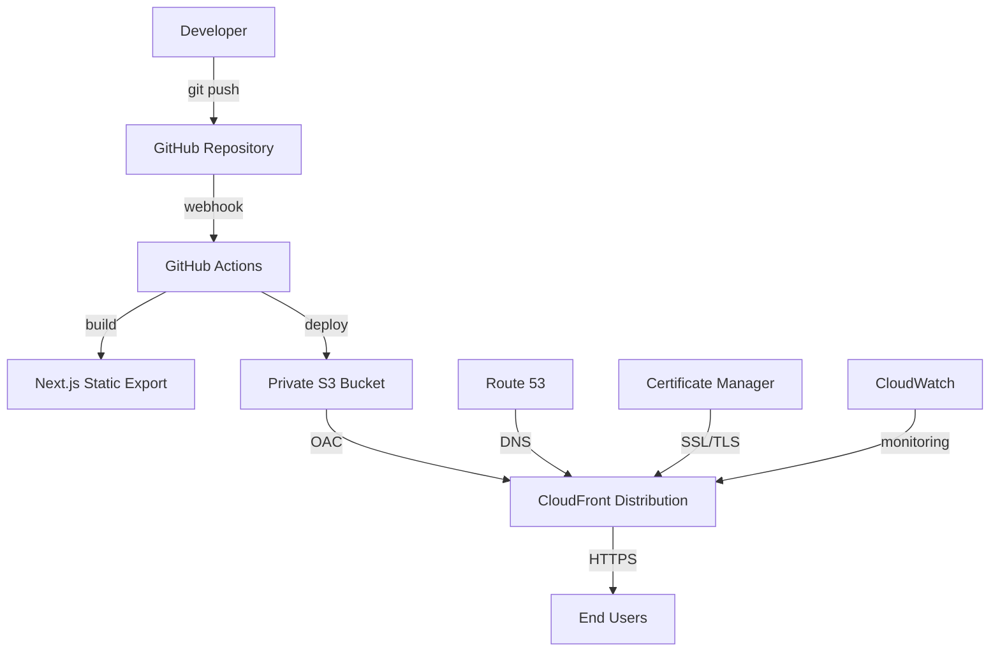
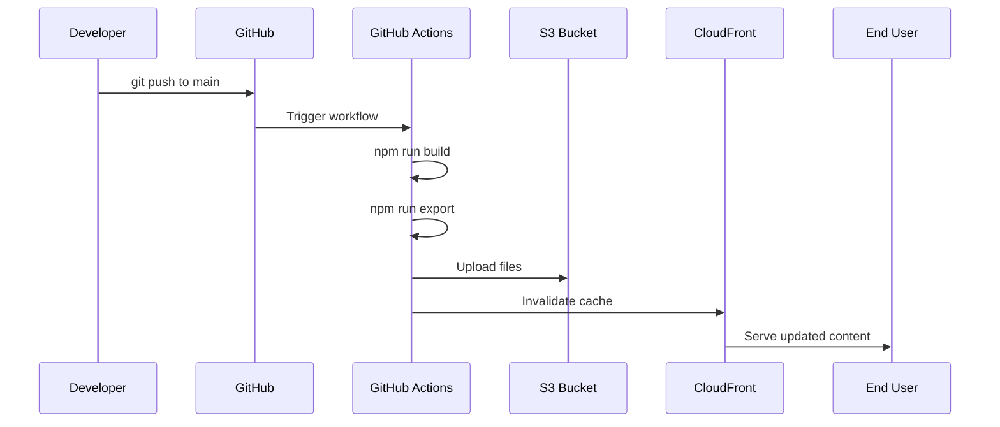

# Team Training Materials - S3 + CloudFront Deployment System

## Training Program Overview

This comprehensive training program is designed to onboard new team members and provide ongoing education for the S3 + CloudFront deployment system. The program follows a structured approach with hands-on exercises, assessments, and continuous learning opportunities.

## Training Objectives

By the end of this training program, team members will be able to:

1. **Understand System Architecture**: Comprehend the complete S3 + CloudFront deployment architecture
2. **Perform Daily Operations**: Execute routine operational tasks independently
3. **Handle Deployments**: Manage both automated and manual deployment processes
4. **Troubleshoot Issues**: Diagnose and resolve common system issues
5. **Respond to Incidents**: Follow proper incident response procedures
6. **Maintain Security**: Implement and maintain security best practices
7. **Optimize Performance**: Monitor and improve system performance
8. **Manage Costs**: Understand and optimize infrastructure costs

## Training Structure

### Phase 1: Foundation (Week 1)
- System architecture overview
- Environment setup
- Basic operations
- Documentation familiarization

### Phase 2: Operations (Week 2)
- Deployment procedures
- Monitoring and alerting
- Basic troubleshooting
- Security fundamentals

### Phase 3: Advanced Skills (Week 3)
- Performance optimization
- Security management
- Cost optimization
- Incident response

### Phase 4: Mastery (Week 4)
- Independent operations
- Advanced troubleshooting
- Process improvement
- Knowledge sharing

## Phase 1: Foundation Training

### Day 1: System Architecture and Setup

#### Learning Objectives
- Understand the overall system architecture
- Set up development environment
- Familiarize with key components

#### Prerequisites
- Basic AWS knowledge
- Git proficiency
- Command line familiarity
- Node.js experience

#### Training Materials

**1. Architecture Overview**



**Key Components Explanation**:

| Component | Purpose | Key Features |
|-----------|---------|--------------|
| **S3 Bucket** | Static file storage | Private, versioned, encrypted |
| **CloudFront** | Global CDN | OAC, caching, security headers |
| **GitHub Actions** | CI/CD pipeline | Automated build and deploy |
| **CloudWatch** | Monitoring | Metrics, logs, alarms |
| **ACM** | SSL certificates | Auto-renewal, validation |

**2. Environment Setup Exercise**

```bash
# Step 1: Clone repository
git clone [repository-url]
cd [repository-name]

# Step 2: Install dependencies
npm install

# Step 3: Configure AWS CLI
aws configure
# Enter your AWS credentials when prompted

# Step 4: Set up environment variables
cp .env.example .env.local
# Edit .env.local with the following values:
# S3_BUCKET_NAME=mobile-marketing-site-prod-1759705011281-tyzuo9
# CLOUDFRONT_DISTRIBUTION_ID=E2IBMHQ3GCW6ZK
# AWS_REGION=us-east-1
# NEXT_PUBLIC_SITE_URL=https://d15sc9fc739ev2.cloudfront.net

# Step 5: Verify setup
node scripts/validate-env.js
```

**3. Hands-on Exercise: First System Check**

```bash
# Run your first system health check
node scripts/deployment-status-dashboard.js

# Expected output should show:
# - S3 bucket status
# - CloudFront distribution status
# - Recent deployment information
# - Basic performance metrics
```

#### Assessment Questions

1. What is the purpose of Origin Access Control (OAC) in our architecture?
2. Why do we use a private S3 bucket instead of public website hosting?
3. What triggers an automated deployment in our system?
4. Name three key benefits of using CloudFront as our CDN.

### Day 2: Documentation and Tools Familiarization

#### Learning Objectives
- Navigate project documentation effectively
- Understand available tools and scripts
- Learn basic operational commands

#### Training Materials

**1. Documentation Structure**

```
docs/
├── comprehensive-operational-runbook.md    # Complete operations guide
├── troubleshooting-procedures-s3-cloudfront.md  # Issue resolution
├── team-training-materials.md             # This document
├── operational-procedures.md              # Daily operations
├── s3-cloudfront-deployment-runbook.md    # Deployment procedures
└── security-incident-response-procedures.md  # Security procedures
```

**2. Essential Scripts Overview**

| Script Category | Key Scripts | Purpose |
|----------------|-------------|---------|
| **Status & Monitoring** | `deployment-status-dashboard.js` | System health overview |
| | `performance-optimization-monitor.js` | Performance monitoring |
| | `security-maintenance-monitor.js` | Security monitoring |
| **Deployment** | `deploy.js` | Manual deployment |
| | `rollback.js` | Deployment rollback |
| | `deployment-validator.js` | Deployment validation |
| **Validation** | `validate-site-functionality.js` | Site functionality check |
| | `comprehensive-deployment-test.js` | Complete system test |
| | `validate-production-env.js` | Environment validation |

**3. Hands-on Exercise: Tool Exploration**

```bash
# Exercise 1: System Status Check
echo "=== System Status Check ==="
node scripts/deployment-status-dashboard.js

# Exercise 2: Performance Check
echo "=== Performance Check ==="
node scripts/core-web-vitals-monitor.js

# Exercise 3: Security Check
echo "=== Security Check ==="
node scripts/security-headers-validator.js

# Exercise 4: Environment Validation
echo "=== Environment Validation ==="
node scripts/validate-production-env.js
```

#### Practical Assignment

**Assignment: Create Your First Monitoring Report**

1. Run all monitoring scripts
2. Document the current system status
3. Identify any warnings or issues
4. Create a summary report

**Template**:
```markdown
# System Status Report - [Date]

## Overall Status
- System Health: [Green/Yellow/Red]
- Performance Grade: [A-F]
- Security Status: [Pass/Warning/Fail]

## Key Metrics
- Response Time: [X]ms
- Cache Hit Ratio: [X]%
- Error Rate: [X]%

## Issues Identified
- [List any issues found]

## Recommendations
- [List any recommendations]
```

### Day 3: Basic Operations

#### Learning Objectives
- Perform daily operational tasks
- Understand monitoring workflows
- Execute basic maintenance procedures

#### Training Materials

**1. Daily Operations Checklist**

```bash
#!/bin/bash
# Daily operations routine

echo "=== Daily Health Check - $(date) ==="

# 1. System status
echo "1. Checking system status..."
node scripts/deployment-status-dashboard.js

# 2. Performance monitoring
echo "2. Monitoring performance..."
node scripts/core-web-vitals-monitor.js

# 3. Security validation
echo "3. Validating security..."
node scripts/security-headers-validator.js

# 4. Recent deployments
echo "4. Checking recent deployments..."
gh run list --limit 5

echo "=== Health Check Complete ==="
```

**2. Monitoring Thresholds**

| Metric | Good | Warning | Critical |
|--------|------|---------|----------|
| **Response Time** | < 1.5s | 1.5-3s | > 3s |
| **Cache Hit Ratio** | > 95% | 85-95% | < 85% |
| **Error Rate** | < 0.5% | 0.5-2% | > 2% |
| **Availability** | > 99.9% | 99-99.9% | < 99% |

**3. Hands-on Exercise: Daily Operations**

```bash
# Morning routine simulation
echo "Starting morning health check..."

# Step 1: Check overnight deployments
gh run list --limit 10

# Step 2: System health check
node scripts/deployment-status-dashboard.js

# Step 3: Performance validation
node scripts/performance-optimization-monitor.js

# Step 4: Security check
node scripts/security-maintenance-monitor.js

# Step 5: Cost monitoring
node scripts/cost-analysis-optimizer.js

echo "Morning health check complete!"
```

#### Assessment Exercise

**Exercise: Identify and Report Issues**

1. Run the daily operations routine
2. Identify any metrics outside normal thresholds
3. Determine appropriate actions
4. Document findings and actions taken

### Day 4-5: Deployment Fundamentals

#### Learning Objectives
- Understand the deployment process
- Monitor deployments effectively
- Perform basic deployment validation

#### Training Materials

**1. Deployment Process Flow**



**2. Deployment Monitoring Commands**

```bash
# Monitor active deployments
gh run list --limit 5

# Watch specific deployment
gh run watch [run-id]

# Check deployment status
node scripts/deployment-status-dashboard.js

# Validate deployment success
node scripts/deployment-validator.js
```

**3. Hands-on Exercise: Deployment Simulation**

```bash
# Simulate deployment monitoring
echo "=== Deployment Monitoring Exercise ==="

# Step 1: Check current deployment status
echo "1. Current deployment status:"
gh run list --limit 3

# Step 2: Monitor system during deployment
echo "2. System status during deployment:"
node scripts/deployment-status-dashboard.js

# Step 3: Validate deployment completion
echo "3. Post-deployment validation:"
node scripts/validate-site-functionality.js

# Step 4: Performance check
echo "4. Performance validation:"
node scripts/core-web-vitals-monitor.js
```

#### Practical Assignment

**Assignment: Deployment Monitoring Report**

Monitor a real deployment (or simulate one) and create a comprehensive report:

1. Pre-deployment status
2. Deployment progress monitoring
3. Post-deployment validation
4. Performance impact assessment
5. Any issues encountered and resolutions

## Phase 2: Operations Training

### Day 6-7: Deployment Management

#### Learning Objectives
- Execute manual deployments
- Understand rollback procedures
- Manage deployment configurations

#### Training Materials

**1. Manual Deployment Process**

```bash
# Manual deployment steps
echo "=== Manual Deployment Process ==="

# Step 1: Pre-deployment validation
echo "1. Pre-deployment validation..."
node scripts/validate-production-env.js
node scripts/test-deployment-readiness.js

# Step 2: Build application
echo "2. Building application..."
npm run build
npm run export

# Step 3: Deploy to S3
echo "3. Deploying to S3..."
node scripts/deploy.js

# Step 4: Post-deployment validation
echo "4. Post-deployment validation..."
node scripts/deployment-validator.js
node scripts/validate-site-functionality.js
```

**2. Rollback Procedures**

```bash
# Emergency rollback
node scripts/rollback.js emergency

# Rollback to specific version
node scripts/rollback.js --list
node scripts/rollback.js --version [version-id]

# Validate rollback
node scripts/validate-site-functionality.js
```

**3. Hands-on Exercise: Deployment and Rollback**

```bash
# Exercise: Practice deployment and rollback
echo "=== Deployment and Rollback Exercise ==="

# Step 1: Record current state
echo "Current deployment state:"
node scripts/deployment-status-dashboard.js > pre-exercise-state.log

# Step 2: Practice rollback (test mode)
echo "Testing rollback procedure..."
node scripts/rollback.js --test-mode

# Step 3: Validate system after rollback test
echo "Validating system..."
node scripts/validate-site-functionality.js
```

### Day 8-9: Monitoring and Troubleshooting

#### Learning Objectives
- Set up effective monitoring
- Diagnose common issues
- Use troubleshooting tools

#### Training Materials

**1. Monitoring Setup**

```bash
# Set up comprehensive monitoring
node scripts/setup-cloudwatch-monitoring.js
node scripts/setup-deployment-notifications.js
node scripts/setup-performance-monitoring.js
```

**2. Common Issues and Diagnostics**

| Issue Type | Diagnostic Command | Common Causes |
|------------|-------------------|---------------|
| **Deployment Failure** | `gh run view --log` | Build errors, AWS permissions |
| **Site Not Loading** | `curl -I [site-url]` | DNS, CloudFront, S3 issues |
| **Performance Issues** | `node scripts/performance-benchmarking.js` | Cache misses, large assets |
| **Security Warnings** | `node scripts/security-validation-suite.js` | Missing headers, SSL issues |

**3. Hands-on Exercise: Troubleshooting Scenarios**

```bash
# Troubleshooting exercise scenarios
echo "=== Troubleshooting Exercise ==="

# Scenario 1: Deployment appears successful but site not updated
echo "Scenario 1: Site not updated after deployment"
echo "Diagnostic steps:"
echo "1. Check CloudFront cache status"
node scripts/cache-invalidation-manager.js report

echo "2. Verify S3 content"
aws s3 ls s3://$S3_BUCKET_NAME/ --recursive | head -10

echo "3. Force cache invalidation if needed"
# node scripts/cache-invalidation-manager.js invalidate full

# Scenario 2: Performance degradation
echo "Scenario 2: Performance issues"
echo "Diagnostic steps:"
echo "1. Performance analysis"
node scripts/performance-benchmarking.js

echo "2. Cache performance check"
node scripts/caching-cdn-optimizer.js
```

### Day 10: Security Fundamentals

#### Learning Objectives
- Understand security requirements
- Perform security validations
- Respond to security alerts

#### Training Materials

**1. Security Checklist**

```bash
# Daily security validation
node scripts/security-maintenance-monitor.js

# SSL certificate check
node scripts/ssl-certificate-validator.js

# Security headers validation
node scripts/security-headers-validator.js

# Comprehensive security audit
node scripts/security-validation-suite.js
```

**2. Security Incident Response**

```bash
# Security incident response steps
echo "=== Security Incident Response ==="

# Step 1: Assess threat
node scripts/security-validation-suite.js

# Step 2: Check for vulnerabilities
npm audit --audit-level moderate

# Step 3: Validate configurations
node scripts/cloudfront-security-validator.js

# Step 4: Apply fixes if needed
# node scripts/configure-cloudfront-security.js
```

## Phase 3: Advanced Skills Training

### Day 11-12: Performance Optimization

#### Learning Objectives
- Analyze performance metrics
- Implement optimization strategies
- Monitor performance improvements

#### Training Materials

**1. Performance Analysis Tools**

```bash
# Comprehensive performance analysis
node scripts/performance-optimization-monitor.js

# Core Web Vitals monitoring
node scripts/core-web-vitals-monitor.js

# Performance benchmarking
node scripts/performance-benchmarking.js

# Cache optimization
node scripts/caching-cdn-optimizer.js
```

**2. Optimization Strategies**

| Performance Issue | Optimization Strategy | Implementation |
|------------------|----------------------|----------------|
| **High LCP** | Optimize images, preload resources | Image optimization, resource hints |
| **High FID** | Reduce JavaScript execution | Code splitting, web workers |
| **High CLS** | Set element dimensions | CSS improvements |
| **Poor Cache Hit Ratio** | Optimize cache settings | CloudFront configuration |

**3. Hands-on Exercise: Performance Optimization**

```bash
# Performance optimization exercise
echo "=== Performance Optimization Exercise ==="

# Step 1: Baseline measurement
echo "1. Baseline performance measurement:"
node scripts/performance-benchmarking.js > baseline-performance.log

# Step 2: Identify optimization opportunities
echo "2. Performance analysis:"
node scripts/performance-optimization-monitor.js

# Step 3: Cache optimization
echo "3. Cache optimization:"
node scripts/caching-cdn-optimizer.js

# Step 4: Measure improvements
echo "4. Post-optimization measurement:"
node scripts/core-web-vitals-monitor.js
```

### Day 13-14: Security Management

#### Learning Objectives
- Implement security best practices
- Manage SSL certificates
- Respond to security incidents

#### Training Materials

**1. Security Management Tasks**

```bash
# Security maintenance routine
node scripts/security-maintenance-monitor.js

# Certificate management
node scripts/ssl-certificate-validator.js

# Penetration testing
node scripts/penetration-testing-suite.js

# TLS configuration validation
node scripts/comprehensive-tls-validator.js
```

**2. Security Incident Simulation**

```bash
# Security incident simulation
echo "=== Security Incident Simulation ==="

# Scenario: SSL certificate expiring soon
echo "Scenario: SSL certificate expiring in 15 days"
echo "Response steps:"

# Step 1: Validate current certificate
node scripts/ssl-certificate-validator.js

# Step 2: Check renewal process
echo "Certificate renewal would be handled by:"
echo "- AWS Certificate Manager (automatic)"
echo "- Manual renewal process (if needed)"

# Step 3: Verify security configuration
node scripts/security-validation-suite.js
```

### Day 15: Cost Optimization

#### Learning Objectives
- Analyze infrastructure costs
- Implement cost optimization strategies
- Monitor cost trends

#### Training Materials

**1. Cost Analysis Tools**

```bash
# Cost analysis and optimization
node scripts/cost-analysis-optimizer.js

# Usage pattern analysis
# (Manual review of AWS Cost Explorer)

# Cost trend monitoring
# (Set up CloudWatch cost alarms)
```

**2. Cost Optimization Strategies**

| Cost Area | Optimization Strategy | Implementation |
|-----------|----------------------|----------------|
| **S3 Storage** | Lifecycle policies | Automated cleanup |
| **CloudFront** | Cache optimization | Reduce origin requests |
| **Data Transfer** | Compression | Enable gzip/brotli |
| **Invalidations** | Selective invalidation | Optimize deployment process |

## Phase 4: Mastery Training

### Day 16-18: Independent Operations

#### Learning Objectives
- Perform all operations independently
- Make decisions under pressure
- Mentor other team members

#### Training Materials

**1. Independent Operations Checklist**

- [ ] Daily health checks
- [ ] Deployment monitoring
- [ ] Performance optimization
- [ ] Security validation
- [ ] Cost monitoring
- [ ] Incident response
- [ ] Documentation updates

**2. Decision-Making Framework**

```bash
# Decision-making process for incidents
echo "=== Incident Decision Framework ==="

# Step 1: Assess severity
# P1: Complete outage (< 5 min response)
# P2: Major degradation (< 15 min response)
# P3: Minor issues (< 1 hour response)
# P4: Cosmetic issues (< 4 hours response)

# Step 2: Determine actions
# Immediate: Rollback, cache invalidation
# Short-term: Configuration fixes
# Long-term: Architecture improvements

# Step 3: Execute and monitor
# Apply fixes, validate results, monitor stability
```

### Day 19-20: Advanced Troubleshooting

#### Learning Objectives
- Diagnose complex issues
- Implement advanced solutions
- Prevent future occurrences

#### Training Materials

**1. Advanced Diagnostic Techniques**

```bash
# Advanced troubleshooting toolkit
echo "=== Advanced Troubleshooting ==="

# Comprehensive system analysis
node scripts/comprehensive-deployment-test.js

# Performance deep dive
node scripts/performance-benchmarking.js

# Security audit
node scripts/security-validation-suite.js

# Infrastructure validation
node scripts/validate-s3-infrastructure.js
```

**2. Complex Scenario Exercises**

**Scenario 1: Intermittent Performance Issues**
```bash
# Diagnosis approach for intermittent issues
echo "Intermittent performance issue diagnosis:"

# 1. Continuous monitoring
watch -n 60 'node scripts/core-web-vitals-monitor.js'

# 2. Pattern analysis
# Review CloudWatch metrics over time
# Identify correlation with traffic patterns

# 3. Cache analysis
node scripts/cloudfront-analytics-integration.js
```

**Scenario 2: Security Alert Investigation**
```bash
# Security alert investigation process
echo "Security alert investigation:"

# 1. Immediate assessment
node scripts/security-validation-suite.js

# 2. Threat analysis
npm audit --audit-level moderate

# 3. Configuration validation
node scripts/cloudfront-security-validator.js
```

## Assessment and Certification

### Knowledge Assessment

#### Written Assessment (50 questions)

**Sample Questions**:

1. **Architecture (10 questions)**
   - Explain the role of Origin Access Control in our architecture
   - Describe the deployment flow from code commit to user access
   - What are the benefits of using CloudFront over direct S3 access?

2. **Operations (15 questions)**
   - List the steps for emergency rollback procedure
   - How do you validate a successful deployment?
   - What metrics indicate a healthy system?

3. **Troubleshooting (15 questions)**
   - A user reports the site is loading slowly. What are your diagnostic steps?
   - Deployment succeeded but users see old content. What could be the cause?
   - How do you investigate a security alert?

4. **Security (10 questions)**
   - What security headers should be present on all responses?
   - How do you validate SSL certificate configuration?
   - Describe the incident response process for a security breach

#### Practical Assessment (Hands-on)

**Assessment Tasks**:

1. **System Health Check** (15 minutes)
   - Perform comprehensive system health check
   - Identify and document any issues
   - Recommend appropriate actions

2. **Deployment Monitoring** (20 minutes)
   - Monitor a live deployment
   - Validate deployment success
   - Perform post-deployment checks

3. **Troubleshooting Scenario** (30 minutes)
   - Given a specific issue scenario
   - Diagnose the problem
   - Implement and validate solution

4. **Performance Analysis** (25 minutes)
   - Analyze current performance metrics
   - Identify optimization opportunities
   - Recommend improvement strategies

### Certification Levels

#### Level 1: Operations Associate
**Requirements**:
- Complete Phase 1-2 training
- Pass written assessment (80% minimum)
- Complete practical assessment
- Demonstrate daily operations competency

**Capabilities**:
- Perform daily operations independently
- Monitor deployments effectively
- Execute basic troubleshooting
- Follow incident response procedures

#### Level 2: Operations Specialist
**Requirements**:
- Complete all training phases
- Pass advanced written assessment (85% minimum)
- Complete advanced practical assessment
- Demonstrate mentoring capability

**Capabilities**:
- Handle complex troubleshooting scenarios
- Optimize system performance
- Lead incident response
- Train new team members

#### Level 3: Operations Expert
**Requirements**:
- 6+ months experience as Specialist
- Contribute to process improvements
- Lead major incident responses
- Mentor multiple team members

**Capabilities**:
- Design system improvements
- Lead architectural decisions
- Develop new procedures
- Provide expert consultation

## Continuous Learning Program

### Monthly Training Topics

#### Month 1: Advanced AWS Services
- CloudWatch advanced features
- AWS Cost Explorer deep dive
- CloudFront advanced configurations
- S3 optimization techniques

#### Month 2: Security Deep Dive
- Advanced security monitoring
- Threat detection and response
- Compliance frameworks
- Security automation

#### Month 3: Performance Engineering
- Advanced performance optimization
- Load testing strategies
- Capacity planning
- Performance automation

#### Month 4: DevOps Best Practices
- Infrastructure as Code
- Advanced CI/CD patterns
- Monitoring and observability
- Incident management

### Quarterly Assessments

#### Q1: Technical Skills Review
- Hands-on technical assessment
- New feature training
- Process improvement feedback
- Career development planning

#### Q2: Security and Compliance
- Security knowledge update
- Compliance training
- Incident response drill
- Security tool training

#### Q3: Performance and Optimization
- Performance optimization workshop
- Cost management training
- Capacity planning exercise
- Automation development

#### Q4: Leadership and Mentoring
- Leadership skills development
- Mentoring training
- Process improvement projects
- Knowledge sharing sessions

### Annual Training Plan

#### Year 1: Foundation and Mastery
- Complete certification program
- Gain operational experience
- Develop specialization areas
- Contribute to improvements

#### Year 2: Leadership and Innovation
- Lead training initiatives
- Develop new procedures
- Mentor junior team members
- Drive innovation projects

#### Year 3: Expertise and Strategy
- Become subject matter expert
- Influence architectural decisions
- Lead strategic initiatives
- External knowledge sharing

## Training Resources

### Internal Resources

#### Documentation
- Comprehensive operational runbook
- Troubleshooting procedures
- Security guidelines
- Performance optimization guides

#### Tools and Scripts
- All operational scripts
- Monitoring dashboards
- Diagnostic tools
- Automation frameworks

#### Knowledge Base
- Incident history and resolutions
- Best practices documentation
- Lessons learned repository
- FAQ and common issues

### External Resources

#### AWS Training
- AWS Certified Solutions Architect
- AWS Certified DevOps Engineer
- AWS Security Specialty
- AWS Performance Efficiency

#### Industry Training
- DevOps Institute certifications
- Security training programs
- Performance engineering courses
- Leadership development programs

#### Community Resources
- AWS user groups
- DevOps meetups
- Security conferences
- Performance engineering forums

## Training Feedback and Improvement

### Feedback Collection

#### Training Feedback Form
- Content quality and relevance
- Instructor effectiveness
- Training materials quality
- Hands-on exercise value
- Overall training experience

#### Continuous Improvement Process
- Monthly feedback review
- Quarterly content updates
- Annual program overhaul
- Industry best practice integration

### Success Metrics

#### Individual Metrics
- Certification completion rate
- Assessment scores
- Time to competency
- Performance improvement

#### Team Metrics
- Incident response time
- System reliability
- Performance optimization
- Cost reduction achievements

#### Organizational Metrics
- Team capability maturity
- Knowledge retention
- Process improvement rate
- Innovation contributions

---

**Document Information**:
- **Version**: 1.0
- **Last Updated**: [Current Date]
- **Maintained By**: Training Team
- **Review Schedule**: Quarterly
- **Approval**: Training Manager